# **STM32F105xx STM32F107xx**

Connectivity line, ARM®-based 32-bit MCU with 64/256 KB Flash, USB OTG, Ethernet, 10 timers, 2 CANs, 2 ADCs, 14 communication interfaces

#### **Datasheet** - **production data**

## **Features**

- Core: ARM® 32-bit Cortex®-M3 CPU
  - 72 MHz maximum frequency, 1.25 DMIPS/MHz (Dhrystone 2.1) performance at 0 wait state memory access
  - Single-cycle multiplication and hardware division
- Memories
  - 64 to 256 Kbytes of Flash memory
  - 64 Kbytes of general-purpose SRAM
- Clock, reset and supply management
  - 2.0 to 3.6 V application supply and I/Os
  - POR, PDR, and programmable voltage detector (PVD)
  - 3-to-25 MHz crystal oscillator
  - Internal 8 MHz factory-trimmed RC
  - Internal 40 kHz RC with calibration
  - 32 kHz oscillator for RTC with calibration
- Low power
  - Sleep, Stop and Standby modes
  - VBAT supply for RTC and backup registers
- 2 × 12-bit, 1 µs A/D converters (16 channels)
  - Conversion range: 0 to 3.6 V
  - Sample and hold capability
  - Temperature sensor
  - up to 2 MSPS in interleaved mode
- 2 × 12-bit D/A converters
- DMA: 12-channel DMA controller
  - Supported peripherals: timers, ADCs, DAC, I2Ss, SPIs, I2Cs and USARTs
- Debug mode
  - Serial wire debug (SWD) & JTAG interfaces
  - Cortex®-M3 Embedded Trace Macrocell™
- Up to 80 fast I/O ports
  - 51/80 I/Os, all mappable on 16 external interrupt vectors and almost all 5 V-tolerant
- CRC calculation unit, 96-bit unique ID

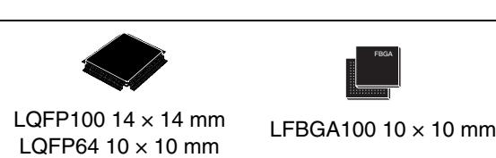

- Up to 10 timers with pinout remap capability
  - Up to four 16-bit timers, each with up to 4 IC/OC/PWM or pulse counter and quadrature (incremental) encoder input
  - 1 × 16-bit motor control PWM timer with dead-time generation and emergency stop
  - 2 × watchdog timers (Independent and Window)
  - SysTick timer: a 24-bit downcounter
  - 2 × 16-bit basic timers to drive the DAC
- Up to 14 communication interfaces with pinout remap capability
  - Up to 2 × I2C interfaces (SMBus/PMBus)
  - Up to 5 USARTs (ISO 7816 interface, LIN, IrDA capability, modem control)
  - Up to 3 SPIs (18 Mbit/s), 2 with a multiplexed I2S interface that offers audio class accuracy via advanced PLL schemes
  - 2 × CAN interfaces (2.0B Active) with 512 bytes of dedicated SRAM
  - USB 2.0 full-speed device/host/OTG controller with on-chip PHY that supports HNP/SRP/ID with 1.25 Kbytes of dedicated SRAM
  - 10/100 Ethernet MAC with dedicated DMA and SRAM (4 Kbytes): IEEE1588 hardware support, MII/RMII available on all packages

#### **Table 1. Device summary**

<span id="page-0-0"></span>

| Reference   | Part number                                                                      |
|-------------|----------------------------------------------------------------------------------|
| STM32F105xx | STM32F105R8, STM32F105V8<br>STM32F105RB, STM32F105VB<br>STM32F105RC, STM32F105VC |
| STM32F107xx | STM32F107RB, STM32F107VB<br>STM32F107RC, STM32F107VC                             |

This is information on a product in full production.

# **Contents**

| 1 |     |                | Introduction 9                                                         |
|---|-----|----------------|------------------------------------------------------------------------|
| 2 |     | Description 10 |                                                                        |
|   | 2.1 |                | Device overview 10                                                     |
|   | 2.2 |                | Full compatibility throughout the family 12                            |
|   | 2.3 |                | Overview 13                                                            |
|   |     | 2.3.1          | ARM Cortex-M3 core with embedded Flash and SRAM 14                     |
|   |     | 2.3.2          | Embedded Flash memory 14                                               |
|   |     | 2.3.3          | CRC (cyclic redundancy check) calculation unit 14                      |
|   |     | 2.3.4          | Embedded SRAM 14                                                       |
|   |     | 2.3.5          | Nested vectored interrupt controller (NVIC) 14                         |
|   |     | 2.3.6          | External interrupt/event controller (EXTI) 15                          |
|   |     | 2.3.7          | Clocks and startup 15                                                  |
|   |     | 2.3.8          | Boot modes 15                                                          |
|   |     | 2.3.9          | Power supply schemes 16                                                |
|   |     | 2.3.10         | Power supply supervisor 16                                             |
|   |     | 2.3.11         | Voltage regulator 16                                                   |
|   |     | 2.3.12         | Low-power modes 16                                                     |
|   |     | 2.3.13         | DMA 17                                                                 |
|   |     | 2.3.14         | RTC (real-time clock) and backup registers 17                          |
|   |     | 2.3.15         | Timers and watchdogs 18                                                |
|   |     | 2.3.16         | I²C bus 19                                                             |
|   |     | 2.3.17         | Universal synchronous/asynchronous receiver transmitters (USARTs) . 19 |
|   |     | 2.3.18         | Serial peripheral interface (SPI) 20                                   |
|   |     | 2.3.19         | Inter-integrated sound (I2S) 20                                        |
|   |     | 2.3.20         | Ethernet MAC interface with dedicated DMA and IEEE 1588 support . 20   |
|   |     | 2.3.21         | Controller area network (CAN) 21                                       |
|   |     | 2.3.22         | Universal serial bus on-the-go full-speed (USB OTG FS) 21              |
|   |     | 2.3.23         | GPIOs (general-purpose inputs/outputs) 21                              |
|   |     | 2.3.24         | Remap capability 22                                                    |
|   |     | 2.3.25         | ADCs (analog-to-digital converters) 22                                 |
|   |     | 2.3.26         | DAC (digital-to-analog converter) 22                                   |
|   |     | 2.3.27         | Temperature sensor 23                                                  |
|   |     | 2.3.28         | Serial wire JTAG debug port (SWJ-DP) 23                                |

2/108 DocID15274 Rev 10


|   |     | 2.3.29                        | Embedded Trace Macrocell™ 23                              |  |
|---|-----|-------------------------------|-----------------------------------------------------------|--|
| 3 |     |                               | Pinouts and pin description 24                            |  |
| 4 |     |                               | Memory mapping 33                                         |  |
| 5 |     | Electrical characteristics 34 |                                                           |  |
|   | 5.1 |                               | Parameter conditions 34                                   |  |
|   |     | 5.1.1                         | Minimum and maximum values 34                             |  |
|   |     | 5.1.2                         | Typical values 34                                         |  |
|   |     | 5.1.3                         | Typical curves 34                                         |  |
|   |     | 5.1.4                         | Loading capacitor 34                                      |  |
|   |     | 5.1.5                         | Pin input voltage 34                                      |  |
|   |     | 5.1.6                         | Power supply scheme 35                                    |  |
|   |     | 5.1.7                         | Current consumption measurement 35                        |  |
|   | 5.2 |                               | Absolute maximum ratings 36                               |  |
|   | 5.3 |                               | Operating conditions 37                                   |  |
|   |     | 5.3.1                         | General operating conditions 37                           |  |
|   |     | 5.3.2                         | Operating conditions at power-up / power-down 38          |  |
|   |     | 5.3.3                         | Embedded reset and power control block characteristics 38 |  |
|   |     | 5.3.4                         | Embedded reference voltage 39                             |  |
|   |     | 5.3.5                         | Supply current characteristics 39                         |  |
|   |     | 5.3.6                         | External clock source characteristics 47                  |  |
|   |     | 5.3.7                         | Internal clock source characteristics 52                  |  |
|   |     | 5.3.8                         | PLL, PLL2 and PLL3 characteristics 53                     |  |
|   |     | 5.3.9                         | Memory characteristics 54                                 |  |
|   |     | 5.3.10                        | EMC characteristics 54                                    |  |
|   |     | 5.3.11                        | Absolute maximum ratings (electrical sensitivity) 56      |  |
|   |     | 5.3.12                        | I/O current injection characteristics 56                  |  |
|   |     | 5.3.13                        | I/O port characteristics 57                               |  |
|   |     | 5.3.14                        | NRST pin characteristics 62                               |  |
|   |     | 5.3.15                        | TIM timer characteristics 63                              |  |
|   |     | 5.3.16                        | Communications interfaces 64                              |  |
|   |     | 5.3.17                        | 12-bit ADC characteristics 74                             |  |
|   |     | 5.3.18                        | DAC electrical specifications 79                          |  |
|   |     | 5.3.19                        | Temperature sensor characteristics 81                     |  |


| 6          |     |                               | Package information 82                                           |  |
|------------|-----|-------------------------------|------------------------------------------------------------------|--|
|            | 6.1 |                               | LFBGA100 package information 82                                  |  |
|            | 6.2 |                               | LQFP100 package information 85                                   |  |
|            | 6.3 | LQFP64 package information 88 |                                                                  |  |
|            | 6.4 |                               | Thermal characteristics 91                                       |  |
|            |     | 6.4.1                         | Reference document 91                                            |  |
|            |     | 6.4.2                         | Selecting the product temperature range 92                       |  |
| 7          |     |                               | Part numbering 94                                                |  |
| Appendix A |     |                               | Application block diagrams 95                                    |  |
|            | A.1 |                               | USB OTG FS interface solutions. 95                               |  |
|            | A.2 |                               | Ethernet interface solutions. 97                                 |  |
|            | A.3 |                               | Complete audio player solutions 99                               |  |
|            | A.4 |                               | USB OTG FS interface + Ethernet/I2S interface solutions<br>. 100 |  |
| 8          |     | Revision history              | . 103                                                            |  |


# **List of tables**

| Table 1.  | Device summary 1                                                              |  |
|-----------|-------------------------------------------------------------------------------|--|
| Table 2.  | STM32F105xx and STM32F107xx features and peripheral counts 10                 |  |
| Table 3.  | STM32F105xx and STM32F107xx family versus STM32F103xx family 12               |  |
| Table 4.  | Timer feature comparison. 18                                                  |  |
| Table 5.  | Pin definitions 27                                                            |  |
| Table 6.  | Voltage characteristics 36                                                    |  |
| Table 7.  | Current characteristics 36                                                    |  |
| Table 8.  | Thermal characteristics. 37                                                   |  |
| Table 9.  | General operating conditions 37                                               |  |
| Table 10. | Operating condition at power-up / power down 38                               |  |
| Table 11. | Embedded reset and power control block characteristics. 38                    |  |
| Table 12. | Embedded internal reference voltage. 39                                       |  |
| Table 13. | Maximum current consumption in Run mode, code with data processing            |  |
|           | running from Flash 40                                                         |  |
| Table 14. | Maximum current consumption in Run mode, code with data processing            |  |
|           | running from RAM. 40                                                          |  |
| Table 15. | Maximum current consumption in Sleep mode, code running from Flash or RAM. 41 |  |
| Table 16. | Typical and maximum current consumptions in Stop and Standby modes 41         |  |
| Table 17. | Typical current consumption in Run mode, code with data processing            |  |
|           | running from Flash 44                                                         |  |
| Table 18. | Typical current consumption in Sleep mode, code running from Flash or         |  |
|           | RAM 45                                                                        |  |
| Table 19. | Peripheral current consumption 46                                             |  |
| Table 20. | High-speed external user clock characteristics. 47                            |  |
| Table 21. | Low-speed external user clock characteristics 48                              |  |
| Table 22. | HSE 3-25 MHz oscillator characteristics 49                                    |  |
| Table 23. | LSE oscillator characteristics (fLSE = 32.768 kHz) 50                         |  |
| Table 24. | HSI oscillator characteristics 52                                             |  |
| Table 25. | LSI oscillator characteristics 52                                             |  |
| Table 26. | Low-power mode wakeup timings 53                                              |  |
| Table 27. | PLL characteristics 53                                                        |  |
| Table 28. | PLL2 and PLL3 characteristics 53                                              |  |
| Table 29. | Flash memory characteristics 54                                               |  |
| Table 30. | Flash memory endurance and data retention 54                                  |  |
| Table 31. | EMS characteristics 55                                                        |  |
| Table 32. | EMI characteristics 56                                                        |  |
| Table 33. | ESD absolute maximum ratings 56                                               |  |
| Table 34. | Electrical sensitivities 56                                                   |  |
| Table 35. | I/O current injection susceptibility 57                                       |  |
| Table 36. | I/O static characteristics 57                                                 |  |
| Table 37. | Output voltage characteristics 60                                             |  |
|           |                                                                               |  |
| Table 38. | I/O AC characteristics 61                                                     |  |
| Table 39. | NRST pin characteristics 62                                                   |  |
| Table 40. | TIMx characteristics 63                                                       |  |
| Table 41. | I2C characteristics. 64                                                       |  |
| Table 42. | SCL frequency (fPCLK1= 36 MHz.,VDD = 3.3 V) 65                                |  |
| Table 43. | SPI characteristics 66                                                        |  |
| Table 44. | I2S characteristics. 69                                                       |  |


| Table 45. | USB OTG FS startup time 71                                                   |  |
|-----------|------------------------------------------------------------------------------|--|
| Table 46. | USB OTG FS DC electrical characteristics. 71                                 |  |
| Table 47. | USB OTG FS electrical characteristics. 72                                    |  |
| Table 48. | Ethernet DC electrical characteristics. 72                                   |  |
| Table 49. | Dynamic characteristics: Ethernet MAC signals for SMI. 72                    |  |
| Table 50. | Dynamic characteristics: Ethernet MAC signals for RMII 73                    |  |
| Table 51. | Dynamic characteristics: Ethernet MAC signals for MII 74                     |  |
| Table 52. | ADC characteristics 74                                                       |  |
| Table 53. | RAIN max for fADC = 14 MHz. 75                                               |  |
| Table 54. | ADC accuracy - limited test conditions 76                                    |  |
| Table 55. | ADC accuracy 76                                                              |  |
| Table 56. | DAC characteristics 79                                                       |  |
| Table 57. | TS characteristics 81                                                        |  |
| Table 58. | LFBGA100 recommended PCB design rules (0.8 mm pitch BGA). 83                 |  |
| Table 59. | LQPF100 - 100-pin, 14 x 14 mm low-profile quad flat package                  |  |
|           | mechanical data 85                                                           |  |
| Table 60. | LQFP64 – 10 x 10 mm 64 pin low-profile quad flat package mechanical data. 88 |  |
| Table 61. | Package thermal characteristics. 91                                          |  |
| Table 62. | Ordering information scheme 94                                               |  |
| Table 63. | PLL configurations 101                                                       |  |
| Table 64. | Applicative current consumption in Run mode, code with data                  |  |
|           | processing running from Flash 102                                            |  |
| Table 65. | Document revision history 103                                                |  |


# **List of figures**

| Figure 1.  | STM32F105xx and STM32F107xx connectivity line block diagram 13           |  |
|------------|--------------------------------------------------------------------------|--|
| Figure 2.  | STM32F105xx and STM32F107xx connectivity line BGA100 ballout top view 24 |  |
| Figure 3.  | STM32F105xx and STM32F107xx connectivity line LQFP100 pinout 25          |  |
| Figure 4.  | STM32F105xx and STM32F107xx connectivity line LQFP64 pinout 26           |  |
| Figure 5.  | Memory map. 33                                                           |  |
| Figure 6.  | Pin loading conditions. 34                                               |  |
| Figure 7.  | Pin input voltage 34                                                     |  |
| Figure 8.  | Power supply scheme. 35                                                  |  |
| Figure 9.  | Current consumption measurement scheme 35                                |  |
| Figure 10. | Typical current consumption on VBAT with RTC on vs. temperature at       |  |
|            | different VBAT values 42                                                 |  |
| Figure 11. | Typical current consumption in Stop mode with regulator in Run mode      |  |
|            | versus temperature at different VDD values 42                            |  |
| Figure 12. | Typical current consumption in Stop mode with regulator in Low-power     |  |
|            | mode versus temperature at different VDD values 43                       |  |
| Figure 13. | Typical current consumption in Standby mode versus temperature at        |  |
|            | different VDD values 43                                                  |  |
| Figure 14. | High-speed external clock source AC timing diagram 48                    |  |
| Figure 15. | Low-speed external clock source AC timing diagram. 49                    |  |
| Figure 16. | Typical application with an 8 MHz crystal 50                             |  |
| Figure 17. | Typical application with a 32.768 kHz crystal 51                         |  |
| Figure 18. | Standard I/O input characteristics - CMOS port 58                        |  |
| Figure 19. | Standard I/O input characteristics - TTL port 59                         |  |
| Figure 20. | 5 V tolerant I/O input characteristics - CMOS port 59                    |  |
| Figure 21. | 5 V tolerant I/O input characteristics - TTL port 59                     |  |
| Figure 22. | I/O AC characteristics definition 62                                     |  |
| Figure 23. | Recommended NRST pin protection 63                                       |  |
| Figure 24. | I2C bus AC waveforms and measurement circuit<br>. 65                     |  |
| Figure 25. | SPI timing diagram - slave mode and CPHA = 0 67                          |  |
| Figure 26. | SPI timing diagram - slave mode and CPHA = 1(1) 67                       |  |
| Figure 27. | SPI timing diagram - master mode(1) 68                                   |  |
| Figure 28. | I2S slave timing diagram (Philips protocol)(1) 70                        |  |
| Figure 29. | I2S master timing diagram (Philips protocol)(1) 70                       |  |
| Figure 30. | USB OTG FS timings: definition of data signal rise and fall time 71      |  |
| Figure 31. | Ethernet SMI timing diagram 72                                           |  |
| Figure 32. | Ethernet RMII timing diagram 73                                          |  |
| Figure 33. | Ethernet MII timing diagram 73                                           |  |
| Figure 34. | ADC accuracy characteristics. 77                                         |  |
| Figure 35. | Typical connection diagram using the ADC 77                              |  |
| Figure 36. | Power supply and reference decoupling (VREF+ not connected to VDDA). 78  |  |
| Figure 37. | Power supply and reference decoupling (VREF+ connected to VDDA). 78      |  |
| Figure 38. | 12-bit buffered /non-buffered DAC 80                                     |  |
| Figure 39. | LFBGA100 - 10 x 10 mm low profile fine pitch ball grid array package     |  |
|            | outline 82                                                               |  |
| Figure 40. | LFBGA100 – 100-ball low profile fine pitch ball grid array, 10 x 10 mm,  |  |
|            | 0.8 mm pitch, package mechanical data 83                                 |  |
| Figure 41. | LFBGA100 – 100-ball low profile fine pitch ball grid array, 10 x 10 mm,  |  |
|            | 0.8 mm pitch, package recommended footprint 83                           |  |
|            |                                                                          |  |


| Figure 42. | LFBGA100 marking example (package top view) 84                             |  |
|------------|----------------------------------------------------------------------------|--|
| Figure 43. | LQFP100 – 14 x 14 mm 100 pin low-profile quad flat package outline 85      |  |
| Figure 44. | LQFP100 - 100-pin, 14 x 14 mm low-profile quad flat                        |  |
|            | recommended footprint. 86                                                  |  |
| Figure 45. | LQFP100 marking example (package top view). 87                             |  |
| Figure 46. | LQFP64 – 10 x 10 mm 64 pin low-profile quad flat package outline 88        |  |
| Figure 47. | LQFP64 - 64-pin, 10 x 10 mm low-profile quad flat recommended footprint 89 |  |
| Figure 48. | LQFP64 marking example (package top view). 90                              |  |
| Figure 49. | LQFP100 PD max vs. TA 93                                                   |  |
| Figure 50. | USB OTG FS device mode. 95                                                 |  |
| Figure 51. | Host connection 95                                                         |  |
| Figure 52. | OTG connection (any protocol). 96                                          |  |
| Figure 53. | MII mode using a 25 MHz crystal 97                                         |  |
| Figure 54. | RMII with a 50 MHz oscillator 97                                           |  |
| Figure 55. | RMII with a 25 MHz crystal and PHY with PLL. 98                            |  |
| Figure 56. | RMII with a 25 MHz crystal 98                                              |  |
| Figure 57. | Complete audio player solution 1 99                                        |  |
| Figure 58. | Complete audio player solution 2 99                                        |  |
| Figure 59. | USB O44TG FS + Ethernet solution 100                                       |  |
| Figure 60. | USB OTG FS + I2S (Audio) solution<br>. 100                                 |  |


# <span id="page-8-0"></span>**1 Introduction**

This datasheet provides the description of the STM32F105xx and STM32F107xx connectivity line microcontrollers. For more details on the whole STMicroelectronics STM32F10xxx family, refer to *[Section 2.2: Full compatibility throughout the family](#page-11-0)*.

The STM32F105xx and STM32F107xx datasheet should be read in conjunction with the STM32F10xxx reference manual.

For information on programming, erasing and protection of the internal Flash memory refer to the STM32F10xxx Flash programming manual.

The reference and Flash programming manuals are both available from the STMicroelectronics website *www.st.com*.

For information on the Cortex®-M3 core refer to the Cortex®-M3 Technical Reference Manual, available from the www.arm.com website.


# <span id="page-9-0"></span>**2 Description**

The STM32F105xx and STM32F107xx connectivity line family incorporates the highperformance ARM® Cortex®-M3 32-bit RISC core operating at a 72 MHz frequency, highspeed embedded memories (Flash memory up to 256 Kbytes and SRAM 64 Kbytes), and an extensive range of enhanced I/Os and peripherals connected to two APB buses. All devices offer two 12-bit ADCs, four general-purpose 16-bit timers plus a PWM timer, as well as standard and advanced communication interfaces: up to two I2Cs, three SPIs, two I2Ss, five USARTs, an USB OTG FS and two CANs. Ethernet is available on the STM32F107xx only.

The STM32F105xx and STM32F107xx connectivity line family operates in the –40 to +105 °C temperature range, from a 2.0 to 3.6 V power supply. A comprehensive set of power-saving mode allows the design of low-power applications.

The STM32F105xx and STM32F107xx connectivity line family offers devices in three different package types: from 64 pins to 100 pins. Depending on the device chosen, different sets of peripherals are included, the description below gives an overview of the complete range of peripherals proposed in this family.

These features make the STM32F105xx and STM32F107xx connectivity line microcontroller family suitable for a wide range of applications such as motor drives and application control, medical and handheld equipment, industrial applications, PLCs, inverters, printers, and scanners, alarm systems, video intercom, HVAC and home audio equipment.

## <span id="page-9-1"></span>**2.1 Device overview**

*[Figure 1](#page-12-1)* shows the general block diagram of the device family.

<span id="page-9-2"></span>

| Peripherals(1)         |                     | STM32F105Rx |     |     | STM32F107Rx |             |                            | STM32F105Vx | STM32F107Vx |                            |     |
|------------------------|---------------------|-------------|-----|-----|-------------|-------------|----------------------------|-------------|-------------|----------------------------|-----|
| Flash memory in Kbytes |                     | 64          | 128 | 256 | 128         | 256         | 64                         | 128         | 256         | 128                        | 256 |
| SRAM in Kbytes         |                     |             |     |     |             |             | 64                         |             |             |                            |     |
| Package                |                     | LQFP64      |     |     |             | LQFP<br>100 | LQFP<br>100,<br>BGA<br>100 | LQFP<br>100 | LQFP<br>100 | LQFP<br>100,<br>BGA<br>100 |     |
| Ethernet               |                     | No<br>Yes   |     |     |             | No          |                            |             | Yes         |                            |     |
|                        | 4                   |             |     |     |             |             |                            |             |             |                            |     |
| Timers                 | Advanced<br>control | 1           |     |     |             |             |                            |             |             |                            |     |
|                        | Basic               |             |     |     |             |             | 2                          |             |             |                            |     |

|  | Table 2. STM32F105xx and STM32F107xx features and peripheral counts |  |  |
|--|---------------------------------------------------------------------|--|--|


| Peripherals(1)         | STM32F105Rx                                         | STM32F107Rx | STM32F105Vx | STM32F107Vx                           |  |  |  |  |  |  |  |
|------------------------|-----------------------------------------------------|-------------|-------------|---------------------------------------|--|--|--|--|--|--|--|
| SPI(I2S)(2)            | 3(2)                                                | 3(2)        | 3(2)        | 3(2)                                  |  |  |  |  |  |  |  |
| 2C<br>I                | 2                                                   | 1           | 2           | 1                                     |  |  |  |  |  |  |  |
| USART                  |                                                     | 5           |             |                                       |  |  |  |  |  |  |  |
| USB OTG FS             |                                                     | Yes         |             |                                       |  |  |  |  |  |  |  |
| CAN                    |                                                     |             | 2           |                                       |  |  |  |  |  |  |  |
|                        | 51                                                  |             | 80          |                                       |  |  |  |  |  |  |  |
|                        | 2                                                   |             |             |                                       |  |  |  |  |  |  |  |
| Number of channels     | 16                                                  |             |             |                                       |  |  |  |  |  |  |  |
|                        | 2                                                   |             |             |                                       |  |  |  |  |  |  |  |
| Number of channels     | 2                                                   |             |             |                                       |  |  |  |  |  |  |  |
| CPU frequency          | 72 MHz                                              |             |             |                                       |  |  |  |  |  |  |  |
| Operating voltage      | 2.0 to 3.6 V                                        |             |             |                                       |  |  |  |  |  |  |  |
| Operating temperatures | Ambient temperatures: –40 to +85 °C /–40 to +105 °C |             |             |                                       |  |  |  |  |  |  |  |
|                        |                                                     |             |             | Junction temperature: –40 to + 125 °C |  |  |  |  |  |  |  |

#### **Table 2. STM32F105xx and STM32F107xx features and peripheral counts (continued)**

1. Refer to *[Table 5: Pin definitions](#page-26-0)* for peripheral availability when the I/O pins are shared by the peripherals required by the application.

2. The SPI2 and SPI3 interfaces give the flexibility to work in either the SPI mode or the I2S audio mode.


# <span id="page-11-0"></span>**2.2 Full compatibility throughout the family**

The STM32F105xx and STM32F107xx constitute the connectivity line family whose members are fully pin-to-pin, software and feature compatible.

The STM32F105xx and STM32F107xx are a drop-in replacement for the low-density (STM32F103x4/6), medium-density (STM32F103x8/B) and high-density (STM32F103xC/D/E) performance line devices, allowing the user to try different memory densities and peripherals providing a greater degree of freedom during the development cycle.

<span id="page-11-1"></span>

| STM32<br>device     | Low-density<br>STM32F103xx devices<br>STM32F103xx devices                                                                                                                                     |    |                                                                                                        | Medium-density |                                                                                                                                                                                               | High-density<br>STM32F103xx devices |                                                                           |                                                                                         | STM32F105xx |                                                                                                                                                                                 |     | STM32F107xx |    |
|---------------------|-----------------------------------------------------------------------------------------------------------------------------------------------------------------------------------------------|----|--------------------------------------------------------------------------------------------------------|----------------|-----------------------------------------------------------------------------------------------------------------------------------------------------------------------------------------------|-------------------------------------|---------------------------------------------------------------------------|-----------------------------------------------------------------------------------------|-------------|---------------------------------------------------------------------------------------------------------------------------------------------------------------------------------|-----|-------------|----|
| Flash<br>size (KB)  | 16<br>32<br>32                                                                                                                                                                                |    |                                                                                                        | 64             | 128                                                                                                                                                                                           | 256<br>384<br>512                   |                                                                           | 64                                                                                      | 128         | 256                                                                                                                                                                             | 128 | 256         |    |
| RAM<br>size (KB)    | 6                                                                                                                                                                                             | 10 | 10                                                                                                     | 20             | 20                                                                                                                                                                                            | 48                                  | 64                                                                        | 64                                                                                      | 64          | 64                                                                                                                                                                              | 64  | 64          | 64 |
| 144 pins            |                                                                                                                                                                                               |    |                                                                                                        |                |                                                                                                                                                                                               |                                     |                                                                           |                                                                                         |             |                                                                                                                                                                                 |     |             |    |
| 100 pins<br>64 pins | 2 × USARTs<br>2 × 16-bit<br>2 × USARTs<br>timers<br>2 × 16-bit timers<br>1 × SPI,<br>1 × SPI, 1 × I2C, USB,<br>1 × I2C,<br>CAN,<br>USB, CAN,<br>1 × PWM timer<br>1 × PWM<br>2 × ADCs<br>timer |    | 3 × USARTs<br>3 × 16-bit<br>timers<br>2 × SPIs,<br>2 × I2Cs, USB,<br>CAN,<br>1 × PWM timer<br>2 × ADCs |                | 5 × USARTs<br>4 × 16-bit timers,<br>2 × basic timers, 3 × SPIs,<br>2 × I2Ss, 2 × I2Cs, USB,<br>CAN, 2 × PWM timers<br>3 × ADCs, 2 × DACs,<br>1 × SDIO, FSMC (100-<br>and 144-pin packages(2)) |                                     | 3 × SPIs,<br>2 × I2Ss,<br>2 × I2Cs,<br>2 × CANs,<br>2 × ADCs,<br>2 × DACs | 5 × USARTs,<br>4 × 16-bit timers,<br>2 × basic timers,<br>USB OTG FS,<br>1 × PWM timer, |             | 5 × USARTs,<br>4 × 16-bit timers,<br>2 × basic timers,<br>3 × SPIs,<br>2 × I2S,<br>1 × I2C,<br>USB OTG FS,<br>2 × CANs,<br>1 × PWM timer,<br>2 × ADCs,<br>2 × DACs,<br>Ethernet |     |             |    |
| 48 pins<br>36 pins  | 2 × ADCs                                                                                                                                                                                      |    |                                                                                                        |                |                                                                                                                                                                                               |                                     |                                                                           |                                                                                         |             |                                                                                                                                                                                 |     |             |    |

1. Refer to *[Table 5: Pin definitions](#page-26-0)* for peripheral availability when the I/O pins are shared by the peripherals required by the application.

2. Ports F and G are not available in devices delivered in 100-pin packages.


### <span id="page-12-0"></span>**2.3 Overview**

<span id="page-12-1"></span>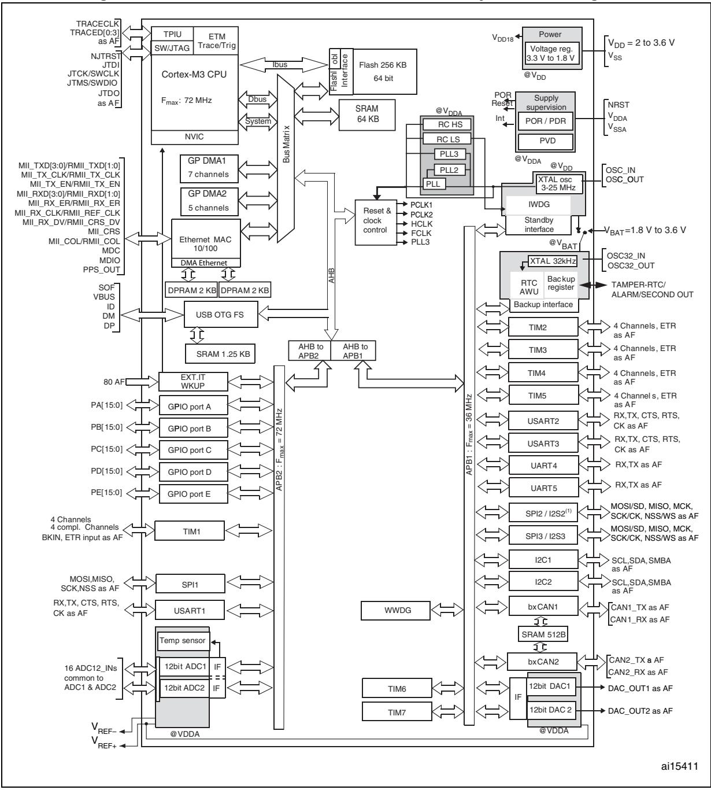

#### **Figure 1. STM32F105xx and STM32F107xx connectivity line block diagram**

1. TA = –40 °C to +85 °C (suffix 6, see *[Table 62](#page-93-1)*) or –40 °C to +105 °C (suffix 7, see *[Table 62](#page-93-1)*), junction temperature up to 105 °C or 125 °C, respectively.

2. AF = alternate function on I/O port pin.


DocID15274 Rev 10 13/108

### <span id="page-13-0"></span>**2.3.1 ARM Cortex-M3 core with embedded Flash and SRAM**

The ARM Cortex-M3 processor is the latest generation of ARM processors for embedded systems. It has been developed to provide a low-cost platform that meets the needs of MCU implementation, with a reduced pin count and low-power consumption, while delivering outstanding computational performance and an advanced system response to interrupts.

The ARM Cortex-M3 32-bit RISC processor features exceptional code-efficiency, delivering the high-performance expected from an ARM core in the memory size usually associated with 8- and 16-bit devices.

With its embedded ARM core, STM32F105xx and STM32F107xx connectivity line family is compatible with all ARM tools and software.

*[Figure 1](#page-12-1)* shows the general block diagram of the device family.

### <span id="page-13-1"></span>**2.3.2 Embedded Flash memory**

64 to 256 Kbytes of embedded Flash is available for storing programs and data.

### <span id="page-13-2"></span>**2.3.3 CRC (cyclic redundancy check) calculation unit**

The CRC (cyclic redundancy check) calculation unit is used to get a CRC code from a 32-bit data word and a fixed generator polynomial.

Among other applications, CRC-based techniques are used to verify data transmission or storage integrity. In the scope of the EN/IEC 60335-1 standard, they offer a means of verifying the Flash memory integrity. The CRC calculation unit helps compute a signature of the software during runtime, to be compared with a reference signature generated at linktime and stored at a given memory location.

### <span id="page-13-3"></span>**2.3.4 Embedded SRAM**

64 Kbytes of embedded SRAM accessed (read/write) at CPU clock speed with 0 wait states.

### <span id="page-13-4"></span>**2.3.5 Nested vectored interrupt controller (NVIC)**

The STM32F105xx and STM32F107xx connectivity line embeds a nested vectored interrupt controller able to handle up to 67 maskable interrupt channels (not including the 16 interrupt lines of Cortex-M3) and 16 priority levels.

- Closely coupled NVIC gives low latency interrupt processing
- Interrupt entry vector table address passed directly to the core
- Closely coupled NVIC core interface
- Allows early processing of interrupts
- Processing of *late arriving* higher priority interrupts
- Support for tail-chaining
- Processor state automatically saved
- Interrupt entry restored on interrupt exit with no instruction overhead

This hardware block provides flexible interrupt management features with minimal interrupt latency.


### <span id="page-14-0"></span>**2.3.6 External interrupt/event controller (EXTI)**

The external interrupt/event controller consists of 20 edge detector lines used to generate interrupt/event requests. Each line can be independently configured to select the trigger event (rising edge, falling edge, both) and can be masked independently. A pending register maintains the status of the interrupt requests. The EXTI can detect an external line with a pulse width shorter than the Internal APB2 clock period. Up to 80 GPIOs can be connected to the 16 external interrupt lines.

### <span id="page-14-1"></span>**2.3.7 Clocks and startup**

System clock selection is performed on startup, however, the internal RC 8 MHz oscillator is selected as default CPU clock on reset. An external 3-25 MHz clock can be selected, in which case it is monitored for failure. If failure is detected, the system automatically switches back to the internal RC oscillator. A software interrupt is generated if enabled. Similarly, full interrupt management of the PLL clock entry is available when necessary (for example with failure of an indirectly used external oscillator).

A single 25 MHz crystal can clock the entire system including the ethernet and USB OTG FS peripherals. Several prescalers and PLLs allow the configuration of the AHB frequency, the high speed APB (APB2) and the low speed APB (APB1) domains. The maximum frequency of the AHB and the high speed APB domains is 72 MHz. The maximum allowed frequency of the low speed APB domain is 36 MHz. Refer to *[Figure 59: USB O44TG FS +](#page-99-1)  [Ethernet solution on page 100](#page-99-1)*.

The advanced clock controller clocks the core and all peripherals using a single crystal or oscillator. In order to achieve audio class performance, an audio crystal can be used. In this case, the I2S master clock can generate all standard sampling frequencies from 8 kHz to 96 kHz with less than 0.5% accuracy error. Refer to *[Figure 60: USB OTG FS + I2S \(Audio\)](#page-99-2)  [solution on page 100](#page-99-2)*.

To configure the PLLs, refer to *[Table 63 on page 101](#page-100-0)*, which provides PLL configurations according to the application type.

### <span id="page-14-2"></span>**2.3.8 Boot modes**

At startup, boot pins are used to select one of three boot options:

- Boot from User Flash
- Boot from System Memory
- Boot from embedded SRAM

The boot loader is located in System Memory. It is used to reprogram the Flash memory by using USART1, USART2 (remapped), CAN2 (remapped) or USB OTG FS in device mode (DFU: device firmware upgrade). For remapped signals refer to *[Table 5: Pin definitions](#page-26-0)*.

The USART peripheral operates with the internal 8 MHz oscillator (HSI), however the CAN and USB OTG FS can only function if an external 8 MHz, 14.7456 MHz or 25 MHz clock (HSE) is present.

For full details about the boot loader, refer to AN2606.


### <span id="page-15-0"></span>**2.3.9 Power supply schemes**

- VDD = 2.0 to 3.6 V: external power supply for I/Os and the internal regulator. Provided externally through VDD pins.
- VSSA, VDDA = 2.0 to 3.6 V: external analog power supplies for ADC, Reset blocks, RCs and PLL (minimum voltage to be applied to VDDA is 2.4 V when the ADC is used). VDDA and VSSA must be connected to VDD and VSS, respectively.
- VBAT = 1.8 to 3.6 V: power supply for RTC, external clock 32 kHz oscillator and backup registers (through power switch) when VDD is not present.

### <span id="page-15-1"></span>**2.3.10 Power supply supervisor**

The device has an integrated power-on reset (POR)/power-down reset (PDR) circuitry. It is always active, and ensures proper operation starting from/down to 2 V. The device remains in reset mode when VDD is below a specified threshold, VPOR/PDR, without the need for an external reset circuit.

The device features an embedded programmable voltage detector (PVD) that monitors the VDD/VDDA power supply and compares it to the VPVD threshold. An interrupt can be generated when VDD/VDDA drops below the VPVD threshold and/or when VDD/VDDA is higher than the VPVD threshold. The interrupt service routine can then generate a warning message and/or put the MCU into a safe state. The PVD is enabled by software.

### <span id="page-15-2"></span>**2.3.11 Voltage regulator**

The regulator has three operation modes: main (MR), low power (LPR) and power down.

- MR is used in the nominal regulation mode (Run)
- LPR is used in the Stop modes.
- Power down is used in Standby mode: the regulator output is in high impedance: the kernel circuitry is powered down, inducing zero consumption (but the contents of the registers and SRAM are lost)

This regulator is always enabled after reset. It is disabled in Standby mode.

### <span id="page-15-3"></span>**2.3.12 Low-power modes**

The STM32F105xx and STM32F107xx connectivity line supports three low-power modes to achieve the best compromise between low power consumption, short startup time and available wakeup sources:

• **Sleep** mode

In Sleep mode, only the CPU is stopped. All peripherals continue to operate and can wake up the CPU when an interrupt/event occurs.

• **Stop** mode

Stop mode achieves the lowest power consumption while retaining the content of SRAM and registers. All clocks in the 1.8 V domain are stopped, the PLL, the HSI RC and the HSE crystal oscillators are disabled. The voltage regulator can also be put either in normal or in low-power mode.

The device can be woken up from Stop mode by any of the EXTI line. The EXTI line source can be one of the 16 external lines, the PVD output, the RTC alarm or the USB OTG FS wakeup.


#### • **Standby** mode

The Standby mode is used to achieve the lowest power consumption. The internal voltage regulator is switched off so that the entire 1.8 V domain is powered off. The PLL, the HSI RC and the HSE crystal oscillators are also switched off. After entering Standby mode, SRAM and register contents are lost except for registers in the Backup domain and Standby circuitry.

The device exits Standby mode when an external reset (NRST pin), an IWDG reset, a rising edge on the WKUP pin, or an RTC alarm occurs.

*Note: The RTC, the IWDG, and the corresponding clock sources are not stopped by entering Stop or Standby mode.*

#### <span id="page-16-0"></span>**2.3.13 DMA**

The flexible 12-channel general-purpose DMAs (7 channels for DMA1 and 5 channels for DMA2) are able to manage memory-to-memory, peripheral-to-memory and memory-toperipheral transfers. The two DMA controllers support circular buffer management, removing the need for user code intervention when the controller reaches the end of the buffer.

Each channel is connected to dedicated hardware DMA requests, with support for software trigger on each channel. Configuration is made by software and transfer sizes between source and destination are independent.

The DMA can be used with the main peripherals: SPI, I2C, USART, general-purpose, basic and advanced control timers TIMx, DAC, I2S and ADC.

In the STM32F107xx, there is a DMA controller dedicated for use with the Ethernet (see *[Section 2.3.20: Ethernet MAC interface with dedicated DMA and IEEE 1588 support](#page-19-2)* for more information).

#### <span id="page-16-1"></span>**2.3.14 RTC (real-time clock) and backup registers**

The RTC and the backup registers are supplied through a switch that takes power either on VDD supply when present or through the VBAT pin. The backup registers are forty-two 16-bit registers used to store 84 bytes of user application data when VDD power is not present. They are not reset by a system or power reset, and they are not reset when the device wakes up from the Standby mode.

The real-time clock provides a set of continuously running counters which can be used with suitable software to provide a clock calendar function, and provides an alarm interrupt and a periodic interrupt. It is clocked by a 32.768 kHz external crystal, resonator or oscillator, the internal low power RC oscillator or the high-speed external clock divided by 128. The internal low-speed RC has a typical frequency of 40 kHz. The RTC can be calibrated using an external 512 Hz output to compensate for any natural quartz deviation. The RTC features a 32-bit programmable counter for long term measurement using the Compare register to generate an alarm. A 20-bit prescaler is used for the time base clock and is by default configured to generate a time base of 1 second from a clock at 32.768 kHz.

For more information, refer to AN2604: "*STM32F101xx and STM32F103xx RTC calibration*", available from *www.st.com*.


### <span id="page-17-0"></span>**2.3.15 Timers and watchdogs**

The STM32F105xx and STM32F107xx devices include an advanced-control timer, four general-purpose timers, two basic timers, two watchdog timers and a SysTick timer.

*[Table 4](#page-17-1)* compares the features of the general-purpose and basic timers.

<span id="page-17-1"></span>

| Timer                                     | Counter<br>resolution | Counter<br>type         | Prescaler<br>factor                   | DMA request<br>generation | Capture/compare<br>channels | Complementary<br>outputs |  |
|-------------------------------------------|-----------------------|-------------------------|---------------------------------------|---------------------------|-----------------------------|--------------------------|--|
| TIM1                                      | 16-bit                | Up,<br>down,<br>up/down | Any integer<br>between 1<br>and 65536 | Yes                       | 4                           | Yes                      |  |
| TIMx<br>(TIM2,<br>TIM3,<br>TIM4,<br>TIM5) | 16-bit                | Up,<br>down,<br>up/down | Any integer<br>between 1<br>and 65536 | Yes                       | 4                           | No                       |  |
| TIM6,<br>TIM7                             | 16-bit                | Up                      | Any integer<br>between 1<br>and 65536 | Yes                       | 0                           | No                       |  |

**Table 4. Timer feature comparison**

#### **Advanced-control timer (TIM1)**

The advanced control timer (TIM1) can be seen as a three-phase PWM multiplexed on 6 channels. It has complementary PWM outputs with programmable inserted dead-times. It can also be seen as a complete general-purpose timer. The 4 independent channels can be used for:

- Input capture
- Output compare
- PWM generation (edge or center-aligned modes)
- One-pulse mode output

If configured as a standard 16-bit timer, it has the same features as the TIMx timer. If configured as the 16-bit PWM generator, it has full modulation capability (0-100%).

The counter can be frozen in debug mode.

Many features are shared with those of the standard TIM timers which have the same architecture. The advanced control timer can therefore work together with the TIM timers via the Timer Link feature for synchronization or event chaining.

#### **General-purpose timers (TIMx)**

There are up to 4 synchronizable standard timers (TIM2, TIM3, TIM4 and TIM5) embedded in the STM32F105xx and STM32F107xx connectivity line devices. These timers are based on a 16-bit auto-reload up/down counter, a 16-bit prescaler and feature 4 independent channels each for input capture/output compare, PWM or one pulse mode output. This gives up to 16 input captures / output compares / PWMs on the largest packages. They can work together with the Advanced Control timer via the Timer Link feature for synchronization or event chaining.

The counter can be frozen in debug mode.

18/108 DocID15274 Rev 10


Any of the standard timers can be used to generate PWM outputs. Each of the timers has independent DMA request generations.

#### **Basic timers TIM6 and TIM7**

These timers are mainly used for DAC trigger generation. They can also be used as a generic 16-bit time base.

#### **Independent watchdog**

The independent watchdog is based on a 12-bit downcounter and 8-bit prescaler. It is clocked from an independent 40 kHz internal RC and as it operates independently from the main clock, it can operate in Stop and Standby modes. It can be used either as a watchdog to reset the device when a problem occurs, or as a free running timer for application timeout management. It is hardware or software configurable through the option bytes. The counter can be frozen in debug mode.

#### **Window watchdog**

The window watchdog is based on a 7-bit downcounter that can be set as free running. It can be used as a watchdog to reset the device when a problem occurs. It is clocked from the main clock. It has an early warning interrupt capability and the counter can be frozen in debug mode.

### **SysTick timer**

This timer is dedicated to real-time operating systems, but could also be used as a standard down counter. It features:

- A 24-bit down counter
- Autoreload capability
- Maskable system interrupt generation when the counter reaches 0.
- Programmable clock source

### <span id="page-18-0"></span>**2.3.16 I²C bus**

Up to two I²C bus interfaces can operate in multimaster and slave modes. They can support standard and fast modes.

They support 7/10-bit addressing mode and 7-bit dual addressing mode (as slave). A hardware CRC generation/verification is embedded.

They can be served by DMA and they support SMBus 2.0/PMBus.

### <span id="page-18-1"></span>**2.3.17 Universal synchronous/asynchronous receiver transmitters (USARTs)**

The STM32F105xx and STM32F107xx connectivity line embeds three universal synchronous/asynchronous receiver transmitters (USART1, USART2 and USART3) and two universal asynchronous receiver transmitters (UART4 and UART5).

These five interfaces provide asynchronous communication, IrDA SIR ENDEC support, multiprocessor communication mode, single-wire half-duplex communication mode and have LIN Master/Slave capability.

The USART1 interface is able to communicate at speeds of up to 4.5 Mbit/s. The other available interfaces communicate at up to 2.25 Mbit/s.


DocID15274 Rev 10 19/108

USART1, USART2 and USART3 also provide hardware management of the CTS and RTS signals, Smart Card mode (ISO 7816 compliant) and SPI-like communication capability. All interfaces can be served by the DMA controller except for UART5.

### <span id="page-19-0"></span>**2.3.18 Serial peripheral interface (SPI)**

Up to three SPIs are able to communicate up to 18 Mbits/s in slave and master modes in full-duplex and simplex communication modes. The 3-bit prescaler gives 8 master mode frequencies and the frame is configurable to 8 bits or 16 bits. The hardware CRC generation/verification supports basic SD Card/MMC/SDHC(a) modes.

All SPIs can be served by the DMA controller.

### <span id="page-19-1"></span>**2.3.19 Inter-integrated sound (I2S)**

Two standard I2S interfaces (multiplexed with SPI2 and SPI3) are available, that can be operated in master or slave mode. These interfaces can be configured to operate with 16/32 bit resolution, as input or output channels. Audio sampling frequencies from 8 kHz up to 96 kHz are supported. When either or both of the I2S interfaces is/are configured in master mode, the master clock can be output to the external DAC/CODEC at 256 times the sampling frequency with less than 0.5% accuracy error owing to the advanced clock controller (see *[Section 2.3.7: Clocks and startup](#page-14-1)*).

Refer to the "Audio frequency precision" tables provided in the "Serial peripheral interface (SPI)" section of the STM32F10xxx reference manual.

### <span id="page-19-2"></span>**2.3.20 Ethernet MAC interface with dedicated DMA and IEEE 1588 support**

Peripheral not available on STM32F105xx devices.

The STM32F107xx devices provide an IEEE-802.3-2002-compliant media access controller (MAC) for ethernet LAN communications through an industry-standard media-independent interface (MII) or a reduced media-independent interface (RMII). The STM32F107xx requires an external physical interface device (PHY) to connect to the physical LAN bus (twisted-pair, fiber, etc.). the PHY is connected to the STM32F107xx MII port using as many as 17 signals (MII) or 9 signals (RMII) and can be clocked using the 25 MHz (MII) or 50 MHz (RMII) output from the STM32F107xx.

The STM32F107xx includes the following features:

- Supports 10 and 100 Mbit/s rates
- Dedicated DMA controller allowing high-speed transfers between the dedicated SRAM and the descriptors (see the STM32F105xx/STM32F107xx reference manual for details)
- Tagged MAC frame support (VLAN support)
- Half-duplex (CSMA/CD) and full-duplex operation
- MAC control sublayer (control frames) support

a. SDHC = Secure digital high capacity.


- 32-bit CRC generation and removal
- Several address filtering modes for physical and multicast address (multicast and group addresses)
- 32-bit status code for each transmitted or received frame
- Internal FIFOs to buffer transmit and receive frames. The transmit FIFO and the receive FIFO are both 2 Kbytes, that is 4 Kbytes in total
- Supports hardware PTP (precision time protocol) in accordance with IEEE 1588 with the timestamp comparator connected to the TIM2 trigger input
- Triggers interrupt when system time becomes greater than target time

### <span id="page-20-0"></span>**2.3.21 Controller area network (CAN)**

The two CANs are compliant with the 2.0A and B (active) specifications with a bitrate up to 1 Mbit/s. They can receive and transmit standard frames with 11-bit identifiers as well as extended frames with 29-bit identifiers. Each CAN has three transmit mailboxes, two receive FIFOS with 3 stages and 28 shared scalable filter banks (all of them can be used even if one CAN is used). The 256 bytes of SRAM which are allocated for each CAN (512 bytes in total) are not shared with any other peripheral.

### <span id="page-20-1"></span>**2.3.22 Universal serial bus on-the-go full-speed (USB OTG FS)**

The STM32F105xx and STM32F107xx connectivity line devices embed a USB OTG fullspeed (12 Mb/s) device/host/OTG peripheral with integrated transceivers. The USB OTG FS peripheral is compliant with the USB 2.0 specification and with the OTG 1.0 specification. It has software-configurable endpoint setting and supports suspend/resume. The USB OTG full-speed controller requires a dedicated 48 MHz clock that is generated by a PLL connected to the HSE oscillator. The major features are:

- 1.25 KB of SRAM used exclusively by the endpoints (not shared with any other peripheral)
- 4 bidirectional endpoints
- HNP/SNP/IP inside (no need for any external resistor)
- for OTG/Host modes, a power switch is needed in case bus-powered devices are connected
- the SOF output can be used to synchronize the external audio DAC clock in isochronous mode
- in accordance with the USB 2.0 Specification, the supported transfer speeds are:
  - in Host mode: full speed and low speed
  - in Device mode: full speed

### <span id="page-20-2"></span>**2.3.23 GPIOs (general-purpose inputs/outputs)**

Each of the GPIO pins can be configured by software as output (push-pull or open-drain), as input (with or without pull-up or pull-down) or as peripheral alternate function. Most of the GPIO pins are shared with digital or analog alternate functions. All GPIOs are high currentcapable.

The I/Os alternate function configuration can be locked if needed following a specific sequence in order to avoid spurious writing to the I/Os registers.

I/Os on APB2 with up to 18 MHz toggling speed


DocID15274 Rev 10 21/108

### <span id="page-21-0"></span>**2.3.24 Remap capability**

This feature allows the use of a maximum number of peripherals in a given application. Indeed, alternate functions are available not only on the default pins but also on other specific pins onto which they are remappable. This has the advantage of making board design and port usage much more flexible.

For details refer to *[Table 5: Pin definitions](#page-26-0)*; it shows the list of remappable alternate functions and the pins onto which they can be remapped. See the STM32F10xxx reference manual for software considerations.

### <span id="page-21-1"></span>**2.3.25 ADCs (analog-to-digital converters)**

Two 12-bit analog-to-digital converters are embedded into STM32F105xx and STM32F107xx connectivity line devices and each ADC shares up to 16 external channels, performing conversions in single-shot or scan modes. In scan mode, automatic conversion is performed on a selected group of analog inputs.

Additional logic functions embedded in the ADC interface allow:

- Simultaneous sample and hold
- Interleaved sample and hold
- Single shunt

The ADC can be served by the DMA controller.

An analog watchdog feature allows very precise monitoring of the converted voltage of one, some or all selected channels. An interrupt is generated when the converted voltage is outside the programmed thresholds.

The events generated by the standard timers (TIMx) and the advanced-control timer (TIM1) can be internally connected to the ADC start trigger and injection trigger, respectively, to allow the application to synchronize A/D conversion and timers.

### <span id="page-21-2"></span>**2.3.26 DAC (digital-to-analog converter)**

The two 12-bit buffered DAC channels can be used to convert two digital signals into two analog voltage signal outputs. The chosen design structure is composed of integrated resistor strings and an amplifier in inverting configuration.

This dual digital Interface supports the following features:

- two DAC converters: one for each output channel
- 8-bit or 12-bit monotonic output
- left or right data alignment in 12-bit mode
- synchronized update capability
- noise-wave generation
- triangular-wave generation
- dual DAC channel independent or simultaneous conversions
- DMA capability for each channel
- external triggers for conversion
- input voltage reference VREF+


Eight DAC trigger inputs are used in the STM32F105xx and STM32F107xx connectivity line family. The DAC channels are triggered through the timer update outputs that are also connected to different DMA channels.

### <span id="page-22-0"></span>**2.3.27 Temperature sensor**

The temperature sensor has to generate a voltage that varies linearly with temperature. The conversion range is between 2 V < VDDA < 3.6 V. The temperature sensor is internally connected to the ADC1\_IN16 input channel which is used to convert the sensor output voltage into a digital value.

### <span id="page-22-1"></span>**2.3.28 Serial wire JTAG debug port (SWJ-DP)**

The ARM SWJ-DP Interface is embedded, and is a combined JTAG and serial wire debug port that enables either a serial wire debug or a JTAG probe to be connected to the target. The JTAG TMS and TCK pins are shared respectively with SWDIO and SWCLK and a specific sequence on the TMS pin is used to switch between JTAG-DP and SW-DP.

### <span id="page-22-2"></span>**2.3.29 Embedded Trace Macrocell™**

The ARM® Embedded Trace Macrocell provides a greater visibility of the instruction and data flow inside the CPU core by streaming compressed data at a very high rate from the STM32F10xxx through a small number of ETM pins to an external hardware trace port analyzer (TPA) device. The TPA is connected to a host computer using USB, Ethernet, or any other high-speed channel. Real-time instruction and data flow activity can be recorded and then formatted for display on the host computer running debugger software. TPA hardware is commercially available from common development tool vendors. It operates with third party debugger software tools.


# <span id="page-23-0"></span>**3 Pinouts and pin description**

<span id="page-23-1"></span>

|   | 1                  | 2                      | 3   | 4     | 5         | 6     | 7     | 8    | 9    | 10       |
|---|--------------------|------------------------|-----|-------|-----------|-------|-------|------|------|----------|
| A | PC14-<br>OSC32_IN  | PC13-<br>TAMPER<br>RTC | PE2 | PB9   | PB7       | PB4   | PB3   | PA15 | PA14 | PA13     |
| B | PC15-<br>OSC32_OUT | VBAT                   | PE3 | PB8   | PB6       | PD5   | PD2   | PC11 | PC10 | PA12     |
| C | OSC_IN             | V<br>SS_5              | PE4 | PE1   | PB5       | PD6   | PD3   | PC12 | PA9  | PA11     |
| D | OSC_OUT            | VDD_5                  | PE5 | PE0   | BOOT0     | PD7   | PD4   | PD0  | PA8  | PA10     |
| E | NRST               | PC2                    | PE6 | VSS_4 | V<br>SS_3 | VSS_2 | VSS_1 | PD1  | PC9  | PC7      |
| F | PC0                | PC1                    | PC3 | VDD_4 | V<br>DD_3 | VDD_2 | VDD_1 | NC   | PC8  | PC6      |
| G | VSSA               | PA0-WKUP               | PA4 | PC4   | PB2       | PE10  | PE14  | PB15 | PD11 | PD15     |
| H | VREF–              | PA1                    | PA5 | PC5   | PE7       | PE11  | PE15  | PB14 | PD10 | PD14     |
| J | V<br>REF+          | PA2                    | PA6 | PB0   | PE8       | PE12  | PB10  | PB13 | PD9  | PD13     |
| K | V<br>DDA           | PA3                    | PA7 | PB1   | PE9       | PE13  | PB11  | PB12 | PD8  | PD12     |
|   |                    |                        |     |       |           |       |       |      |      | AI14601c |

**Figure 2. STM32F105xx and STM32F107xx connectivity line BGA100 ballout top view**


<span id="page-24-0"></span>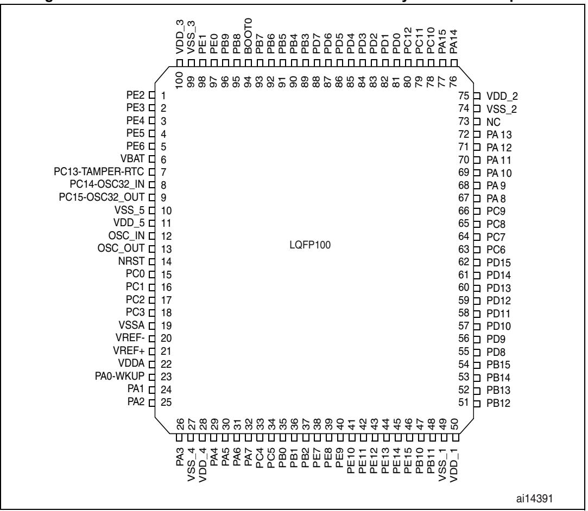


<span id="page-25-0"></span>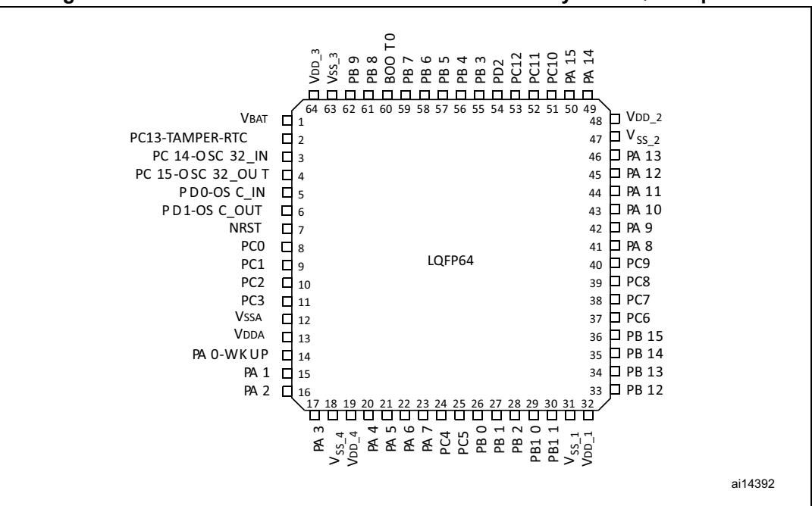

**Figure 4. STM32F105xx and STM32F107xx connectivity line LQFP64 pinout**


<span id="page-26-0"></span>

| Pins   |        |         |                       |         |                |                                      | Alternate functions(4)                                    |       |  |
|--------|--------|---------|-----------------------|---------|----------------|--------------------------------------|-----------------------------------------------------------|-------|--|
| BGA100 | LQFP64 | LQFP100 | Pin name              | Type(1) | I / O Level(2) | Main<br>function(3)<br>(after reset) | Default                                                   | Remap |  |
| A3     | -      | 1       | PE2                   | I/O     | FT             | PE2                                  | TRACECK                                                   | -     |  |
| B3     | -      | 2       | PE3                   | I/O     | FT             | PE3                                  | TRACED0                                                   | -     |  |
| C3     | -      | 3       | PE4                   | I/O     | FT             | PE4                                  | TRACED1                                                   | -     |  |
| D3     | -      | 4       | PE5                   | I/O     | FT             | PE5                                  | TRACED2                                                   | -     |  |
| E3     | -      | 5       | PE6                   | I/O     | FT             | PE6                                  | TRACED3                                                   | -     |  |
| B2     | 1      | 6       | VBAT                  | S       | -              | VBAT                                 | -                                                         | -     |  |
| A2     | 2      | 7       | PC13-TAMPER<br>RTC(5) | I/O     | -              | PC13(6)                              | TAMPER-RTC                                                | -     |  |
| A1     | 3      | 8       | PC14-<br>OSC32_IN(5)  | I/O     | -              | PC14(6)                              | OSC32_IN                                                  | -     |  |
| B1     | 4      | 9       | PC15-<br>OSC32_OUT(5) | I/O     | -              | PC15(6)                              | OSC32_OUT                                                 | -     |  |
| C2     | -      | 10      | VSS_5                 | S       | -              | VSS_5                                | -                                                         | -     |  |
| D2     | -      | 11      | VDD_5                 | S       | -              | VDD_5                                | -                                                         | -     |  |
| C1     | 5      | 12      | OSC_IN                | I       | -              | OSC_IN                               | -                                                         | -     |  |
| D1     | 6      | 13      | OSC_OUT               | O       | -              | OSC_OUT                              | -                                                         | -     |  |
| E1     | 7      | 14      | NRST                  | I/O     | -              | NRST                                 | -                                                         | -     |  |
| F1     | 8      | 15      | PC0                   | I/O     | -              | PC0                                  | ADC12_IN10                                                | -     |  |
| F2     | 9      | 16      | PC1                   | I/O     | -              | PC1                                  | ADC12_IN11/ ETH_MII_MDC/<br>ETH_RMII_MDC                  | -     |  |
| E2     | 10     | 17      | PC2                   | I/O     | -              | PC2                                  | ADC12_IN12/ ETH_MII_TXD2                                  | -     |  |
| F3     | 11     | 18      | PC3                   | I/O     | -              | PC3                                  | ADC12_IN13/<br>ETH_MII_TX_CLK                             | -     |  |
| G1     | 12     | 19      | VSSA                  | S       | -              | VSSA                                 | -                                                         | -     |  |
| H1     | -      | 20      | VREF-                 | S       | -              | VREF-<br>-                           |                                                           | -     |  |
| J1     | -      | 21      | VREF+                 | S       | -              | VREF+                                | -                                                         |       |  |
| K1     | 13     | 22      | VDDA                  | S       | -              | VDDA                                 | -                                                         | -     |  |
| G2     | 14     | 23      | PA0-WKUP              | I/O     | -              | PA0                                  | WKUP/USART2_CTS(7)<br>ADC12_IN0/TIM2_CH1_ETR<br>TIM5_CH1/ | -     |  |

**Table 5. Pin definitions** 


ETH\_MII\_CRS\_WKUP

|  |  |  | Table 5. Pin definitions (continued) |
|--|--|--|--------------------------------------|
|--|--|--|--------------------------------------|

| Pins   |        |         |          |         |                |                                      | Alternate functions(4)                                                                     |                  |  |
|--------|--------|---------|----------|---------|----------------|--------------------------------------|--------------------------------------------------------------------------------------------|------------------|--|
| BGA100 | LQFP64 | LQFP100 | Pin name | Type(1) | I / O Level(2) | Main<br>function(3)<br>(after reset) | Default                                                                                    | Remap            |  |
| H2     | 15     | 24      | PA1      | I/O     | -              | PA1                                  | USART2_RTS(7)/ ADC12_IN1/<br>TIM5_CH2 /TIM2_CH2(7)/<br>ETH_MII_RX_CLK/<br>ETH_RMII_REF_CLK | -                |  |
| J2     | 16     | 25      | PA2      | I/O     | -              | PA2                                  | USART2_TX(7)/<br>TIM5_CH3/ADC12_IN2/<br>TIM2_CH3 (7)/ ETH_MII_MDIO/<br>ETH_RMII_MDIO       | -                |  |
| K2     | 17     | 26      | PA3      | I/O     | -              | PA3                                  | USART2_RX(7)/<br>TIM5_CH4/ADC12_IN3 /<br>TIM2_CH4(7)/ ETH_MII_COL                          | -                |  |
| E4     | 18     | 27      | VSS_4    | S       | -              | VSS_4                                | -                                                                                          | -                |  |
| F4     | 19     | 28      | VDD_4    | S       | -              | VDD_4                                | -                                                                                          | -                |  |
| G3     | 20     | 29      | PA4      | I/O     | -              | PA4                                  | SPI1_NSS(7)/DAC_OUT1 /<br>USART2_CK(7) / ADC12_IN4                                         | SPI3_NSS/I2S3_WS |  |
| H3     | 21     | 30      | PA5      | I/O     | -              | PA5                                  | SPI1_SCK(7) /<br>DAC_OUT2 / ADC12_IN5                                                      | -                |  |
| J3     | 22     | 31      | PA6      | I/O     | -              | PA6                                  | SPI1_MISO(7)/ADC12_IN6 /<br>TIM3_CH1(7)                                                    | TIM1_BKIN        |  |
| K3     | 23     | 32      | PA7      | I/O     | -              | PA7                                  | SPI1_MOSI(7)/ADC12_IN7 /<br>TIM3_CH2(7)/<br>ETH_MII_RX_DV(8)/<br>ETH_RMII_CRS_DV           | TIM1_CH1N        |  |
| G4     | 24     | 33      | PC4      | I/O     | -              | PC4                                  | ADC12_IN14/<br>ETH_MII_RXD0(8)/<br>ETH_RMII_RXD0                                           | -                |  |
| H4     | 25     | 34      | PC5      | I/O     | -              | PC5                                  | ADC12_IN15/<br>ETH_MII_RXD1(8)/<br>ETH_RMII_RXD1                                           | -                |  |
| J4     | 26     | 35      | PB0      | I/O     | -              | PB0                                  | ADC12_IN8/TIM3_CH3/<br>ETH_MII_RXD2(8)                                                     | TIM1_CH2N        |  |
| K4     | 27     | 36      | PB1      | I/O     | -              | PB1                                  | ADC12_IN9/TIM3_CH4(7)/<br>ETH_MII_RXD3(8)                                                  | TIM1_CH3N        |  |
| G5     | 28     | 37      | PB2      | I/O FT  |                | PB2/BOOT1                            | -                                                                                          | -                |  |
| H5     | -      | 38      | PE7      | I/O FT  |                | PE7                                  | -                                                                                          | TIM1_ETR         |  |
| J5     | -      | 39      | PE8      | I/O FT  |                | PE8                                  | -                                                                                          | TIM1_CH1N        |  |


|  |  |  | Table 5. Pin definitions (continued) |
|--|--|--|--------------------------------------|
|--|--|--|--------------------------------------|

| Pins   |        |         |          |         |                |                                      | Alternate functions(4)                                                                                               |                                                 |  |
|--------|--------|---------|----------|---------|----------------|--------------------------------------|----------------------------------------------------------------------------------------------------------------------|-------------------------------------------------|--|
| BGA100 | LQFP64 | LQFP100 | Pin name | Type(1) | I / O Level(2) | Main<br>function(3)<br>(after reset) | Default                                                                                                              | Remap                                           |  |
| K5     | -      | 40      | PE9      | I/O FT  |                | PE9                                  | -                                                                                                                    | TIM1_CH1                                        |  |
| -      | -      | -       | VSS_7    | S       | -              | -                                    | -                                                                                                                    | -                                               |  |
| -      | -      | -       | VDD_7    | S       | -              | -                                    | -                                                                                                                    | -                                               |  |
| G6     | -      | 41      | PE10     | I/O FT  |                | PE10                                 | -                                                                                                                    | TIM1_CH2N                                       |  |
| H6     | -      | 42      | PE11     | I/O FT  |                | PE11                                 | -                                                                                                                    | TIM1_CH2                                        |  |
| J6     | -      | 43      | PE12     | I/O FT  |                | PE12                                 | -                                                                                                                    | TIM1_CH3N                                       |  |
| K6     | -      | 44      | PE13     | I/O FT  |                | PE13                                 | -                                                                                                                    | TIM1_CH3                                        |  |
| G7     | -      | 45      | PE14     | I/O FT  |                | PE14                                 | -                                                                                                                    | TIM1_CH4                                        |  |
| H7     | -      | 46      | PE15     | I/O FT  |                | PE15                                 | -                                                                                                                    | TIM1_BKIN                                       |  |
| J7     | 29     | 47      | PB10     | I/O FT  |                | PB10                                 | I2C2_SCL(8)/USART3_TX(7)/<br>ETH_MII_RX_ER                                                                           | TIM2_CH3                                        |  |
| K7     | 30     | 48      | PB11     | I/O FT  |                | PB11                                 | I2C2_SDA(8)/USART3_RX(7)/<br>ETH_MII_TX_EN/<br>ETH_RMII_TX_EN                                                        | TIM2_CH4                                        |  |
| E7     | 31     | 49      | VSS_1    | S       | -              | VSS_1                                | -                                                                                                                    | -                                               |  |
| F7     | 32     | 50      | VDD_1    | S       | -              | VDD_1                                | -                                                                                                                    | -                                               |  |
| K8     | 33     | 51      | PB12     | I/O FT  |                | PB12                                 | SPI2_NSS(8)/I2S2_WS(8)/<br>I2C2_SMBA(8) /<br>USART3_CK(7)/ TIM1_BKIN(7) /<br>CAN2_RX/ ETH_MII_TXD0/<br>ETH_RMII_TXD0 | -                                               |  |
| J8     | 34     | 52      | PB13     | I/O FT  |                | PB13                                 | SPI2_SCK(8) / I2S2_CK(8) /<br>USART3_CTS(7)/<br>TIM1_CH1N/CAN2_TX/<br>ETH_MII_TXD1/<br>ETH_RMII_TXD1                 | -                                               |  |
| H8     | 35     | 53      | PB14     | I/O FT  |                | PB14                                 | SPI2_MISO(8) / TIM1_CH2N /<br>USART3_RTS(7)                                                                          | -                                               |  |
| G8     | 36     | 54      | PB15     | I/O FT  |                | PB15                                 | SPI2_MOSI(8) / I2S2_SD(8) /<br>TIM1_CH3N(7)                                                                          | -                                               |  |
| K9     | -      | 55      | PD8      | I/O FT  |                | PD8                                  | -                                                                                                                    | USART3_TX/<br>ETH_MII_RX_DV/<br>ETH_RMII_CRS_DV |  |


| Pins   |        |         |          |         |                |                                      | Alternate functions(4)                               |                                              |  |
|--------|--------|---------|----------|---------|----------------|--------------------------------------|------------------------------------------------------|----------------------------------------------|--|
| BGA100 | LQFP64 | LQFP100 | Pin name | Type(1) | I / O Level(2) | Main<br>function(3)<br>(after reset) | Default                                              | Remap                                        |  |
| J9     | -      | 56      | PD9      |         | I/O FT         | PD9                                  | -                                                    | USART3_RX/<br>ETH_MII_RXD0/<br>ETH_RMII_RXD0 |  |
| H9     | -      | 57      | PD10     |         | I/O FT         | PD10                                 | -                                                    | USART3_CK/<br>ETH_MII_RXD1/<br>ETH_RMII_RXD1 |  |
| G9     | -      | 58      | PD11     |         | I/O FT         | PD11                                 | -                                                    | USART3_CTS/<br>ETH_MII_RXD2                  |  |
| K10    | -      | 59      | PD12     |         | I/O FT         | PD12                                 | -                                                    | TIM4_CH1 /<br>USART3_RTS/<br>ETH_MII_RXD3    |  |
| J10    | -      | 60      | PD13     |         | I/O FT         | PD13                                 | -                                                    | TIM4_CH2                                     |  |
| H10    | -      | 61      | PD14     |         | I/O FT         | PD14                                 | -                                                    | TIM4_CH3                                     |  |
| G10    | -      | 62      | PD15     |         | I/O FT         | PD15                                 | -                                                    | TIM4_CH4                                     |  |
| F10    | 37     | 63      | PC6      |         | I/O FT         | PC6                                  | I2S2_MCK/                                            | TIM3_CH1                                     |  |
| E10    | 38     | 64      | PC7      |         | I/O FT         | PC7                                  | I2S3_MCK                                             | TIM3_CH2                                     |  |
| F9     | 39     | 65      | PC8      |         | I/O FT         | PC8                                  | -                                                    | TIM3_CH3                                     |  |
| E9     | 40     | 66      | PC9      |         | I/O FT         | PC9                                  | -                                                    | TIM3_CH4                                     |  |
| D9     | 41     | 67      | PA8      |         | I/O FT         | PA8                                  | USART1_CK/OTG_FS_SOF /<br>TIM1_CH1(8)/MCO            | -                                            |  |
| C9     | 42     | 68      | PA9      |         | I/O FT         | PA9                                  | USART1_TX(7)/ TIM1_CH2(7)/<br>OTG_FS_VBUS            | -                                            |  |
| D10 43 |        | 69      | PA10     |         | I/O FT         | PA10                                 | USART1_RX(7)/<br>TIM1_CH3(7)/OTG_FS_ID               | -                                            |  |
| C10 44 |        | 70      | PA11     |         | I/O FT         | PA11                                 | USART1_CTS / CAN1_RX /<br>TIM1_CH4(7)/OTG_FS_DM      | -                                            |  |
| B10    | 45     | 71      | PA12     |         | I/O FT         | PA12                                 | USART1_RTS / OTG_FS_DP /<br>CAN1_TX(7) / TIM1_ETR(7) | -                                            |  |
| A10    | 46     | 72      | PA13     |         |                | I/O FT JTMS-SWDIO                    | -                                                    | PA13                                         |  |
| F8     | -      | 73      |          |         |                | Not connected                        |                                                      | -                                            |  |
| E6     | 47     | 74      | VSS_2    | S       | -              | VSS_2                                | -                                                    | -                                            |  |
| F6     | 48     | 75      | VDD_2    | S       | -              | VDD_2                                | -                                                    | -                                            |  |
| A9     | 49     | 76      | PA14     |         |                | I/O FT JTCK-SWCLK                    | -                                                    | PA14                                         |  |

**Table 5. Pin definitions (continued)**


|  |  | Table 5. Pin definitions (continued) |  |
|--|--|--------------------------------------|--|
|--|--|--------------------------------------|--|

|        | Pins   |         |          |         |                |                                      | Alternate functions(4)                                                   |                                        |
|--------|--------|---------|----------|---------|----------------|--------------------------------------|--------------------------------------------------------------------------|----------------------------------------|
| BGA100 | LQFP64 | LQFP100 | Pin name | Type(1) | I / O Level(2) | Main<br>function(3)<br>(after reset) | Default                                                                  | Remap                                  |
| A8     | 50     | 77      | PA15     | I/O FT  |                | JTDI                                 | SPI3_NSS / I2S3_WS                                                       | TIM2_CH1_ETR / PA15<br>SPI1_NSS        |
| B9     | 51     | 78      | PC10     | I/O FT  |                | PC10                                 | UART4_TX                                                                 | USART3_TX/<br>SPI3_SCK/I2S3_CK         |
| B8     | 52     | 79      | PC11     | I/O FT  |                | PC11                                 | UART4_RX                                                                 | USART3_RX/<br>SPI3_MISO                |
| C8     | 53     | 80      | PC12     | I/O FT  |                | PC12                                 | UART5_TX                                                                 | USART3_CK/<br>SPI3_MOSI/I2S3_SD        |
| D8     | -      | 81      | PD0      | I/O FT  |                | PD0                                  | -                                                                        | OSC_IN(9)/CAN1_RX                      |
| E8     | -      | 82      | PD1      | I/O FT  |                | PD1                                  | -                                                                        | OSC_OUT(9)/CAN1_TX                     |
| B7     | 54     | 83      | PD2      | I/O FT  |                | PD2                                  | TIM3_ETR / UART5_RX                                                      |                                        |
| C7     | -      | 84      | PD3      | I/O FT  |                | PD3                                  | -                                                                        | USART2_CTS                             |
| D7     | -      | 85      | PD4      | I/O FT  |                | PD4                                  | -                                                                        | USART2_RTS                             |
| B6     | -      | 86      | PD5      | I/O FT  |                | PD5                                  | -                                                                        | USART2_TX                              |
| C6     | -      | 87      | PD6      | I/O FT  |                | PD6                                  | -                                                                        | USART2_RX                              |
| D6     | -      | 88      | PD7      | I/O FT  |                | PD7                                  | -                                                                        | USART2_CK                              |
| A7     | 55     | 89      | PB3      | I/O FT  |                | JTDO                                 | SPI3_SCK / I2S3_CK                                                       | PB3 / TRACESWO/<br>TIM2_CH2 / SPI1_SCK |
| A6     | 56     | 90      | PB4      | I/O FT  |                | NJTRST                               | SPI3_MISO                                                                | PB4 / TIM3_CH1/<br>SPI1_MISO           |
| C5     | 57     | 91      | PB5      | I/O     | -              | PB5                                  | I2C1_SMBA / SPI3_MOSI /<br>ETH_MII_PPS_OUT / I2S3_SD<br>ETH_RMII_PPS_OUT | TIM3_CH2/SPI1_MOSI/<br>CAN2_RX         |
| B5     | 58     | 92      | PB6      | I/O FT  |                | PB6                                  | I2C1_SCL(7)/TIM4_CH1(7)                                                  | USART1_TX/CAN2_TX                      |
| A5     | 59     | 93      | PB7      | I/O FT  |                | PB7                                  | I2C1_SDA(7)/TIM4_CH2(7)                                                  | USART1_RX                              |
| D5     | 60     | 94      | BOOT0    | I       | -              | BOOT0                                | -                                                                        | -                                      |
| B4     | 61     | 95      | PB8      | I/O FT  |                | PB8                                  | TIM4_CH3(7)/ ETH_MII_TXD3                                                | I2C1_SCL/CAN1_RX                       |
| A4     | 62     | 96      | PB9      | I/O FT  |                | PB9                                  | TIM4_CH4(7)                                                              | I2C1_SDA / CAN1_TX                     |
| D4     | -      | 97      | PE0      | I/O FT  |                | PE0                                  | TIM4_ETR                                                                 | -                                      |
| C4     | -      | 98      | PE1      | I/O FT  |                | PE1                                  | -                                                                        | -                                      |
| E5     | 63     | 99      | VSS_3    | S       | -              | VSS_3                                | -                                                                        | -                                      |
| F5     | 64     | 100     | VDD_3    | S       | -              | VDD_3                                | -                                                                        | -                                      |


DocID15274 Rev 10 31/108

- 1. I = input, O = output, S = supply, HiZ = high impedance.
- 2. FT = 5 V tolerant. All I/Os are VDD capable.
- 3. Function availability depends on the chosen device.
- 4. If several peripherals share the same I/O pin, to avoid conflict between these alternate functions only one peripheral should be enabled at a time through the peripheral clock enable bit (in the corresponding RCC peripheral clock enable register).
- 5. PC13, PC14 and PC15 are supplied through the power switch, and so their use in output mode is limited: they can be used only in output 2 MHz mode with a maximum load of 30 pF and only one pin can be put in output mode at a time.
- <span id="page-31-0"></span>6. Main function after the first backup domain power-up. Later on, it depends on the contents of the Backup registers even after reset (because these registers are not reset by the main reset). For details on how to manage these IOs, refer to the Battery backup domain and BKP register description sections in the STM32F10xxx reference manual, available from the STMicroelectronics website: *www.st.com*.
- <span id="page-31-1"></span>7. This alternate function can be remapped by software to some other port pins (if available on the used package). For more details, refer to the Alternate function I/O and debug configuration section in the STM32F10xxx reference manual, available from the STMicroelectronics website: *www.st.com*.
- 8. SPI2/I2S2 and I2C2 are not available when the Ethernet is being used.
- 9. For the LQFP64 package, the pins number 5 and 6 are configured as OSC\_IN/OSC\_OUT after reset, however the functionality of PD0 and PD1 can be remapped by software on these pins. For the LQFP100 and BGA100 packages, PD0 and PD1 are available by default, so there is no need for remapping. For more details, refer to Alternate function I/O and debug configuration section in the STM32F10xxx reference manual.


# <span id="page-32-0"></span>**4 Memory mapping**

The memory map is shown in *[Figure 5](#page-32-1)*.

<span id="page-32-1"></span>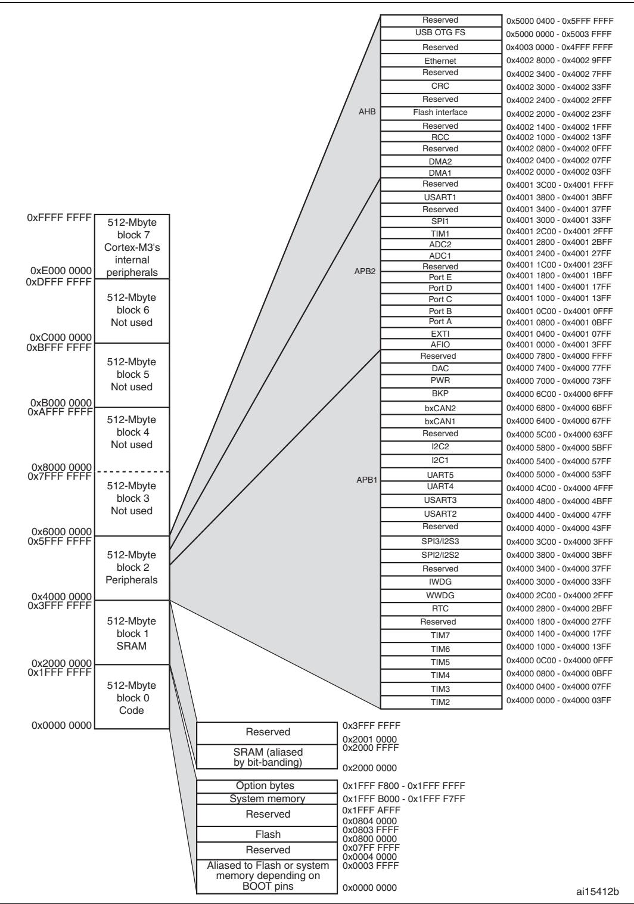

**Figure 5. Memory map**


DocID15274 Rev 10 33/108

# <span id="page-33-0"></span>**5 Electrical characteristics**

## <span id="page-33-1"></span>**5.1 Parameter conditions**

Unless otherwise specified, all voltages are referenced to VSS.

### <span id="page-33-2"></span>**5.1.1 Minimum and maximum values**

Unless otherwise specified the minimum and maximum values are guaranteed in the worst conditions of ambient temperature, supply voltage and frequencies by tests in production on 100% of the devices with an ambient temperature at TA = 25 °C and TA = TAmax (given by the selected temperature range).

Data based on characterization results, design simulation and/or technology characteristics are indicated in the table footnotes and are not tested in production. Based on characterization, the minimum and maximum values refer to sample tests and represent the mean value plus or minus three times the standard deviation (mean±3Σ).

### <span id="page-33-3"></span>**5.1.2 Typical values**

Unless otherwise specified, typical data are based on TA = 25 °C, VDD = 3.3 V (for the 2 V ≤VDD ≤3.6 V voltage range). They are given only as design guidelines and are not tested.

Typical ADC accuracy values are determined by characterization of a batch of samples from a standard diffusion lot over the full temperature range, where 95% of the devices have an error less than or equal to the value indicated (mean±2Σ).

### <span id="page-33-4"></span>**5.1.3 Typical curves**

Unless otherwise specified, all typical curves are given only as design guidelines and are not tested.

### <span id="page-33-5"></span>**5.1.4 Loading capacitor**

The loading conditions used for pin parameter measurement are shown in *[Figure 6](#page-33-7)*.

### <span id="page-33-6"></span>**5.1.5 Pin input voltage**

<span id="page-33-8"></span>The input voltage measurement on a pin of the device is described in *[Figure 7](#page-33-8)*.

<span id="page-33-7"></span>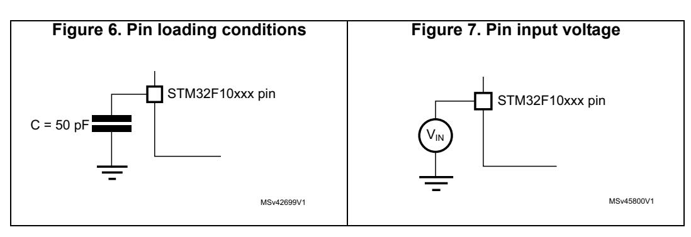


### <span id="page-34-0"></span>**5.1.6 Power supply scheme**

<span id="page-34-2"></span>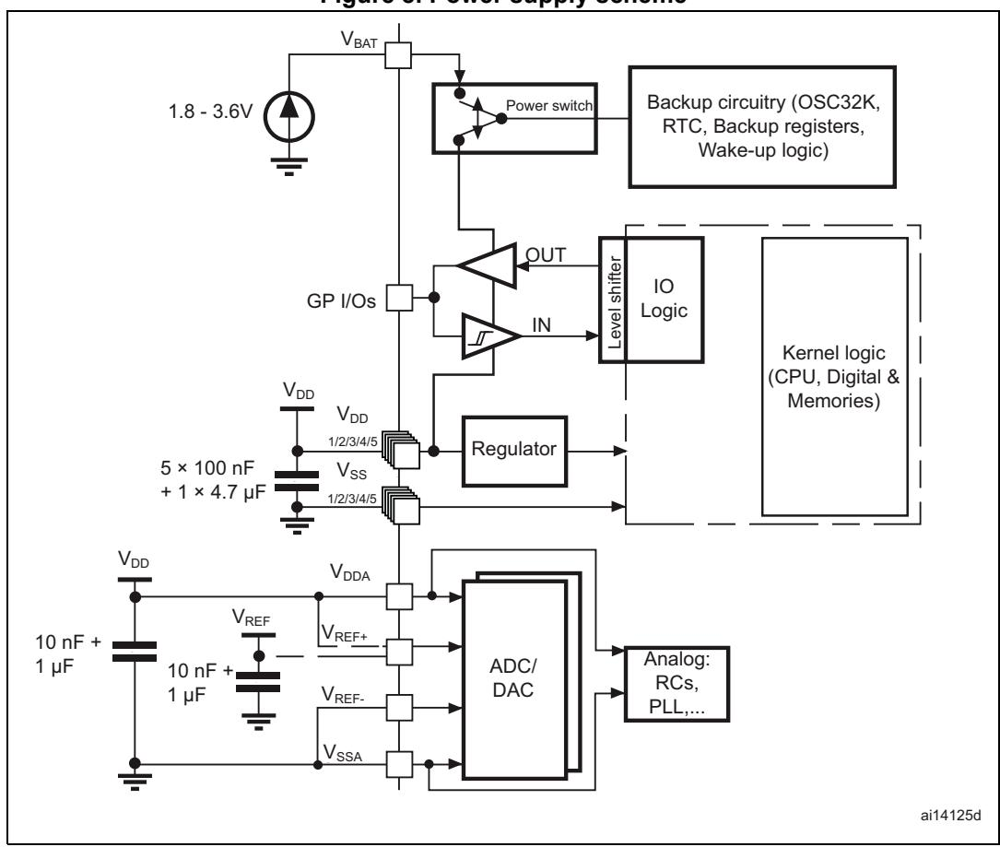

**Figure 8. Power supply scheme**


### <span id="page-34-1"></span>**5.1.7 Current consumption measurement**


<span id="page-34-3"></span>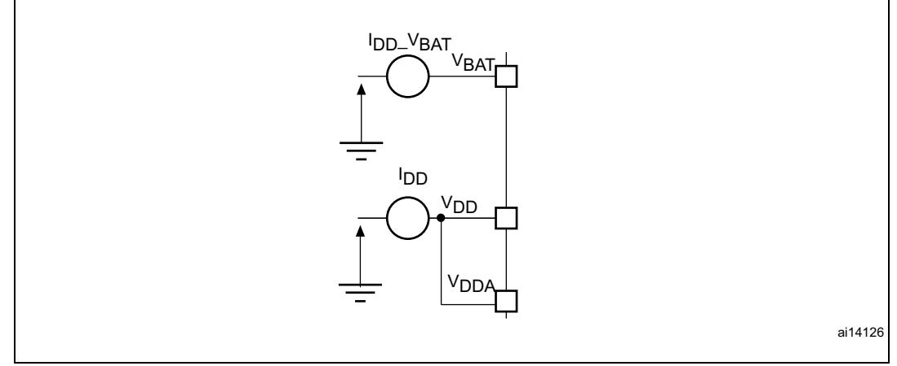


## <span id="page-35-0"></span>**5.2 Absolute maximum ratings**

Stresses above the absolute maximum ratings listed in *[Table 6: Voltage characteristics](#page-35-1)*, *[Table 7: Current characteristics](#page-35-2)*, and *[Table 8: Thermal characteristics](#page-36-2)* may cause permanent damage to the device. These are stress ratings only and functional operation of the device at these conditions is not implied. Exposure to maximum rating conditions for extended periods may affect device reliability.

<span id="page-35-1"></span>

| Symbol    | Ratings                                                         | Min                                                                         | Max       | Unit |
|-----------|-----------------------------------------------------------------|-----------------------------------------------------------------------------|-----------|------|
| VDD–VSS   | External main supply voltage (including VDDA<br>(1)<br>and VDD) | –0.3                                                                        | 4.0       | V    |
| VIN(2)    | Input voltage on five volt tolerant pin                         | VSS − 0.3                                                                   | VDD + 4.0 |      |
|           | Input voltage on any other pin                                  | VSS<br>−0.3                                                                 | 4.0       |      |
| ΔVDDx     | Variations between different VDD power pins                     | -                                                                           | 50        | mV   |
| VSSX −VSS | Variations between all the different ground pins                | -                                                                           | 50        |      |
| VESD(HBM) | Electrostatic discharge voltage (human body<br>model)           | see Section 5.3.11:<br>Absolute maximum ratings<br>(electrical sensitivity) |           | -    |

|  |  |  | Table 6. Voltage characteristics |
|--|--|--|----------------------------------|
|--|--|--|----------------------------------|

1. All main power (VDD, VDDA) and ground (VSS, VSSA) pins must always be connected to the external power supply, in the permitted range.

2. VIN maximum must always be respected. Refer to *[Table 7: Current characteristics](#page-35-2)* for the maximum allowed injected current values.

<span id="page-35-2"></span>

| Symbol       | Ratings                                                     | Max.  | Unit |
|--------------|-------------------------------------------------------------|-------|------|
| IVDD         | Total current into VDD/VDDA power lines (source)(1)         | 150   |      |
| IVSS         | Total current out of VSS ground lines (sink)(1)             | 150   |      |
| IIO          | Output current sunk by any I/O and control pin              | 25    |      |
|              | Output current source by any I/Os and control pin           | − 25  | mA   |
| IINJ(PIN)(2) | Injected current on five volt tolerant pins(3)              | -5/+0 |      |
|              | Injected current on any other pin(4)                        | ± 5   |      |
| ΣIINJ(PIN)   | Total injected current (sum of all I/O and control pins)(5) | ± 25  |      |

#### **Table 7. Current characteristics**

1. All main power (VDD, VDDA) and ground (VSS, VSSA) pins must always be connected to the external power supply, in the permitted range.

2. Negative injection disturbs the analog performance of the device. See *Note: on page 76*.

3. Positive injection is not possible on these I/Os. A negative injection is induced by VIN<VSS. IINJ(PIN) must never be exceeded. Refer to *[Table 6: Voltage characteristics](#page-35-1)* for the maximum allowed input voltage values.

4. A positive injection is induced by VIN>VDD while a negative injection is induced by VIN<VSS. IINJ(PIN) must never be exceeded. Refer to *[Table 6: Voltage characteristics](#page-35-1)* for the maximum allowed input voltage values.

5. When several inputs are submitted to a current injection, the maximum ΣIINJ(PIN) is the absolute sum of the positive and negative injected currents (instantaneous values).


<span id="page-36-2"></span>

| Symbol | Ratings                      |             | Unit |  |
|--------|------------------------------|-------------|------|--|
| TSTG   | Storage temperature range    | –65 to +150 | °C   |  |
| TJ     | Maximum junction temperature | 150         | °C   |  |

#### **Table 8. Thermal characteristics**

## <span id="page-36-0"></span>**5.3 Operating conditions**

### <span id="page-36-1"></span>**5.3.1 General operating conditions**

<span id="page-36-3"></span>

| Symbol  | Parameter                                            | Conditions                              | Min | Max | Unit |  |
|---------|------------------------------------------------------|-----------------------------------------|-----|-----|------|--|
| fHCLK   | Internal AHB clock frequency                         | -                                       | 0   | 72  |      |  |
| fPCLK1  | Internal APB1 clock frequency                        | -                                       | 0   | 36  | MHz  |  |
| fPCLK2  | Internal APB2 clock frequency                        | -                                       | 0   | 72  |      |  |
| VDD     | Standard operating voltage                           | -                                       | 2   | 3.6 | V    |  |
| VDDA(1) | Analog operating voltage<br>(ADC not used)           | Must be the same potential<br>as VDD(2) | 2   | 3.6 | V    |  |
|         | Analog operating voltage<br>(ADC used)               |                                         | 2.4 | 3.6 |      |  |
| VBAT    | Backup operating voltage                             | -                                       | 1.8 | 3.6 | V    |  |
|         | Power dissipation at TA<br>=                         | LFBGA100                                | -   | 500 | mW   |  |
| PD      | 85 °C for suffix 6 or TA =                           | LQFP100                                 | -   | 434 |      |  |
|         | 105 °C for suffix 7(3)                               | LQFP64                                  | -   | 444 |      |  |
| PD      | Power dissipation at TA<br>=                         | LQFP100                                 | -   | 434 | mW   |  |
|         | 85 °C for suffix 6 or TA =<br>105 °C for suffix 7(4) | LQFP64                                  | -   | 444 |      |  |
| TA      | Ambient temperature for 6                            | Maximum power dissipation               | –40 | 85  |      |  |
|         | suffix version                                       | Low power dissipation(5)                | –40 | 105 | °C   |  |
|         | Ambient temperature for 7                            | Maximum power dissipation               | –40 | 105 |      |  |
|         | suffix version                                       | Low power dissipation(5)                | –40 | 125 | °C   |  |
| TJ      |                                                      | 6 suffix version                        | –40 | 105 | °C   |  |
|         | Junction temperature range                           | 7 suffix version                        | –40 | 125 |      |  |

#### **Table 9. General operating conditions**

1. When the ADC is used, refer to *[Table 52: ADC characteristics](#page-73-2)*.

2. It is recommended to power VDD and VDDA from the same source. A maximum difference of 300 mV between VDD and VDDA can be tolerated during power-up and operation.

3. If TA is lower, higher PD values are allowed as long as TJ does not exceed TJmax.

4. If TA is lower, higher PD values are allowed as long as TJ does not exceed TJmax.

5. In low power dissipation state, TA can be extended to this range as long as TJ does not exceed TJmax.


### <span id="page-37-0"></span>**5.3.2 Operating conditions at power-up / power-down**

Subject to general operating conditions for TA.

<span id="page-37-2"></span>

| Symbol | Parameter          | Condition | Min | Max | Unit |  |
|--------|--------------------|-----------|-----|-----|------|--|
| tVDD   | VDD rise time rate |           | 0   | -   |      |  |
| TJ     | VDD fall time rate | -         | 20  | -   | µs/V |  |

**Table 10. Operating condition at power-up / power down**

### <span id="page-37-1"></span>**5.3.3 Embedded reset and power control block characteristics**

The parameters given in *[Table 11](#page-37-3)* are derived from tests performed under ambient temperature and VDD supply voltage conditions summarized in *[Table 9](#page-36-3)*.

<span id="page-37-3"></span>

| Symbol       | Parameter                                        | Conditions                  | Min    | Typ  | Max  | Unit |
|--------------|--------------------------------------------------|-----------------------------|--------|------|------|------|
|              |                                                  | PLS[2:0]=000 (rising edge)  | 2.1    | 2.18 | 2.26 | V    |
|              |                                                  | PLS[2:0]=000 (falling edge) | 2      | 2.08 | 2.16 | V    |
|              |                                                  | PLS[2:0]=001 (rising edge)  | 2.19   | 2.28 | 2.37 | V    |
|              |                                                  | PLS[2:0]=001 (falling edge) | 2.09   | 2.18 | 2.27 | V    |
|              |                                                  | PLS[2:0]=010 (rising edge)  | 2.28   | 2.38 | 2.48 | V    |
|              | Programmable voltage<br>detector level selection | PLS[2:0]=010 (falling edge) | 2.18   | 2.28 | 2.38 | V    |
|              |                                                  | PLS[2:0]=011 (rising edge)  | 2.38   | 2.48 | 2.58 | V    |
| VPVD         |                                                  | PLS[2:0]=011 (falling edge) | 2.28   | 2.38 | 2.48 | V    |
|              |                                                  | PLS[2:0]=100 (rising edge)  | 2.47   | 2.58 | 2.69 | V    |
|              |                                                  | PLS[2:0]=100 (falling edge) | 2.37   | 2.48 | 2.59 | V    |
|              |                                                  | PLS[2:0]=101 (rising edge)  | 2.57   | 2.68 | 2.79 | V    |
|              |                                                  | PLS[2:0]=101 (falling edge) | 2.47   | 2.58 | 2.69 | V    |
|              |                                                  | PLS[2:0]=110 (rising edge)  | 2.66   | 2.78 | 2.9  | V    |
|              |                                                  | PLS[2:0]=110 (falling edge) | 2.56   | 2.68 | 2.8  | V    |
|              |                                                  | PLS[2:0]=111 (rising edge)  | 2.76   | 2.88 | 3    | V    |
|              |                                                  | PLS[2:0]=111 (falling edge) | 2.66   | 2.78 | 2.9  | V    |
| VPVDhyst(2)  | PVD hysteresis                                   | -                           | -      | 100  | -    | mV   |
| VPOR/PDR     | Power on/power down                              | Falling edge                | 1.8(1) | 1.88 | 1.96 | V    |
|              | reset threshold                                  | Rising edge                 | 1.84   | 1.92 | 2.0  | V    |
| VPDRhyst(2)  | PDR hysteresis                                   | -                           | -      | 40   | -    | mV   |
| TRSTTEMPO(2) | Reset temporization                              | -                           | 1      | 2.5  | 4.5  | ms   |

**Table 11. Embedded reset and power control block characteristics**

1. The product behavior is guaranteed by design down to the minimum VPOR/PDR value.

2. Guaranteed by design, not tested in production.

38/108 DocID15274 Rev 10


### <span id="page-38-0"></span>**5.3.4 Embedded reference voltage**

The parameters given in *[Table 12](#page-38-2)* are derived from tests performed under ambient temperature and VDD supply voltage conditions summarized in *[Table 9](#page-36-3)*.

<span id="page-38-2"></span>

| Symbol        | Parameter                                                           | Conditions            | Min  | Typ  | Max     | Unit   |
|---------------|---------------------------------------------------------------------|-----------------------|------|------|---------|--------|
| VREFINT       | Internal reference voltage                                          | –40 °C < TA < +105 °C | 1.16 | 1.20 | 1.26    | V      |
|               |                                                                     | –40 °C < TA < +85 °C  | 1.16 | 1.20 | 1.24    | V      |
| TS_vrefint(1) | ADC sampling time when<br>reading the internal reference<br>voltage | -                     | -    | 5.1  | 17.1(2) | µs     |
| VRERINT(2)    | Internal reference voltage<br>spread over the temperature<br>range  | VDD = 3 V ±10 mV      | -    | -    | 10      | mV     |
| TCoeff(2)     | Temperature coefficient                                             | -                     | -    | -    | 100     | ppm/°C |

**Table 12. Embedded internal reference voltage**

1. Shortest sampling time can be determined in the application by multiple iterations.

2. Guaranteed by design, not tested in production.

### <span id="page-38-1"></span>**5.3.5 Supply current characteristics**

The current consumption is a function of several parameters and factors such as the operating voltage, ambient temperature, I/O pin loading, device software configuration, operating frequencies, I/O pin switching rate, program location in memory and executed binary code.

The current consumption is measured as described in *[Figure 9: Current consumption](#page-34-3)  [measurement scheme](#page-34-3)*.

All Run-mode current consumption measurements given in this section are performed with a reduced code that gives a consumption equivalent to Dhrystone 2.1 code.

#### **Maximum current consumption**

The MCU is placed under the following conditions:

- All I/O pins are in input mode with a static value at VDD or VSS (no load)
- All peripherals are disabled except when explicitly mentioned
- The Flash memory access time is adjusted to the fHCLK frequency (0 wait state from 0 to 24 MHz, 1 wait state from 24 to 48 MHz and 2 wait states above)
- Prefetch in ON (reminder: this bit must be set before clock setting and bus prescaling)
- When the peripherals are enabled fPCLK1 = fHCLK/2, fPCLK2 = fHCLK

The parameters given in *[Table 13](#page-39-0)*, *[Table 14](#page-39-1)* and *[Table 15](#page-40-0)* are derived from tests performed under ambient temperature and VDD supply voltage conditions summarized in *[Table 9](#page-36-3)*.


|        |                               | Conditions                                     | fHCLK  | Max(1)     |             |      |
|--------|-------------------------------|------------------------------------------------|--------|------------|-------------|------|
| Symbol | Parameter                     |                                                |        | TA = 85 °C | TA = 105 °C | Unit |
| IDD    | Supply current in<br>Run mode | External clock(2), all<br>peripherals enabled  | 72 MHz | 68         | 68.4        |      |
|        |                               |                                                | 48 MHz | 49         | 49.2        |      |
|        |                               |                                                | 36 MHz | 38.7       | 38.9        | mA   |
|        |                               |                                                | 24 MHz | 27.3       | 27.9        |      |
|        |                               |                                                | 16 MHz | 20.2       | 20.5        |      |
|        |                               |                                                | 8 MHz  | 10.2       | 10.8        |      |
|        |                               | External clock(2), all<br>peripherals disabled | 72 MHz | 32.7       | 32.9        |      |
|        |                               |                                                | 48 MHz | 25         | 25.2        |      |
|        |                               |                                                | 36 MHz | 20.3       | 20.6        |      |
|        |                               |                                                | 24 MHz | 14.8       | 15.1        |      |
|        |                               |                                                | 16 MHz | 11.2       | 11.7        |      |
|        |                               |                                                | 8 MHz  | 6.6        | 7.2         |      |

#### <span id="page-39-0"></span>**Table 13. Maximum current consumption in Run mode, code with data processing running from Flash**

1. Based on characterization, not tested in production.

<span id="page-39-2"></span>2. External clock is 8 MHz and PLL is on when fHCLK > 8 MHz.

<span id="page-39-1"></span>

| Table 14. Maximum current consumption in Run mode, code with data processing |  |  |  |  |  |
|------------------------------------------------------------------------------|--|--|--|--|--|
| running from RAM                                                             |  |  |  |  |  |

|        |                                  | Conditions                                     | fHCLK  | Max(1)     |             |      |
|--------|----------------------------------|------------------------------------------------|--------|------------|-------------|------|
| Symbol | Parameter                        |                                                |        | TA = 85 °C | TA = 105 °C | Unit |
| IDD    | Supply<br>current in<br>Run mode | External clock(2), all<br>peripherals enabled  | 72 MHz | 65.5       | 66          |      |
|        |                                  |                                                | 48 MHz | 45.4       | 46          |      |
|        |                                  |                                                | 36 MHz | 35.5       | 36.1        |      |
|        |                                  |                                                | 24 MHz | 25.2       | 25.6        |      |
|        |                                  |                                                | 16 MHz | 18         | 18.5        |      |
|        |                                  |                                                | 8 MHz  | 10.5       | 11          |      |
|        |                                  | External clock(2), all<br>peripherals disabled | 72 MHz | 31.4       | 31.9        | mA   |
|        |                                  |                                                | 48 MHz | 27.8       | 28.2        |      |
|        |                                  |                                                | 36 MHz | 17.6       | 18.3        |      |
|        |                                  |                                                | 24 MHz | 13.1       | 13.8        |      |
|        |                                  |                                                | 16 MHz | 10.2       | 10.9        |      |
|        |                                  |                                                | 8 MHz  | 6.1        | 7.8         |      |

1. Based on characterization, tested in production at VDD max, fHCLK max..

<span id="page-39-3"></span>2. External clock is 8 MHz and PLL is on when fHCLK > 8 MHz.


<span id="page-40-0"></span>

| Symbol |                   | Conditions                                     | fHCLK  | Max(1)     |             |      |
|--------|-------------------|------------------------------------------------|--------|------------|-------------|------|
|        | Parameter         |                                                |        | TA = 85 °C | TA = 105 °C | Unit |
| IDD    | Supply current in | External clock(2), all<br>peripherals enabled  | 72 MHz | 48.4       | 49          |      |
|        |                   |                                                | 48 MHz | 33.9       | 34.4        |      |
|        |                   |                                                | 36 MHz | 26.7       | 27.2        |      |
|        |                   |                                                | 24 MHz | 19.3       | 19.8        |      |
|        |                   |                                                | 16 MHz | 14.2       | 14.8        |      |
|        |                   |                                                | 8 MHz  | 8.7        | 9.1         |      |
|        | Sleep mode        |                                                | 72 MHz | 10.1       | 10.6        | mA   |
|        |                   |                                                | 48 MHz | 8.3        | 8.75        |      |
|        |                   | External clock(2), all<br>peripherals disabled | 36 MHz | 7.5        | 8           |      |
|        |                   |                                                | 24 MHz | 6.6        | 7.1         |      |
|        |                   |                                                | 16 MHz | 6          | 6.5         |      |
|        |                   |                                                | 8 MHz  | 2.5        | 3           |      |

#### **Table 15. Maximum current consumption in Sleep mode, code running from Flash or RAM**

1. Based on characterization, tested in production at VDD max and fHCLK max with peripherals enabled.

<span id="page-40-2"></span>2. External clock is 8 MHz and PLL is on when fHCLK > 8 MHz.

<span id="page-40-1"></span>

| Symbol   |                                      | Conditions                                                                                                                                     | Typ(1)              |                     |                     | Max           |                |      |
|----------|--------------------------------------|------------------------------------------------------------------------------------------------------------------------------------------------|---------------------|---------------------|---------------------|---------------|----------------|------|
|          | Parameter                            |                                                                                                                                                | VDD/VBAT<br>= 2.0 V | VDD/VBAT<br>= 2.4 V | VDD/VBAT<br>= 3.3 V | TA =<br>85 °C | TA =<br>105 °C | Unit |
| IDD      | Supply current<br>in Stop mode       | Regulator in Run mode, low-speed<br>and high-speed internal RC<br>oscillators and high-speed oscillator<br>OFF (no independent watchdog)       | -                   | 32                  | 33                  | 600           | 1300           |      |
|          |                                      | Regulator in Low Power mode, low<br>speed and high-speed internal RC<br>oscillators and high-speed oscillator<br>OFF (no independent watchdog) | -                   | 25                  | 26                  | 590           | 1280           |      |
|          | Supply current<br>in Standby<br>mode | Low-speed internal RC oscillator and<br>independent watchdog ON                                                                                | -                   | 3                   | 3.8                 | -             | -              | µA   |
|          |                                      | Low-speed internal RC oscillator<br>ON, independent watchdog OFF                                                                               | -                   | 2.8                 | 3.6                 | -             | -              |      |
|          |                                      | Low-speed internal RC oscillator and<br>independent watchdog OFF, low<br>speed oscillator and RTC OFF                                          | -                   | 1.9                 | 2.1                 | 5(2)          | 6.5(2)         |      |
| IDD_VBAT | Backup<br>domain supply<br>current   | Low-speed oscillator and RTC ON                                                                                                                | 1.1                 | 1.2                 | 1.4                 | 2.1(2)        | 2.3(2)         |      |

#### **Table 16. Typical and maximum current consumptions in Stop and Standby modes**

1. Typical values are measured at TA = 25 °C.

2. Based on characterization, not tested in production.


<span id="page-41-0"></span>**Figure 10. Typical current consumption on VBAT with RTC on vs. temperature at different VBAT values**

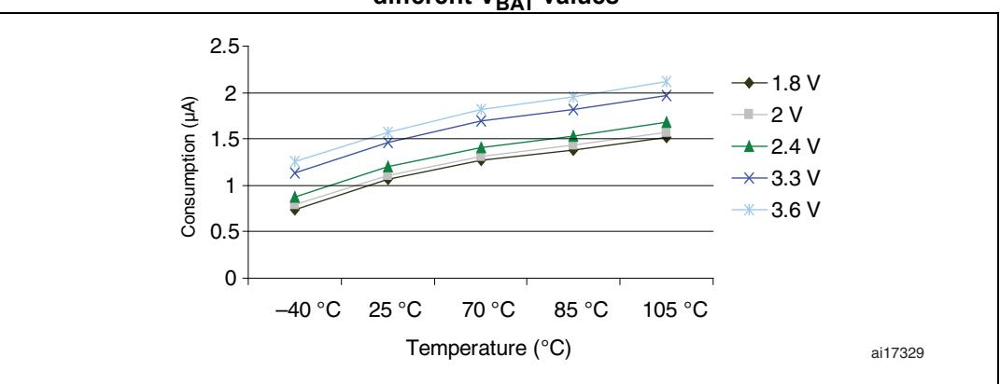

<span id="page-41-1"></span>**Figure 11. Typical current consumption in Stop mode with regulator in Run mode versus temperature at different VDD values**

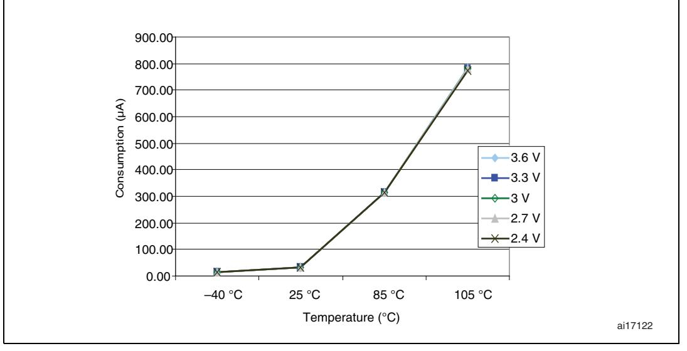


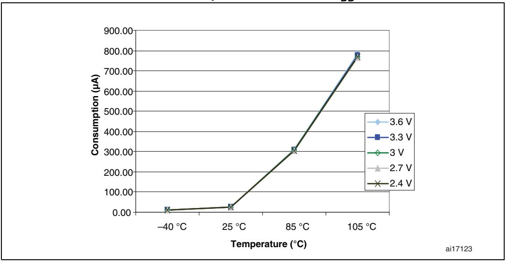

<span id="page-42-0"></span>**Figure 12. Typical current consumption in Stop mode with regulator in Low-power mode versus temperature at different VDD values**

<span id="page-42-1"></span>**Figure 13. Typical current consumption in Standby mode versus temperature at different VDD values**

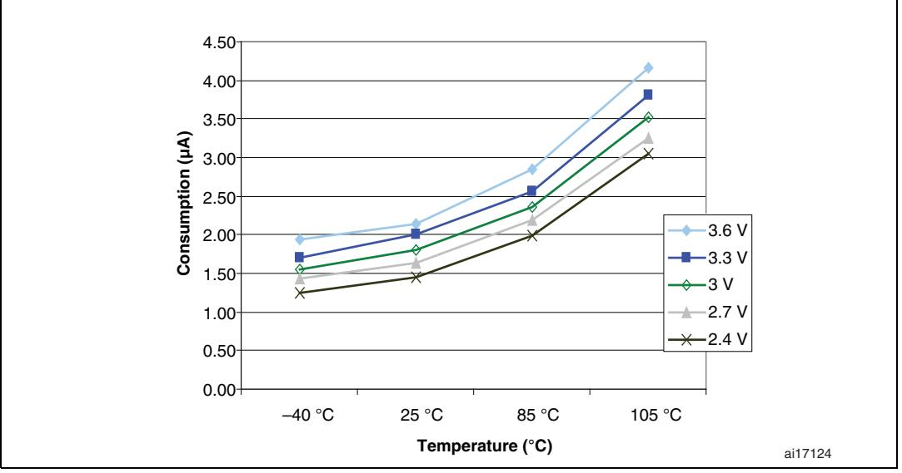

### **Typical current consumption**

The MCU is placed under the following conditions:

- All I/O pins are in input mode with a static value at VDD or VSS (no load).
- All peripherals are disabled except if it is explicitly mentioned.
- The Flash access time is adjusted to fHCLK frequency (0 wait state from 0 to 24 MHz, 1 wait state from 24 to 48 MHz and 2 wait states above).
- Ambient temperature and VDD supply voltage conditions summarized in *[Table 9](#page-36-3)*.
- Prefetch is ON (Reminder: this bit must be set before clock setting and bus prescaling)

When the peripherals are enabled fPCLK1 = fHCLK/4, fPCLK2 = fHCLK/2, fADCCLK = fPCLK2/4


| Symbol | Parameter                        | Conditions                                                                                         | fHCLK   | Typ(1)                        |                             |      |
|--------|----------------------------------|----------------------------------------------------------------------------------------------------|---------|-------------------------------|-----------------------------|------|
|        |                                  |                                                                                                    |         | All peripherals<br>enabled(2) | All peripherals<br>disabled | Unit |
|        | Supply<br>current in<br>Run mode | External clock(3)                                                                                  | 72 MHz  | 47.3                          | 28.3                        | mA   |
|        |                                  |                                                                                                    | 48 MHz  | 32                            | 19.6                        |      |
|        |                                  |                                                                                                    | 36 MHz  | 24.6                          | 15.4                        |      |
|        |                                  |                                                                                                    | 24 MHz  | 16.8                          | 10.6                        |      |
|        |                                  |                                                                                                    | 16 MHz  | 11.8                          | 7.4                         |      |
|        |                                  |                                                                                                    | 8 MHz   | 5.9                           | 3.7                         |      |
|        |                                  |                                                                                                    | 4 MHz   | 3.7                           | 2.9                         |      |
|        |                                  |                                                                                                    | 2 MHz   | 2.5                           | 2                           |      |
|        |                                  |                                                                                                    | 1 MHz   | 1.8                           | 1.53                        |      |
| IDD    |                                  |                                                                                                    | 500 kHz | 1.5                           | 1.3                         |      |
|        |                                  |                                                                                                    | 125 kHz | 1.3                           | 1.2                         |      |
|        |                                  | Running on high<br>speed internal RC<br>(HSI), AHB<br>prescaler used to<br>reduce the<br>frequency | 36 MHz  | 23.9                          | 14.8                        | mA   |
|        |                                  |                                                                                                    | 24 MHz  | 16.1                          | 9.7                         |      |
|        |                                  |                                                                                                    | 16 MHz  | 11.1                          | 6.7                         |      |
|        |                                  |                                                                                                    | 8 MHz   | 5.6                           | 3.8                         |      |
|        |                                  |                                                                                                    | 4 MHz   | 3.1                           | 2.1                         |      |
|        |                                  |                                                                                                    | 2 MHz   | 1.8                           | 1.3                         |      |
|        |                                  |                                                                                                    | 1 MHz   | 1.16                          | 0.9                         |      |
|        |                                  |                                                                                                    | 500 kHz | 0.8                           | 0.67                        |      |
|        |                                  |                                                                                                    | 125 kHz | 0.6                           | 0.5                         |      |

<span id="page-43-0"></span>

| Table 17. Typical current consumption in Run mode, code with data processing |
|------------------------------------------------------------------------------|
| running from Flash                                                           |

1. Typical values are measures at TA = 25 °C, VDD = 3.3 V.

2. Add an additional power consumption of 0.8 mA per ADC for the analog part. In applications, this consumption occurs only while the ADC is on (ADON bit is set in the ADC\_CR2 register).

3. External clock is 8 MHz and PLL is on when fHCLK > 8 MHz.


| Symbol | Parameter                          | Conditions                                                                                      | fHCLK   | Typ(1)                        |                             |      |
|--------|------------------------------------|-------------------------------------------------------------------------------------------------|---------|-------------------------------|-----------------------------|------|
|        |                                    |                                                                                                 |         | All peripherals<br>enabled(2) | All peripherals<br>disabled | Unit |
|        | Supply<br>current in<br>Sleep mode | External clock(3)                                                                               | 72 MHz  | 28.2                          | 6                           | mA   |
|        |                                    |                                                                                                 | 48 MHz  | 19                            | 4.2                         |      |
|        |                                    |                                                                                                 | 36 MHz  | 14.7                          | 3.4                         |      |
|        |                                    |                                                                                                 | 24 MHz  | 10.1                          | 2.5                         |      |
|        |                                    |                                                                                                 | 16 MHz  | 6.7                           | 2                           |      |
|        |                                    |                                                                                                 | 8 MHz   | 3.2                           | 1.3                         |      |
|        |                                    |                                                                                                 | 4 MHz   | 2.3                           | 1.2                         |      |
|        |                                    |                                                                                                 | 2 MHz   | 1.7                           | 1.16                        |      |
|        |                                    |                                                                                                 | 1 MHz   | 1.5                           | 1.1                         |      |
|        |                                    |                                                                                                 | 500 kHz | 1.3                           | 1.05                        |      |
| IDD    |                                    |                                                                                                 | 125 kHz | 1.2                           | 1.05                        |      |
|        |                                    | Running on high<br>speed internal RC<br>(HSI), AHB prescaler<br>used to reduce the<br>frequency | 36 MHz  | 13.7                          | 2.6                         |      |
|        |                                    |                                                                                                 | 24 MHz  | 9.3                           | 1.8                         |      |
|        |                                    |                                                                                                 | 16 MHz  | 6.3                           | 1.3                         |      |
|        |                                    |                                                                                                 | 8 MHz   | 2.7                           | 0.6                         |      |
|        |                                    |                                                                                                 | 4 MHz   | 1.6                           | 0.5                         |      |
|        |                                    |                                                                                                 | 2 MHz   | 1                             | 0.46                        |      |
|        |                                    |                                                                                                 | 1 MHz   | 0.8                           | 0.44                        |      |
|        |                                    |                                                                                                 | 500 kHz | 0.6                           | 0.43                        |      |
|        |                                    |                                                                                                 |         | 125 kHz                       | 0.5                         | 0.42 |

<span id="page-44-0"></span>

| Table 18. Typical current consumption in Sleep mode, code running from Flash or |
|---------------------------------------------------------------------------------|
| RAM                                                                             |

1. Typical values are measures at TA = 25 °C, VDD = 3.3 V.

2. Add an additional power consumption of 0.8 mA per ADC for the analog part. In applications, this consumption occurs only while the ADC is on (ADON bit is set in the ADC\_CR2 register).

3. External clock is 8 MHz and PLL is on when fHCLK > 8 MHz.

#### **On-chip peripheral current consumption**

The current consumption of the on-chip peripherals is given in *[Table 19](#page-45-0)*. The MCU is placed under the following conditions:

- all I/O pins are in input mode with a static value at VDD or VSS (no load)
- all peripherals are disabled unless otherwise mentioned
- the given value is calculated by measuring the current consumption
  - with all peripherals clocked off
  - with one peripheral clocked on (with only the clock applied)
- ambient operating temperature and VDD supply voltage conditions summarized in *[Table 6](#page-35-1)*


DocID15274 Rev 10 45/108

<span id="page-45-0"></span>

| Peripheral         |              | Typical consumption at 25 °C | Unit   |  |
|--------------------|--------------|------------------------------|--------|--|
|                    | DMA1         | 14.03                        |        |  |
|                    | DMA2         | 9.31                         |        |  |
|                    | OTG_fs       | 111.11                       | µA/MHz |  |
| AHB (up to 72 MHz) | ETH-MAC      | 56.25                        |        |  |
|                    | CRC          | 1.11                         |        |  |
|                    | BusMatrix(1) | 15.97                        |        |  |
|                    | APB1-Bridge  | 9.72                         |        |  |
|                    | TIM2         | 33.61                        |        |  |
|                    | TIM3         | 33.06                        |        |  |
|                    | TIM4         | 32.50                        |        |  |
|                    | TIM5         | 31.94                        |        |  |
|                    | TIM6         | 6.11                         |        |  |
|                    | TIM7         | 6.11                         |        |  |
|                    | SPI2/I2S2(2) | 7.50                         |        |  |
|                    | SPI3/I2S3(2) | 7.50                         |        |  |
|                    | USART2       | 10.83                        |        |  |
|                    | USART3       | 11.11                        |        |  |
| APB1(up to 36MHz)  | UART4        | 10.83                        | µA/MHz |  |
|                    | UART5        | 10.56                        |        |  |
|                    | I2C1         | 11.39                        |        |  |
|                    | I2C2         | 11.11                        |        |  |
|                    | CAN1         | 19.44                        |        |  |
|                    | CAN2         | 18.33                        |        |  |
|                    | DAC(3)       | 8.61                         |        |  |
|                    | WWDG         | 3.33                         |        |  |
|                    | PWR          | 2.22                         |        |  |
|                    | BKP          | 0.83                         |        |  |
|                    | IWDG         | 3.89                         |        |  |

**Table 19. Peripheral current consumption**


| Peripheral          |             | Typical consumption at 25 °C | Unit   |
|---------------------|-------------|------------------------------|--------|
|                     | APB2-Bridge | 3.47                         | µA/MHz |
|                     | GPIOA       | 6.39                         |        |
|                     | GPIOB       | 6.39                         |        |
|                     | GPIOC       | 6.11                         |        |
|                     | GPIOD       | 6.39                         |        |
| APB2 (up to 72 MHz) | GPIOE       | 6.11                         |        |
|                     | SPI1        | 3.61                         |        |
|                     | USART1      | 12.08                        |        |
|                     | TIM1        | 23.47                        |        |
|                     | ADC1(4)     | 18.21                        |        |

**Table 19. Peripheral current consumption (continued)**

1. The BusMatrix is automatically active when at least one master is ON.(CPU, ETH-MAC, DMA1 or DMA2).

<span id="page-46-2"></span>2. When I2S is enabled we have a consumption add equal to 0, 02 mA.

- 3. When DAC\_OUT1 or DAC\_OUT2 is enabled we have a consumption add equal to 0, 3 mA.
- 4. Specific conditions for measuring ADC current consumption: fHCLK = 56 MHz, fAPB1 = fHCLK/2, fAPB2 = fHCLK, fADCCLK = fAPB2/4. When ADON bit in the ADC\_CR2 register is set to 1, a current consumption of analog part equal to 0.6 mA must be added.

#### <span id="page-46-0"></span>**5.3.6 External clock source characteristics**

#### **High-speed external user clock generated from an external source**

The characteristics given in *[Table 20](#page-46-1)* result from tests performed using an high-speed external clock source, and under ambient temperature and supply voltage conditions summarized in *[Table 9](#page-36-3)*.

<span id="page-46-1"></span>

| Symbol             | Parameter                                  | Conditions          | Min    | Typ | Max    | Unit |  |
|--------------------|--------------------------------------------|---------------------|--------|-----|--------|------|--|
| fHSE_ext           | External user clock source<br>frequency(1) |                     |        | 8   | 50     | MHz  |  |
| VHSEH              | OSC_IN input pin high level voltage        |                     | 0.7VDD | -   | VDD    | V    |  |
| VHSEL              | OSC_IN input pin low level voltage<br>-    |                     | VSS    | -   | 0.3VDD |      |  |
| tw(HSE)<br>tw(HSE) | OSC_IN high or low time(1)                 |                     | 5      | -   | -      | ns   |  |
| tr(HSE)<br>tf(HSE) | OSC_IN rise or fall time(1)                |                     | -      | -   | 20     |      |  |
| Cin(HSE)           | OSC_IN input capacitance(1)                | -                   | -      | 5   | -      | pF   |  |
| DuCy(HSE)          | Duty cycle                                 | -                   | 45     | -   | 55     | %    |  |
| IL                 | OSC_IN Input leakage current               | VSS<br>≤VIN<br>≤VDD | -      | -   | ±1     | µA   |  |

|  |  | Table 20. High-speed external user clock characteristics |
|--|--|----------------------------------------------------------|
|--|--|----------------------------------------------------------|

1. Guaranteed by design, not tested in production.


#### **Low-speed external user clock generated from an external source**

The characteristics given in *[Table 21](#page-47-0)* result from tests performed using an low-speed external clock source, and under ambient temperature and supply voltage conditions summarized in *[Table 9](#page-36-3)*.

<span id="page-47-0"></span>

| Symbol             | Parameter                                  | Conditions          | Min    | Typ    | Max    | Unit |
|--------------------|--------------------------------------------|---------------------|--------|--------|--------|------|
| fLSE_ext           | User External clock source<br>frequency(1) |                     |        | 32.768 | 1000   | kHz  |
| VLSEH              | OSC32_IN input pin high level<br>voltage   |                     | 0.7VDD | -      | VDD    |      |
| VLSEL              | OSC32_IN input pin low level<br>voltage    | -                   | VSS    | -      | 0.3VDD | V    |
| tw(LSE)<br>tw(LSE) | OSC32_IN high or low time(1)               |                     | 450    | -      | -      | ns   |
| tr(LSE)<br>tf(LSE) | OSC32_IN rise or fall time(1)              |                     | -      | -      | 50     |      |
| Cin(LSE)           | OSC32_IN input capacitance(1)              | -                   | -      | 5      |        | pF   |
| DuCy(LSE)          | Duty cycle                                 | -                   | 30     | -      | 70     | %    |
| IL                 | OSC32_IN Input leakage current             | VSS<br>≤VIN<br>≤VDD | -      | -      | ±1     | µA   |

**Table 21. Low-speed external user clock characteristics**

1. Guaranteed by design, not tested in production.


<span id="page-47-1"></span>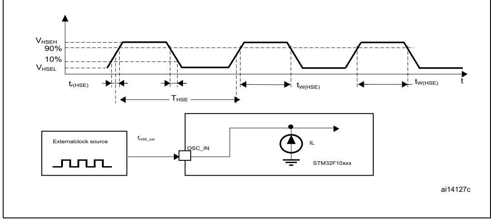

<span id="page-48-1"></span>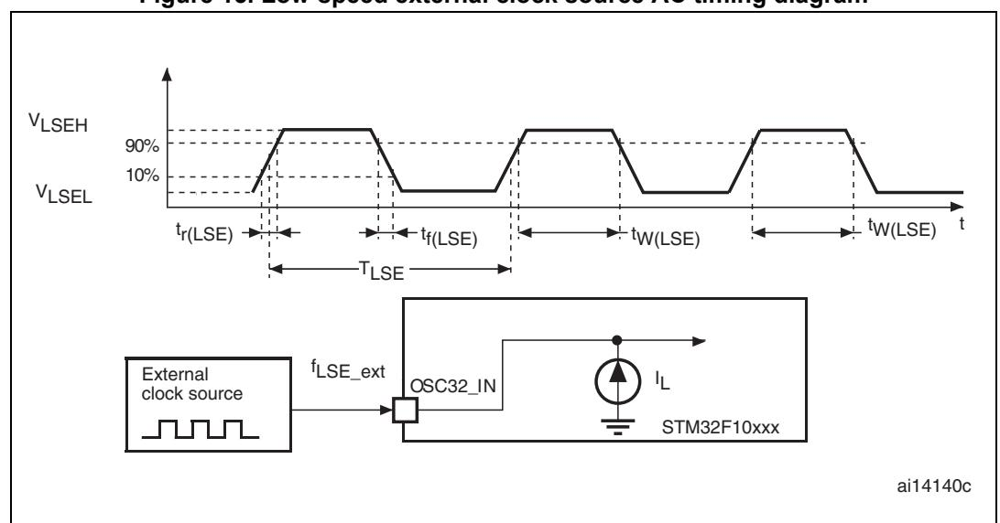

**Figure 15. Low-speed external clock source AC timing diagram**

#### **High-speed external clock generated from a crystal/ceramic resonator**

The high-speed external (HSE) clock can be supplied with a 3 to 25 MHz crystal/ceramic resonator oscillator. All the information given in this paragraph are based on characterization results obtained with typical external components specified in *[Table 22](#page-48-0)*. In the application, the resonator and the load capacitors have to be placed as close as possible to the oscillator pins in order to minimize output distortion and startup stabilization time. Refer to the crystal resonator manufacturer for more details on the resonator characteristics (frequency, package, accuracy).

<span id="page-48-0"></span>

| Symbol     | Parameter                                                                                         | Conditions                                   | Min | Typ | Max | Unit |
|------------|---------------------------------------------------------------------------------------------------|----------------------------------------------|-----|-----|-----|------|
| fOSC_IN    | Oscillator frequency                                                                              | -                                            | 3   |     | 25  | MHz  |
| RF         | Feedback resistor                                                                                 | -                                            | -   | 200 | -   | kΩ   |
| C          | Recommended load capacitance<br>versus equivalent serial<br>(3)<br>resistance of the crystal (RS) | RS = 30 Ω                                    | -   | 30  | -   | pF   |
| i<br>2     | HSE driving current                                                                               | VDD = 3.3 V, VIN<br>= VSS<br>with 30 pF load | -   | -   | 1   | mA   |
| gm         | Oscillator transconductance                                                                       | Startup                                      | 25  | -   | -   | mA/V |
| tSU(HSE(4) | Startup time                                                                                      | VDD is stabilized                            | -   | 2   | -   | ms   |

**Table 22. HSE 3-25 MHz oscillator characteristics(1) (2)**

1. Resonator characteristics given by the crystal/ceramic resonator manufacturer.

2. Based on characterization, not tested in production.

3. The relatively low value of the RF resistor offers a good protection against issues resulting from use in a humid environment, due to the induced leakage and the bias condition change. However, it is recommended to take this point into account if the MCU is used in tough humidity conditions.

4. tSU(HSE) is the startup time measured from the moment it is enabled (by software) to a stabilized 8 MHz oscillation is reached. This value is measured for a standard crystal resonator and it can vary significantly with the crystal manufacturer


For CL1 and CL2, it is recommended to use high-quality external ceramic capacitors in the 5 pF to 25 pF range (typ.), designed for high-frequency applications, and selected to match the requirements of the crystal or resonator (see *[Figure 16](#page-49-1)*). CL1 and CL2 are usually the same size. The crystal manufacturer typically specifies a load capacitance which is the series combination of CL1 and CL2. PCB and MCU pin capacitance must be included (10 pF can be used as a rough estimate of the combined pin and board capacitance) when sizing CL1 and CL2. Refer to the application note AN2867 "Oscillator design guide for ST microcontrollers" available from the ST website *www.st.com*.

<span id="page-49-1"></span>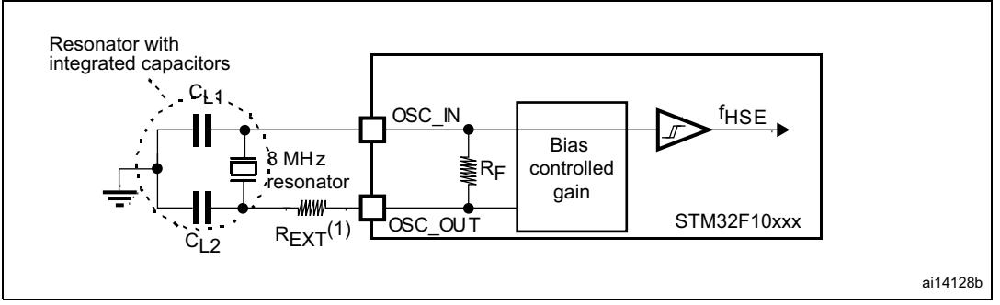


1. REXT value depends on the crystal characteristics.

### **Low-speed external clock generated from a crystal/ceramic resonator**

The low-speed external (LSE) clock can be supplied with a 32.768 kHz crystal/ceramic resonator oscillator. All the information given in this paragraph are based on characterization results obtained with typical external components specified in *[Table 23](#page-49-0)*. In the application, the resonator and the load capacitors have to be placed as close as possible to the oscillator pins in order to minimize output distortion and startup stabilization time. Refer to the crystal resonator manufacturer for more details on the resonator characteristics (frequency, package, accuracy).

<span id="page-49-0"></span>

| Symbol | Parameter                                                                                         | Conditions             | Min | Typ | Max | Unit |
|--------|---------------------------------------------------------------------------------------------------|------------------------|-----|-----|-----|------|
| RF     | Feedback resistor                                                                                 | -                      | -   | 5   | -   | MΩ   |
| C(2)   | Recommended load capacitance<br>versus equivalent serial<br>(3)<br>resistance of the crystal (RS) | RS = 30 kΩ             | -   | -   | 15  | pF   |
| I2     | LSE driving current                                                                               | VDD = 3.3 V, VIN = VSS | -   | -   | 1.4 | µA   |
| gm     | Oscillator Transconductance                                                                       | -                      | 5   | -   | -   | µA/V |

| Table 23. LSE oscillator characteristics (fLSE = 32.768 kHz) (1) |  |  |  |
|------------------------------------------------------------------|--|--|--|
|------------------------------------------------------------------|--|--|--|


| Symbol          | Parameter    |                   | Conditions  | Min | Typ | Max | Unit |
|-----------------|--------------|-------------------|-------------|-----|-----|-----|------|
| tSU(LSE)<br>(4) | Startup time | VDD is stabilized | TA = 50 °C  | -   | 1.5 | -   | s    |
|                 |              |                   | TA = 25 °C  | -   | 2.5 | -   |      |
|                 |              |                   | TA = 10 °C  | -   | 4   | -   |      |
|                 |              |                   | TA = 0 °C   | -   | 6   | -   |      |
|                 |              |                   | TA = -10 °C | -   | 10  | -   |      |
|                 |              |                   | TA = -20 °C | -   | 17  | -   |      |
|                 |              |                   | TA = -30 °C | -   | 32  | -   |      |
|                 |              |                   | TA = -40 °C | -   | 60  | -   |      |

### **Table 23. LSE oscillator characteristics (fLSE = 32.768 kHz) (1) (continued)**

1. Based on characterization, not tested in production.

2. Refer to the note and caution paragraphs below the table, and to the application note AN2867 "Oscillator design guide for ST microcontrollers".

3. The oscillator selection can be optimized in terms of supply current using an high quality resonator with small RS value for example MSIV-TIN32.768kHz. Refer to crystal manufacturer for more details

- 4. tSU(LSE) is the startup time measured from the moment it is enabled (by software) to a stabilized 32.768 kHz oscillation is reached. This value is measured for a standard crystal and it can vary significantly with the crystal manufacturer
- *Note: For CL1 and CL2 it is recommended to use high-quality external ceramic capacitors in the 5 pF to 15 pF range selected to match the requirements of the crystal or resonator (see [Figure 17](#page-50-0)). CL1 and CL2, are usually the same size. The crystal manufacturer typically specifies a load capacitance which is the series combination of CL1 and CL2. Load capacitance CL has the following formula: CL =* CL1 *x* CL2 */ (*CL1 *+* CL2*) + Cstray where Cstray is the pin capacitance and board or trace PCB-related capacitance. Typically, it is between 2 pF and 7 pF.*
- **Caution:** To avoid exceeding the maximum value of CL1 and CL2 (15 pF) it is strongly recommended to use a resonator with a load capacitance CL <sup>≤</sup> 7 pF. Never use a resonator with a load capacitance of 12.5 pF.

**Example:** if you choose a resonator with a load capacitance of CL = 6 pF, and Cstray = 2 pF, then CL1 = CL2 = 8 pF.

<span id="page-50-0"></span>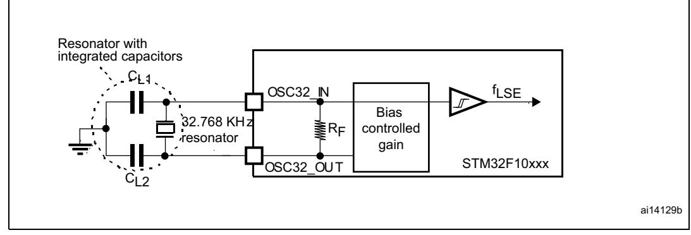

**Figure 17. Typical application with a 32.768 kHz crystal**


### <span id="page-51-0"></span>**5.3.7 Internal clock source characteristics**

The parameters given in *[Table 24](#page-51-1)* are derived from tests performed under ambient temperature and VDD supply voltage conditions summarized in *[Table 9](#page-36-3)*.

### **High-speed internal (HSI) RC oscillator**

<span id="page-51-1"></span>

| Symbol      | Parameter                           | Conditions                                  |                    | Min  | Typ | Max  | Unit |
|-------------|-------------------------------------|---------------------------------------------|--------------------|------|-----|------|------|
| fHSI        | Frequency                           | -                                           |                    | -    | 8   |      | MHz  |
| DuCy(HSI)   | Duty cycle                          | -                                           |                    | 45   | -   | 55   | %    |
| ACCHSI      |                                     | User-trimmed with the RCC_CR<br>register(2) |                    | -    | -   | 1(3) | %    |
|             | Accuracy of the HSI<br>oscillator   | Factory<br>calibrated(4)                    | TA = –40 to 105 °C | –2   | -   | 2.5  | %    |
|             |                                     |                                             | TA = –10 to 85 °C  | –1.5 | -   | 2.2  | %    |
|             |                                     |                                             | TA = 0 to 70 °C    | –1.3 | -   | 2    | %    |
|             |                                     |                                             | TA = 25 °C         | –1.1 | -   | 1.8  | %    |
| tsu(HSI)(4) | HSI oscillator<br>startup time      | -                                           |                    | 1    | -   | 2    | µs   |
| IDD(HSI)(4) | HSI oscillator<br>power consumption | -                                           |                    | -    | 80  | 100  | µA   |

|  |  | Table 24. HSI oscillator characteristics (1) |  |
|--|--|----------------------------------------------|--|
|--|--|----------------------------------------------|--|

1. VDD = 3.3 V, TA = –40 to 105 °C unless otherwise specified.

2. Refer to application note AN2868 "STM32F10xxx internal RC oscillator (HSI) calibration" available from the ST website *www.st.com*.

3. Guaranteed by design, not tested in production.

4. Based on characterization, not tested in production.

#### **Low-speed internal (LSI) RC oscillator**

|  |  |  |  | Table 25. LSI oscillator characteristics (1) |  |
|--|--|--|--|----------------------------------------------|--|
|--|--|--|--|----------------------------------------------|--|

<span id="page-51-2"></span>

| Symbol      | Parameter                        | Min | Typ  | Max | Unit |
|-------------|----------------------------------|-----|------|-----|------|
| fLSI(2)     | Frequency                        | 30  | 40   | 60  | kHz  |
| tsu(LSI)(3) | LSI oscillator startup time      | -   | -    | 85  | µs   |
| IDD(LSI)(3) | LSI oscillator power consumption | -   | 0.65 | 1.2 | µA   |

1. VDD = 3 V, TA = –40 to 105 °C unless otherwise specified.

2. Based on characterization, not tested in production.

3. Guaranteed by design, not tested in production.

#### **Wakeup time from low-power mode**

The wakeup times given in *[Table 26](#page-52-1)* is measured on a wakeup phase with a 8-MHz HSI RC oscillator. The clock source used to wake up the device depends from the current operating mode:

- Stop or Standby mode: the clock source is the RC oscillator
- Sleep mode: the clock source is the clock that was set before entering Sleep mode.


All timings are derived from tests performed under ambient temperature and VDD supply voltage conditions summarized in *[Table 9](#page-36-3)*.

<span id="page-52-1"></span>

| Symbol      | Parameter                                           |     | Unit |  |  |  |
|-------------|-----------------------------------------------------|-----|------|--|--|--|
| tWUSLEEP(1) | Wakeup from Sleep mode                              | 1.8 | µs   |  |  |  |
| tWUSTOP(1)  | Wakeup from Stop mode (regulator in run mode)       | 3.6 | µs   |  |  |  |
|             | Wakeup from Stop mode (regulator in low power mode) | 5.4 |      |  |  |  |
| tWUSTDBY(1) | Wakeup from Standby mode                            | 50  | µs   |  |  |  |

**Table 26. Low-power mode wakeup timings**

1. The wakeup times are measured from the wakeup event to the point in which the user application code reads the first instruction.

### <span id="page-52-0"></span>**5.3.8 PLL, PLL2 and PLL3 characteristics**

The parameters given in *[Table 27](#page-52-2)* and *[Table 28](#page-52-3)* are derived from tests performed under temperature and VDD supply voltage conditions summarized in *[Table 9](#page-36-3)*.

<span id="page-52-2"></span>

| Symbol   | Parameter                   | Min(1) | Max(1) | Unit |
|----------|-----------------------------|--------|--------|------|
| fPLL_IN  | PLL input clock(2)          | 3      | 12     | MHz  |
|          | Pulse width at high level   | 30     | -      | ns   |
| fPLL_OUT | PLL multiplier output clock | 18     | 72     | MHz  |
| fVCO_OUT | PLL VCO output              | 36     | 144    | MHz  |
| tLOCK    | PLL lock time               | -      | 350    | µs   |
| Jitter   | Cycle-to-cycle jitter       | -      | 300    | ps   |

#### **Table 27. PLL characteristics**

1. Based on characterization, not tested in production.

2. Take care of using the appropriate multiplier factors so as to have PLL input clock values compatible with the range defined by fPLL\_OUT.

| Table 28. PLL2 and PLL3 characteristics |  |
|-----------------------------------------|--|
|-----------------------------------------|--|

<span id="page-52-3"></span>

| Symbol                          | Parameter                   | Min(1) | Max(1) | Unit |
|---------------------------------|-----------------------------|--------|--------|------|
| fPLL_IN                         | PLL input clock(2)          | 3      | 5      | MHz  |
|                                 | Pulse width at high level   | 30     | -      | ns   |
| fPLL_OUT                        | PLL multiplier output clock | 40     | 74     | MHz  |
| fVCO_OUT                        | PLL VCO output              | 80     | 148    | MHz  |
| tLOCK                           | PLL lock time               |        | 350    | µs   |
| Jitter<br>Cycle-to-cycle jitter |                             | -      | 400    | ps   |

1. Based on characterization, not tested in production.

2. Take care of using the appropriate multiplier factors so as to have PLL input clock values compatible with the range defined by fPLL\_OUT.


### <span id="page-53-0"></span>**5.3.9 Memory characteristics**

### **Flash memory**

The characteristics are given at TA = –40 to 105 °C unless otherwise specified.

<span id="page-53-2"></span>

| Parameter               | Conditions                                                     | Min(1) | Typ  | Max(1) | Unit |  |
|-------------------------|----------------------------------------------------------------|--------|------|--------|------|--|
| 16-bit programming time | TA = –40 to +105 °C                                            | 40     | 52.5 | 70     | µs   |  |
| Page (1 KB) erase time  | TA = –40 to +105 °C                                            | 20     | -    | 40     | ms   |  |
| Mass erase time         | TA = –40 to +105 °C                                            | 20     | -    | 40     | ms   |  |
| Supply current          | Read mode<br>fHCLK = 72 MHz with 2 wait<br>states, VDD = 3.3 V | -      | -    | 20     | mA   |  |
|                         | Write / Erase modes<br>fHCLK = 72 MHz, VDD = 3.3 V             | -      | -    | 5      | mA   |  |
|                         | Power-down mode / Halt,<br>VDD = 3.0 to 3.6 V                  | -      | -    | 50     | µA   |  |
| Programming voltage     | -                                                              | 2      | -    | 3.6    | V    |  |
|                         |                                                                |        |      |        |      |  |

|  |  |  | Table 29. Flash memory characteristics |
|--|--|--|----------------------------------------|
|--|--|--|----------------------------------------|

1. Guaranteed by design, not tested in production.

<span id="page-53-3"></span>

| Symbol | Parameter      | Conditions                                                                        | Min(1) | Typ | Max(1) | Unit    |
|--------|----------------|-----------------------------------------------------------------------------------|--------|-----|--------|---------|
| NEND   | Endurance      | TA = –40 to +85 °C (6 suffix versions)<br>TA = –40 to +105 °C (7 suffix versions) | 10     | -   | -      | Kcycles |
| tRET   | Data retention | 1 kcycle(2) at TA = 85 °C                                                         | 30     | -   | -      |         |
|        |                | (2) at TA = 105 °C<br>1 kcycle                                                    | 10     | -   | -      | Years   |
|        |                | 10 kcycles(2) at TA = 55 °C                                                       | 20     | -   | -      |         |

#### **Table 30. Flash memory endurance and data retention**

1. Based on characterization, not tested in production.

<span id="page-53-4"></span>2. Cycling performed over the whole temperature range.

### <span id="page-53-1"></span>**5.3.10 EMC characteristics**

Susceptibility tests are performed on a sample basis during device characterization.

### **Functional EMS (electromagnetic susceptibility)**

While a simple application is executed on the device (toggling 2 LEDs through I/O ports). the device is stressed by two electromagnetic events until a failure occurs. The failure is indicated by the LEDs:

- **Electrostatic discharge (ESD)** (positive and negative) is applied to all device pins until a functional disturbance occurs. This test is compliant with the IEC 61000-4-2 standard.
- **FTB**: A burst of fast transient voltage (positive and negative) is applied to VDD and VSS through a 100 pF capacitor, until a functional disturbance occurs. This test is compliant with the IEC 61000-4-4 standard.

54/108 DocID15274 Rev 10


A device reset allows normal operations to be resumed.

The test results are given in *[Table 31](#page-54-0)*. They are based on the EMS levels and classes defined in application note AN1709.

<span id="page-54-0"></span>

| Symbol | Parameter                                                                                                                     | Conditions                                                                         | Level/<br>Class |
|--------|-------------------------------------------------------------------------------------------------------------------------------|------------------------------------------------------------------------------------|-----------------|
| VFESD  | Voltage limits to be applied on any I/O pin to<br>induce a functional disturbance                                             | VDD = 3.3 V, LQFP100, TA =<br>+25 °C, fHCLK = 72 MHz, conforms<br>to IEC 61000-4-2 | 2B              |
| VEFTB  | Fast transient voltage burst limits to be<br>applied through 100 pF on VDD and VSS<br>pins to induce a functional disturbance | VDD = 3.3 V, LQFP100, TA =<br>+25 °C, fHCLK = 72 MHz, conforms<br>to IEC 61000-4-4 | 4A              |

|  |  | Table 31. EMS characteristics |
|--|--|-------------------------------|
|--|--|-------------------------------|

#### **Designing hardened software to avoid noise problems**

EMC characterization and optimization are performed at component level with a typical application environment and simplified MCU software. It should be noted that good EMC performance is highly dependent on the user application and the software in particular.

Therefore it is recommended that the user applies EMC software optimization and prequalification tests in relation with the EMC level requested for his application.

#### **Software recommendations**

The software flowchart must include the management of runaway conditions such as:

- Corrupted program counter
- Unexpected reset
- Critical Data corruption (control registers...)

#### **Prequalification trials**

Most of the common failures (unexpected reset and program counter corruption) can be reproduced by manually forcing a low state on the NRST pin or the Oscillator pins for 1 second.

To complete these trials, ESD stress can be applied directly on the device, over the range of specification values. When unexpected behavior is detected, the software can be hardened to prevent unrecoverable errors occurring (see application note AN1015).

### **Electromagnetic Interference (EMI)**

The electromagnetic field emitted by the device are monitored while a simple application is executed (toggling 2 LEDs through the I/O ports). This emission test is compliant with IEC61967-2 standard which specifies the test board and the pin loading.


<span id="page-55-2"></span>

| Symbol | Parameter  | Conditions                                                               | Monitored       | Max vs. [fHSE/fHCLK] |          | Unit |
|--------|------------|--------------------------------------------------------------------------|-----------------|----------------------|----------|------|
|        |            |                                                                          | frequency band  | 8/48 MHz             | 8/72 MHz |      |
| SEMI   | Peak level | VDD = 3.3 V, TA = 25 °C,<br>LQFP100 package<br>compliant with IEC61967-2 | 0.1 to 30 MHz   | 9                    | 9        |      |
|        |            |                                                                          | 30 to 130 MHz   | 26                   | 13       | dBµV |
|        |            |                                                                          | 130 MHz to 1GHz | 25                   | 31       |      |
|        |            |                                                                          | EMI Level       | 4                    | 4        | -    |

#### **Table 32. EMI characteristics**

### <span id="page-55-0"></span>**5.3.11 Absolute maximum ratings (electrical sensitivity)**

Based on three different tests (ESD, LU) using specific measurement methods, the device is stressed in order to determine its performance in terms of electrical sensitivity.

### **Electrostatic discharge (ESD)**

Electrostatic discharges (a positive then a negative pulse separated by 1 second) are applied to the pins of each sample according to each pin combination. The sample size depends on the number of supply pins in the device (3 parts × (n+1) supply pins). This test conforms to the JESD22-A114/C101 standard.

| Table 33. ESD absolute maximum ratings |  |  |  |  |  |
|----------------------------------------|--|--|--|--|--|
|----------------------------------------|--|--|--|--|--|

<span id="page-55-3"></span>

| Symbol    | Ratings                                                  | Conditions                               | Class | Maximum<br>value(1) | Unit |  |
|-----------|----------------------------------------------------------|------------------------------------------|-------|---------------------|------|--|
| VESD(HBM) | Electrostatic discharge voltage<br>(human body model)    | TA = +25 °C conforming to<br>JESD22-A114 | 2     | 2000                |      |  |
| VESD(CDM) | Electrostatic discharge voltage<br>(charge device model) | TA = +25 °C conforming to<br>JESD22-C101 | II    | 500                 | V    |  |

1. Based on characterization results, not tested in production.

### **Static latch-up**

Two complementary static tests are required on six parts to assess the latch-up performance:

- A supply overvoltage is applied to each power supply pin
- A current injection is applied to each input, output and configurable I/O pin

These tests are compliant with EIA/JESD 78A IC latch-up standard.

<span id="page-55-4"></span>

| Symbol | Parameter             | Conditions                         | Class      |
|--------|-----------------------|------------------------------------|------------|
| LU     | Static latch-up class | TA = +105 °C conforming to JESD78A | II level A |

### <span id="page-55-1"></span>**5.3.12 I/O current injection characteristics**

As a general rule, current injection to the I/O pins, due to external voltage below VSS or above VDD (for standard, 3 V-capable I/O pins) should be avoided during normal product


operation. However, in order to give an indication of the robustness of the microcontroller in cases when abnormal injection accidentally happens, susceptibility tests are performed on a sample basis during device characterization.

#### **Functional susceptibility to I/O current injection**

While a simple application is executed on the device, the device is stressed by injecting current into the I/O pins programmed in floating input mode. While current is injected into the I/O pin, one at a time, the device is checked for functional failures.

The failure is indicated by an out of range parameter: ADC error above a certain limit (>5 LSB TUE), out of spec current injection on adjacent pins or other functional failure (for example reset, oscillator frequency deviation).

The test results are given in *[Table 35](#page-56-1)*

<span id="page-56-1"></span>

| Symbol |                                                            | Functional susceptibility |                       |      |  |
|--------|------------------------------------------------------------|---------------------------|-----------------------|------|--|
|        | Description                                                | Negative<br>injection     | Positive<br>injection | Unit |  |
| IINJ   | Injected current on OSC_IN32,<br>OSC_OUT32, PA4, PA5, PC13 | -0                        | +0                    | mA   |  |
|        | Injected current on all FT pins                            | -5                        | +0                    |      |  |
|        | Injected current on any other pin                          | -5                        | +5                    |      |  |

#### **Table 35. I/O current injection susceptibility**

#### <span id="page-56-0"></span>**5.3.13 I/O port characteristics**

### **General input/output characteristics**

Unless otherwise specified, the parameters given in *[Table 36](#page-56-2)* are derived from tests performed under the conditions summarized in *[Table 9](#page-36-3)*. All I/Os are CMOS and TTL compliant.

<span id="page-56-2"></span>

| Symbol | Parameter                                               | Conditions | Min                  | Typ | Max                  | Unit |
|--------|---------------------------------------------------------|------------|----------------------|-----|----------------------|------|
| VIL    | Standard IO input low<br>level voltage                  | -          | –0.3                 | -   | 0.28*(VDD-2 V)+0.8 V | V    |
|        | IO FT(1) input low level<br>voltage                     | -          | –0.3                 | -   | 0.32*(VDD-2V)+0.75 V | V    |
| VIH    | Standard IO input high<br>level voltage                 | -          | 0.41*(VDD-2 V)+1.3 V | -   | VDD+0.3              | V    |
|        | IO FT(1) input high level<br>voltage                    | VDD > 2 V  |                      | -   | 5.5                  |      |
|        |                                                         | VDD ≤ 2 V  | 0.42*(VDD-2 V)+1 V   |     | 5.2                  | V    |
| Vhys   | Standard IO Schmitt<br>trigger voltage<br>hysteresis(2) | -          | 200                  | -   | -                    | mV   |
|        | IO FT Schmitt trigger<br>voltage hysteresis(2)          | -          | 5% VDD(3)            | -   | -                    | mV   |

**Table 36. I/O static characteristics**


| Symbol                   | Parameter                                      |                                | Conditions                           | Min | Typ | Max | Unit |
|--------------------------|------------------------------------------------|--------------------------------|--------------------------------------|-----|-----|-----|------|
| Ilkg                     | Input leakage current (4)                      |                                | VSS<br>≤VIN<br>≤VDD<br>Standard I/Os | -   | -   | ±1  | µA   |
|                          |                                                |                                | VIN= 5 V, I/O FT                     | -   | -   | 3   |      |
| up<br>RPU<br>resistor(5) | Weak pull<br>equivalent                        | All pins<br>except for<br>PA10 | VIN = VSS                            | 30  | 40  | 50  | kΩ   |
|                          |                                                | PA10                           |                                      | 8   | 11  | 15  |      |
| RPD                      | Weak pull<br>down<br>equivalent<br>resistor(5) | All pins<br>except for<br>PA10 | VIN = VDD                            | 30  | 40  | 50  | kΩ   |
|                          |                                                | PA10                           |                                      | 8   | 11  | 15  |      |
| CIO                      | I/O pin capacitance                            |                                | -                                    | -   | 5   | -   | pF   |

#### **Table 36. I/O static characteristics (continued)**

1. FT = Five-volt tolerant. In order to sustain a voltage higher than VDD+0.3 the internal pull-up/pull-down resistors must be disabled.

2. Hysteresis voltage between Schmitt trigger switching levels. Based on characterization, not tested in production.

3. With a minimum of 100 mV.

4. Leakage could be higher than max. if negative current is injected on adjacent pins.

5. Pull-up and pull-down resistors are designed with a true resistance in series with a switchable PMOS/NMOS. This MOS/NMOS contribution to the series resistance is minimum (~10% order).

> All I/Os are CMOS and TTL compliant (no software configuration required). Their characteristics cover more than the strict CMOS-technology or TTL parameters. The coverage of these requirements is shown in *[Figure 18](#page-57-0)* and *[Figure 19](#page-58-0)* for standard I/Os, and in *[Figure 20](#page-58-1)* and *[Figure 21](#page-58-2)* for 5 V tolerant I/Os.

#### **Figure 18. Standard I/O input characteristics - CMOS port**

<span id="page-57-0"></span>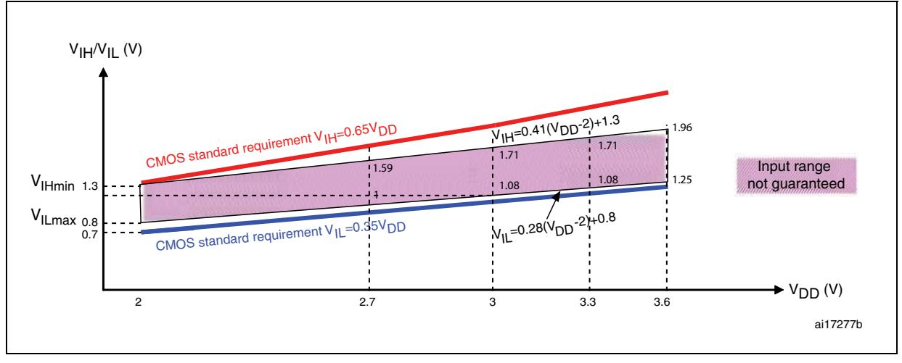

58/108 DocID15274 Rev 10


<span id="page-58-0"></span>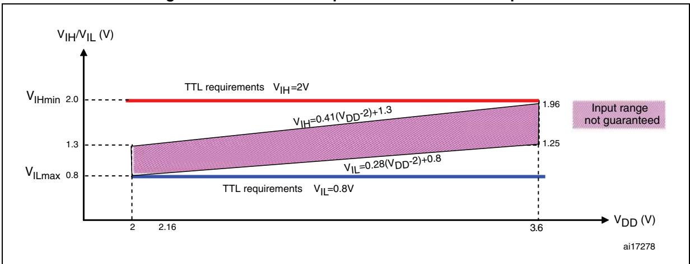

**Figure 19. Standard I/O input characteristics - TTL port**

<span id="page-58-1"></span>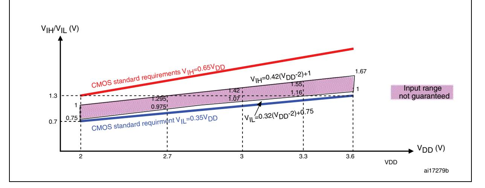

**Figure 20. 5 V tolerant I/O input characteristics - CMOS port**

**Figure 21. 5 V tolerant I/O input characteristics - TTL port**

<span id="page-58-2"></span>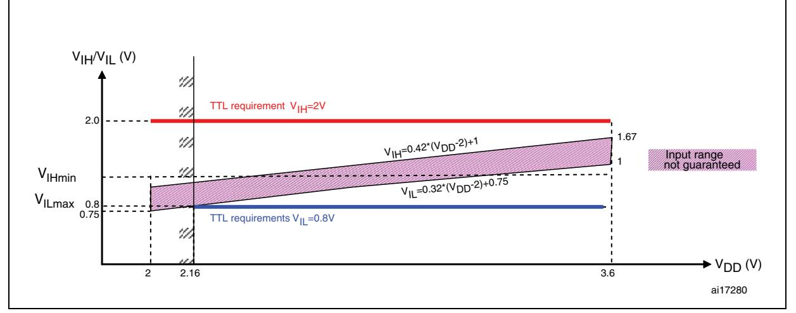


#### **Output driving current**

The GPIOs (general purpose input/outputs) can sink or source up to +/-8 mA, and sink or source up to +/-20 mA (with a relaxed VOL/VOH).

In the user application, the number of I/O pins which can drive current must be limited to respect the absolute maximum rating specified in *[Section 5.2](#page-35-0)*:

- The sum of the currents sourced by all the I/Os on VDD, plus the maximum Run consumption of the MCU sourced on VDD, cannot exceed the absolute maximum rating IVDD (see *[Table 7](#page-35-2)*).
- The sum of the currents sunk by all the I/Os on VSS plus the maximum Run consumption of the MCU sunk on VSS cannot exceed the absolute maximum rating IVSS (see *[Table 7](#page-35-2)*).

### **Output voltage levels**

Unless otherwise specified, the parameters given in *[Table 37](#page-59-0)* are derived from tests performed under ambient temperature and VDD supply voltage conditions summarized in *[Table 9](#page-36-3)*. All I/Os are CMOS and TTL compliant.

<span id="page-59-0"></span>

| Symbol    | Parameter                                                                        | Conditions                         | Min     | Max | Unit   |
|-----------|----------------------------------------------------------------------------------|------------------------------------|---------|-----|--------|
| VOL(1)    | Output low level voltage for an I/O pin<br>when 8 pins are sunk at same time     | TTL port                           | -       | 0.4 | V<br>V |
| VOH(2)    | Output high level voltage for an I/O pin<br>when 8 pins are sourced at same time | IIO = +8 mA<br>2.7 V < VDD < 3.6 V | VDD–0.4 | -   |        |
| VOL (1)   | Output low level voltage for an I/O pin<br>when 8 pins are sunk at same time     | CMOS port                          | -       | 0.4 |        |
| VOH (2)   | Output high level voltage for an I/O pin<br>when 8 pins are sourced at same time | IIO =+ 8mA<br>2.7 V < VDD < 3.6 V  | 2.4     | -   |        |
| VOL(1)(3) | Output low level voltage for an I/O pin<br>when 8 pins are sunk at same time     | IIO = +20 mA                       | -       | 1.3 |        |
| VOH(2)(3) | Output high level voltage for an I/O pin<br>when 8 pins are sourced at same time | 2.7 V < VDD < 3.6 V                | VDD–1.3 | -   | V      |
| VOL(1)(3) | Output low level voltage for an I/O pin<br>when 8 pins are sunk at same time     | IIO = +6 mA                        | -       | 0.4 | V      |
| VOH(2)(3) | Output high level voltage for an I/O pin<br>when 8 pins are sourced at same time | 2 V < VDD < 2.7 V                  | VDD–0.4 | -   |        |

**Table 37. Output voltage characteristics** 

1. The IIO current sunk by the device must always respect the absolute maximum rating specified in *[Table 7](#page-35-2)* and the sum of IIO (I/O ports and control pins) must not exceed IVSS.

2. The IIO current sourced by the device must always respect the absolute maximum rating specified in *[Table 7](#page-35-2)* and the sum of IIO (I/O ports and control pins) must not exceed IVDD.

3. Based on characterization data, not tested in production.


#### **Input/output AC characteristics**

The definition and values of input/output AC characteristics are given in *[Figure 22](#page-61-2)* and *[Table 38](#page-60-0)*, respectively.

Unless otherwise specified, the parameters given in *[Table 38](#page-60-0)* are derived from tests performed under the ambient temperature and VDD supply voltage conditions summarized in *[Table 9](#page-36-3)*.

<span id="page-60-0"></span>

| MODEx[1:0]<br>bit value(1) | Symbol      | Parameter                                                             | Conditions                       | Min | Max    | Unit |  |
|----------------------------|-------------|-----------------------------------------------------------------------|----------------------------------|-----|--------|------|--|
| 10                         | fmax(IO)out | Maximum frequency(2)                                                  | CL = 50 pF, VDD = 2 V to 3.6 V   | -   | 2      | MHz  |  |
|                            | tf(IO)out   | Output high to low<br>level fall time                                 |                                  | -   | 125(3) |      |  |
|                            | tr(IO)out   | Output low to high<br>level rise time                                 | CL = 50 pF, VDD = 2 V to 3.6 V   |     | 125(3) | ns   |  |
| 01                         | fmax(IO)out | Maximum frequency(2) CL = 50                                          | pF, VDD = 2 V to 3.6 V           | -   | 10     | MHz  |  |
|                            | tf(IO)out   | Output high to low<br>level fall time                                 | CL = 50 pF, VDD = 2 V to 3.6 V   |     | 25(3)  | ns   |  |
|                            | tr(IO)out   | Output low to high<br>level rise time                                 |                                  |     | 25(3)  |      |  |
|                            | Fmax(IO)out | Maximum frequency(2)                                                  | CL = 30 pF, VDD = 2.7 V to 3.6 V | -   | 50     | MHz  |  |
|                            |             |                                                                       | CL = 50 pF, VDD = 2.7 V to 3.6 V | -   | 30     | MHz  |  |
|                            |             |                                                                       | CL = 50 pF, VDD = 2 V to 2.7 V   | -   | 20     | MHz  |  |
|                            | tf(IO)out   | Output high to low<br>level fall time                                 | CL = 30 pF, VDD = 2.7 V to 3.6 V | -   | 5(3)   |      |  |
| 11                         |             |                                                                       | CL = 50 pF, VDD = 2.7 V to 3.6 V | -   | 8(3)   |      |  |
|                            |             |                                                                       | CL = 50 pF, VDD = 2 V to 2.7 V   | -   | 12(3)  |      |  |
|                            | tr(IO)out   | Output low to high<br>level rise time                                 | CL = 30 pF, VDD = 2.7 V to 3.6 V | -   | 5(3)   | ns   |  |
|                            |             |                                                                       | CL = 50 pF, VDD = 2.7 V to 3.6 V | -   | 8(3)   |      |  |
|                            |             |                                                                       | CL = 50 pF, VDD = 2 V to 2.7 V   | -   | 12(3)  |      |  |
| -                          | tEXTIpw     | Pulse width of external<br>signals detected by<br>the EXTI controller | -                                | 10  | -      | ns   |  |

**Table 38. I/O AC characteristics(1)**

1. The I/O speed is configured using the MODEx[1:0] bits. Refer to the STM32F10xxx reference manual for a description of GPIO Port configuration register.

2. The maximum frequency is defined in *[Figure 22](#page-61-2)*.

3. Guaranteed by design, not tested in production.


<span id="page-61-2"></span>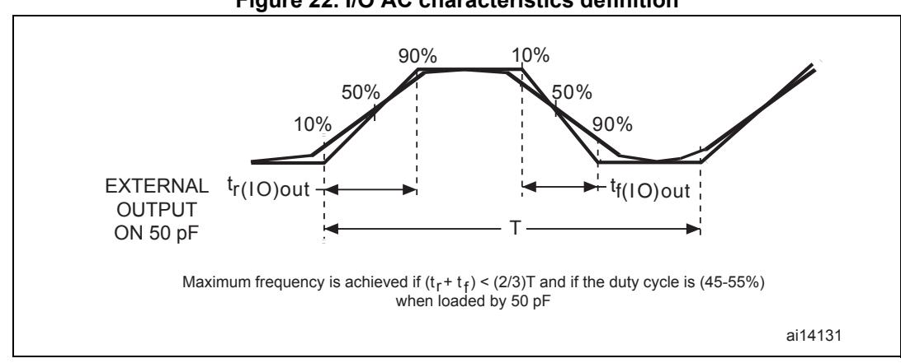


### <span id="page-61-0"></span>**5.3.14 NRST pin characteristics**

The NRST pin input driver uses CMOS technology. It is connected to a permanent pull-up resistor, RPU (see *[Table 36](#page-56-2)*).

Unless otherwise specified, the parameters given in *[Table 39](#page-61-1)* are derived from tests performed under the ambient temperature and VDD supply voltage conditions summarized in *[Table 9](#page-36-3)*.

<span id="page-61-1"></span>

| Symbol       | Parameter                                  | Conditions  | Min  | Typ | Max     | Unit |
|--------------|--------------------------------------------|-------------|------|-----|---------|------|
| VIL(NRST)(1) | NRST Input low level voltage               | -           | –0.5 | -   | 0.8     |      |
| VIH(NRST)(1) | NRST Input high level voltage              | -           | 2    | -   | VDD+0.5 | V    |
| Vhys(NRST)   | NRST Schmitt trigger voltage<br>hysteresis | -           | -    | 200 | -       | mV   |
| RPU          | Weak pull-up equivalent resistor(2)        | VIN = VSS   | 30   | 40  | 50      | kΩ   |
| VF(NRST)(1)  | NRST Input filtered pulse                  | -           | -    | -   | 100     | ns   |
| VNF(NRST)(1) | NRST Input not filtered pulse              | VDD > 2.7 V | 300  | -   | -       | ns   |

**Table 39. NRST pin characteristics** 

1. Guaranteed by design, not tested in production.

2. The pull-up is designed with a true resistance in series with a switchable PMOS. This PMOS contribution to the series resistance must be minimum (~10% order).


<span id="page-62-2"></span>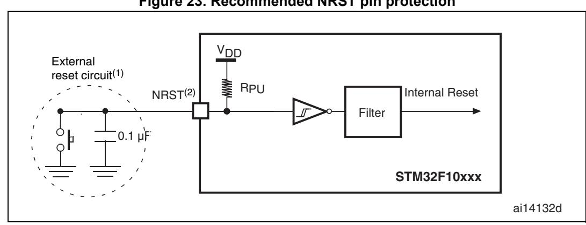

**Figure 23. Recommended NRST pin protection**

- 2. The reset network protects the device against parasitic resets.
- 3. The user must ensure that the level on the NRST pin can go below the VIL(NRST) max level specified in *[Table 39](#page-61-1)*. Otherwise the reset will not be taken into account by the device.

#### <span id="page-62-0"></span>**5.3.15 TIM timer characteristics**

The parameters given in *[Table 40](#page-62-1)* are guaranteed by design.

Refer to *[Section 5.3.12: I/O current injection characteristics](#page-55-1)* for details on the input/output alternate function characteristics (output compare, input capture, external clock, PWM output).

<span id="page-62-1"></span>

| Symbol     | Parameter                                                         | Conditions<br>Min |        | Max           | Unit     |
|------------|-------------------------------------------------------------------|-------------------|--------|---------------|----------|
|            |                                                                   | -                 | 1      | -             | tTIMxCLK |
| tres(TIM)  | Timer resolution time                                             | fTIMxCLK = 72 MHz | 13.9   | -             | ns       |
| fEXT       | Timer external clock                                              | -                 | 0      | fTIMxCLK/2    | MHz      |
|            | frequency on CH1 to CH4                                           | fTIMxCLK = 72 MHz | 0      | 36            | MHz      |
| ResTIM     | Timer resolution                                                  | -                 | -      | 16            | bit      |
| tCOUNTER   | 16-bit counter clock period<br>when internal clock is<br>selected | -                 | 1      | 65536         | tTIMxCLK |
|            |                                                                   | fTIMxCLK = 72 MHz | 0.0139 | 910           | µs       |
| tMAX_COUNT |                                                                   | -                 | -      | 65536 × 65536 | tTIMxCLK |
|            | Maximum possible count                                            | fTIMxCLK = 72 MHz | -      | 59.6          | s        |

**Table 40. TIMx(1) characteristics** 

1. TIMx is used as a general term to refer to the TIM1, TIM2, TIM3, TIM4 and TIM5 timers.


### <span id="page-63-0"></span>**5.3.16 Communications interfaces**

#### **I 2 C interface characteristics**

Unless otherwise specified, the parameters given in *[Table 41](#page-63-1)* are derived from tests performed under the ambient temperature, fPCLK1 frequency and VDD supply voltage conditions summarized in *[Table 9](#page-36-3)*.

The STM32F105xx and STM32F107xx I 2 C interface meets the requirements of the standard I<sup>2</sup> C communication protocol with the following restrictions: the I/O pins SDA and SCL are mapped to are not "true" open-drain. When configured as open-drain, the PMOS connected between the I/O pin and VDD is disabled, but is still present.

The I<sup>2</sup> C characteristics are described in *[Table 41](#page-63-1)*. Refer also to *[Section 5.3.12: I/O current](#page-55-1)  [injection characteristics](#page-55-1)* for more details on the input/output alternate function characteristics (SDA and SCL).

<span id="page-63-1"></span>

|                    |                                            | Standard mode I2C(1) |      | Fast mode I2C(1)(2) |        | Unit |
|--------------------|--------------------------------------------|----------------------|------|---------------------|--------|------|
| Symbol             | Parameter                                  | Min<br>Max           |      | Min<br>Max          |        |      |
| tw(SCLL)           | SCL clock low time                         | 4.7                  | -    | 1.3                 | -      | µs   |
| tw(SCLH)           | SCL clock high time                        | 4.0                  | -    | 0.6                 | -      |      |
| tsu(SDA)           | SDA setup time                             | 250                  | -    | 100                 | -      |      |
| th(SDA)            | SDA data hold time                         | 0(3)                 | -    | 0(4)                | 900(3) |      |
| tr(SDA)<br>tr(SCL) | SDA and SCL rise time                      | -                    | 1000 | 20 + 0.1Cb          | 300    | ns   |
| tf(SDA)<br>tf(SCL) | SDA and SCL fall time                      | -                    | 300  | -                   | 300    |      |
| th(STA)            | Start condition hold time                  | 4.0                  | -    | 0.6                 | -      |      |
| tsu(STA)           | Repeated Start condition<br>setup time     | 4.7                  | -    | 0.6                 | -      | µs   |
| tsu(STO)           | Stop condition setup time                  | 4.0                  | -    | 0.6                 | -      | μs   |
| tw(STO:STA)        | Stop to Start condition time<br>(bus free) | 4.7                  | -    | 1.3                 | -      | μs   |
| Cb                 | Capacitive load for each bus<br>line       | -                    | 400  | -                   | 400    | pF   |

**Table 41. I2C characteristics** 

1. Guaranteed by design, not tested in production.

2. fPCLK1 must be at least 2 MHz to achieve standard mode I2C frequencies. It must be at least 4 MHz to achieve the fast mode I2C frequencies and it must be a mulitple of 10 MHz in order to reach I2C fast mode maximum clock 400 kHz.

3. The maximum hold time of the Start condition has only to be met if the interface does not stretch the low period of SCL signal.

4. The device must internally provide a hold time of at least 300ns for the SDA signal in order to bridge the undefined region of the falling edge of SCL.


<span id="page-64-1"></span>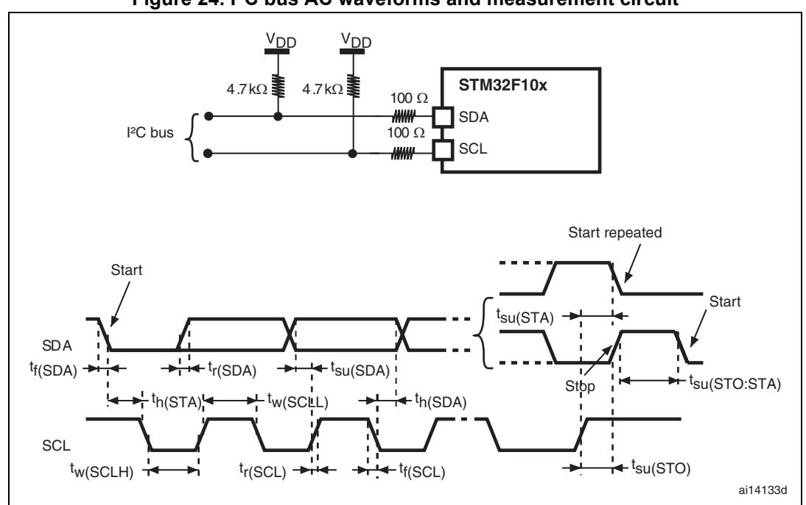

**Figure 24. I2C bus AC waveforms and measurement circuit**

1. Measurement points are done at CMOS levels: 0.3VDD and 0.7VDD.

<span id="page-64-0"></span>

|            | I2C_CCR value |  |  |
|------------|---------------|--|--|
| fSCL (kHz) | RP = 4.7 kΩ   |  |  |
| 400        | 0x801E        |  |  |
| 300        | 0x8028        |  |  |
| 200        | 0x803C        |  |  |
| 100        | 0x00B4        |  |  |
| 50         | 0x0168        |  |  |
| 20         | 0x0384        |  |  |

#### **Table 42. SCL frequency (fPCLK1= 36 MHz.,VDD = 3.3 V)(1)(2)**

1. RP = External pull-up resistance, fSCL = I2C speed,

2. For speeds around 200 kHz, the tolerance on the achieved speed is of ±5%. For other speed ranges, the tolerance on the achieved speed ±2%. These variations depend on the accuracy of the external components used to design the application.


#### **I 2S - SPI interface characteristics**

Unless otherwise specified, the parameters given in *[Table 43](#page-65-0)* for SPI or in *[Table 44](#page-68-0)* for I2S are derived from tests performed under the ambient temperature, fPCLKx frequency and VDD supply voltage conditions summarized in *[Table 9](#page-36-3)*.

Refer to *[Section 5.3.12: I/O current injection characteristics](#page-55-1)* for more details on the input/output alternate function characteristics (NSS, SCK, MOSI, MISO for SPI and WS, CK, SD for I2S).

<span id="page-65-0"></span>

| Symbol               | Parameter                           | Conditions                                | Min     | Max     | Unit |
|----------------------|-------------------------------------|-------------------------------------------|---------|---------|------|
| fSCK                 |                                     | Master mode                               | -       | 18      |      |
| 1/tc(SCK)            | SPI clock frequency                 | Slave mode                                | -       | 18      | MHz  |
| tr(SCK)<br>tf(SCK)   | SPI clock rise and fall<br>time     | Capacitive load: C = 30 pF                | -       | 8       | ns   |
| DuCy(SCK)            | SPI slave input clock<br>duty cycle | Slave mode                                | 30      | 70      | %    |
| tsu(NSS)             | NSS setup time                      | Slave mode                                | 4 tPCLK | -       |      |
| th(NSS)              | NSS hold time                       | Slave mode                                | 2 tPCLK | -       |      |
| tw(SCKH)<br>tw(SCKL) | SCK high and low time               | Master mode, fPCLK = 36 MHz,<br>presc = 4 | 50      | 60      |      |
| tsu(MI)              |                                     | Master mode                               | 4       | -       |      |
| tsu(SI)              | Data input setup time               | Slave mode                                | 5       | -       |      |
| th(MI)               | Data input hold time                | Master mode                               | 5       | -       | ns   |
| th(SI)               |                                     | Slave mode                                | 5       | -       |      |
| ta(SO)               | Data output access<br>time          | Slave mode, fPCLK = 20 MHz                | -       | 3*tPCLK |      |
| tv(SO)               | Data output valid time              | Slave mode (after enable edge)            | -       | 34      |      |
| tv(MO)               | Data output valid time              | Master mode (after enable edge)           | -       | 8       |      |
| th(SO)               | Data output hold time               | Slave mode (after enable edge)            | 32      | -       |      |
| th(MO)               |                                     | Master mode (after enable edge)           | 10      | -       |      |

**Table 43. SPI characteristics**


<span id="page-66-0"></span>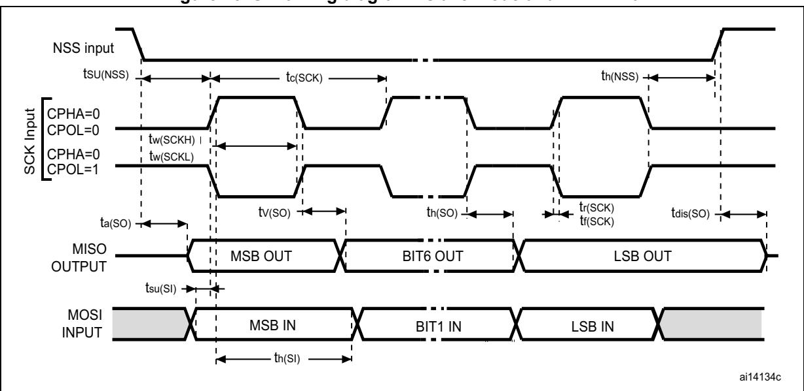

**Figure 25. SPI timing diagram - slave mode and CPHA = 0**


<span id="page-66-1"></span>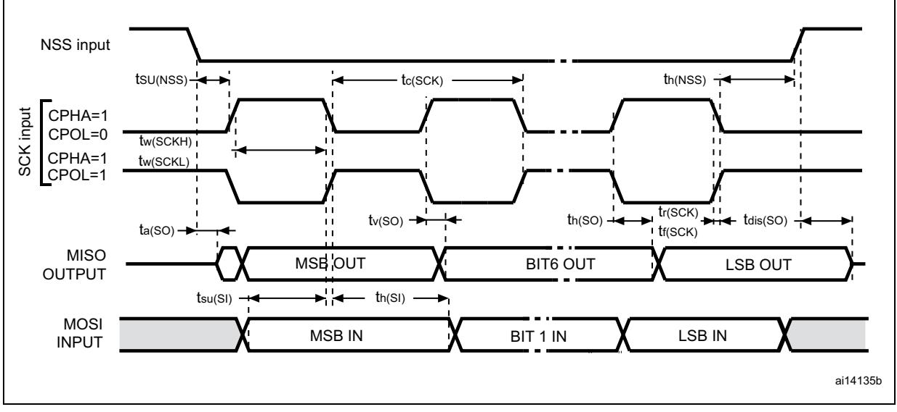

1. Measurement points are done at CMOS levels: 0.3VDD and 0.7VDD.


<span id="page-67-0"></span>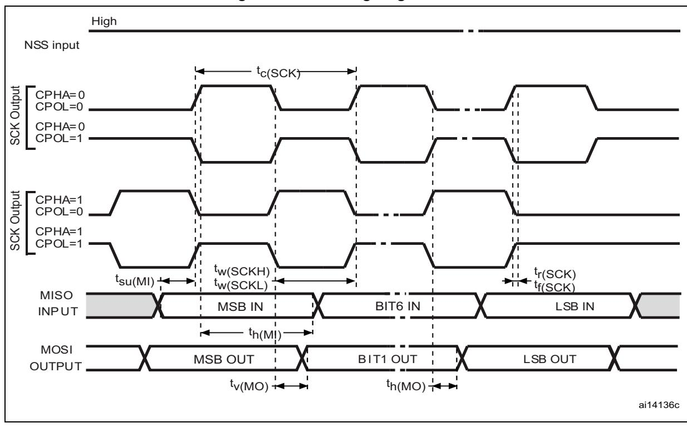

**Figure 27. SPI timing diagram - master mode(1)**

1. Measurement points are done at CMOS levels: 0.3VDD and 0.7VDD.


<span id="page-68-0"></span>

| Symbol           | Parameter                           | Conditions                                 |         | Min  | Max  | Unit |
|------------------|-------------------------------------|--------------------------------------------|---------|------|------|------|
| fCK<br>1/tc(CK)  | 2S clock frequency<br>I             | Master data: 16 bits, audio<br>freq = 48 K |         | 1.52 | 1.54 | MHz  |
|                  |                                     | Slave                                      |         | 0    | 6.5  |      |
| tr(CK)<br>tf(CK) | 2S clock rise and fall time<br>I    | capacitive load CL                         | = 50 pF |      | 8    |      |
| tw(CKH)(1)       | 2S clock high time<br>I             | Master fPCLK = 16 MHz,                     |         | 317  | 320  |      |
| tw(CKL)(1)       | 2S clock low time<br>I              | audio freq = 48 K                          |         | 333  | 336  |      |
| tv(WS) (1)       | WS valid time                       | Master mode                                |         | 3    | -    |      |
|                  |                                     |                                            | I2S2    | 0    | -    | ns   |
| th(WS) (1)       | WS hold time                        | Master mode                                | I2S3    | 0    | -    |      |
|                  |                                     |                                            | I2S2    | 4    | -    |      |
| tsu(WS) (1)      | WS setup time                       | Slave mode                                 | I2S3    | 9    | -    |      |
| th(WS) (1)       | WS hold time                        | Slave mode                                 |         | 0    | -    |      |
| DuCy(SCK)        | I2S slave input clock duty<br>cycle | Slave mode                                 |         |      | 70   | %    |
|                  | Data input setup time               |                                            | I2S2    | 8    | -    |      |
| tsu(SD_MR) (1)   |                                     | Master receiver                            | I2S3    | 10   | -    |      |
|                  |                                     |                                            | I2S2    | 3    | -    |      |
| tsu(SD_SR) (1)   |                                     | Slave receiver                             | I2S3    | 8    | -    |      |
|                  |                                     | Master receiver                            | I2S2    | 2    | -    |      |
| th(SD_MR)(1)     |                                     |                                            | I2S3    | 4    | -    |      |
|                  | Data input hold time                |                                            | I2S2    | 2    | -    |      |
| th(SD_SR) (1)    |                                     | Slave receiver                             | I2S3    | 4    | -    | ns   |
|                  | Data output valid time              | Slave transmitter                          | I2S2    | 23   | -    |      |
| tv(SD_ST) (1)(3) |                                     | (after enable edge)                        | I2S3    | 33   | -    |      |
|                  | Data output hold time               | Slave transmitter                          | I2S2    | 29   | -    |      |
| th(SD_ST) (1)    |                                     | (after enable edge)                        | I2S3    | 27   | -    |      |
|                  |                                     | Master transmitter<br>(after enable edge)  | I2S2    | -    | 5    |      |
| tv(SD_MT) (1)    | Data output valid time              |                                            | I2S3    | -    | 2    |      |
|                  |                                     | Master transmitter                         | I2S2    | 11   | -    |      |
| th(SD_MT) (1)    | Data output hold time               | (after enable edge)                        | I2S3    | 4    | -    |      |

**Table 44. I2S characteristics**

1. Based on design simulation and/or characterization results, not tested in production.


<span id="page-69-0"></span>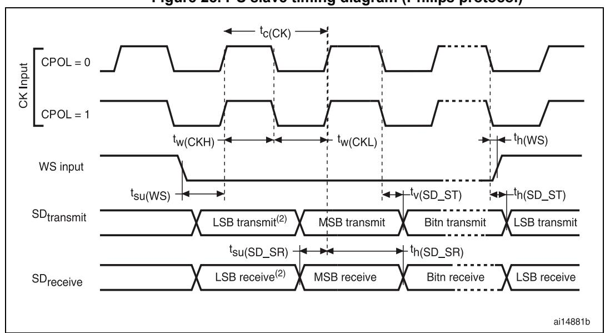

**Figure 28. I2S slave timing diagram (Philips protocol)(1)**

- 1. Measurement points are done at CMOS levels: 0.3 × VDD and 0.7 × VDD.
- 2. LSB transmit/receive of the previously transmitted byte. No LSB transmit/receive is sent before the first byte.

<span id="page-69-1"></span>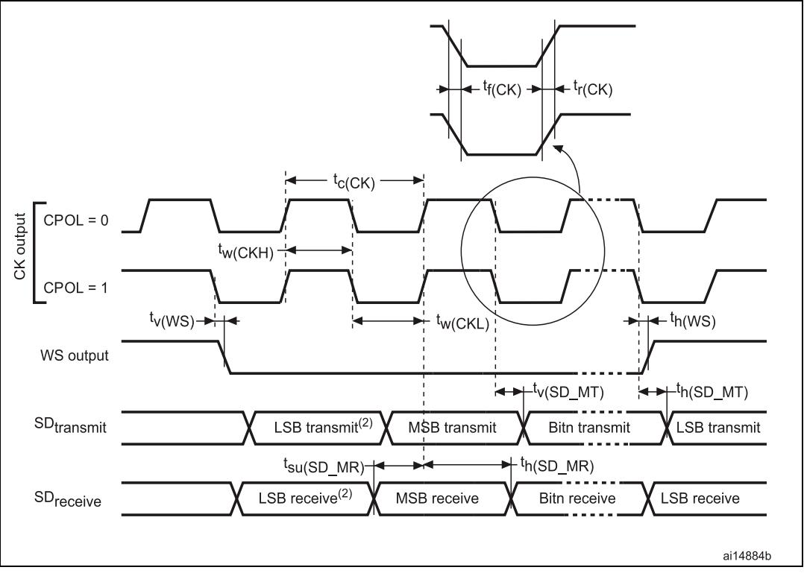

#### **Figure 29. I2S master timing diagram (Philips protocol)(1)**

- 1. Based on characterization, not tested in production.
- 2. LSB transmit/receive of the previously transmitted byte. No LSB transmit/receive is sent before the first byte.


#### **USB OTG FS characteristics**

The USB OTG interface is USB-IF certified (Full-Speed).

|  |  | Table 45. USB OTG FS startup time |
|--|--|-----------------------------------|
|--|--|-----------------------------------|

<span id="page-70-0"></span>

| Symbol      | Parameter                           | Max | Unit |  |
|-------------|-------------------------------------|-----|------|--|
| tSTARTUP(1) | USB OTG FS transceiver startup time | 1   | µs   |  |

1. Guaranteed by design, not tested in production.

<span id="page-70-1"></span>

| Symbol          |        | Parameter                             | Conditions               | Min.(1) | Typ.         | Max.(1) | Unit |  |
|-----------------|--------|---------------------------------------|--------------------------|---------|--------------|---------|------|--|
|                 | VDD    | USB OTG FS operating<br>-<br>voltage  |                          | 3.0(2)  | -            | 3.6     | V    |  |
|                 | VDI(3) | Differential input sensitivity        | I(USBDP, USBDM)          | 0.2     | -            | -       |      |  |
| Input<br>levels | VCM(3) | Differential common mode<br>range     | Includes VDI range       | 0.8     | -            | 2.5     | V    |  |
|                 | VSE(3) | Single ended receiver<br>threshold    | -                        | 1.3     | -            | 2.0     |      |  |
| VOL<br>Output   |        | Static output level low               | RL of 1.5 kΩ to 3.6 V(4) |         | -            | 0.3     | V    |  |
| levels          | VOH    | Static output level high              | RL of 15 kΩ to VSS(4)    | 2.8     | -            | 3.6     |      |  |
| RPD             |        | Pull-down resistance on<br>PA11, PA12 |                          | 17      | 21           | 24      |      |  |
|                 |        | Pull-down resistance on<br>PA9        | VIN = VDD                | 0.65    | 1.1          | 2.0     | kΩ   |  |
| RPU             |        | Pull-up resistance on PA12            | VIN = VSS<br>1.5         |         | 1.8          | 2.1     |      |  |
|                 |        | Pull-up resistance on PA9             | VIN = VSS                | 0.25    | 0.37<br>0.55 |         |      |  |

#### **Table 46. USB OTG FS DC electrical characteristics**

1. All the voltages are measured from the local ground potential.

2. The STM32F105xx and STM32F107xx USB OTG FS functionality is ensured down to 2.7 V but not the full USB OTG FS electrical characteristics which are degraded in the 2.7-to-3.0 V VDD voltage range.

3. Guaranteed by design, not tested in production.

4. RL is the load connected on the USB OTG FS drivers

<span id="page-70-2"></span>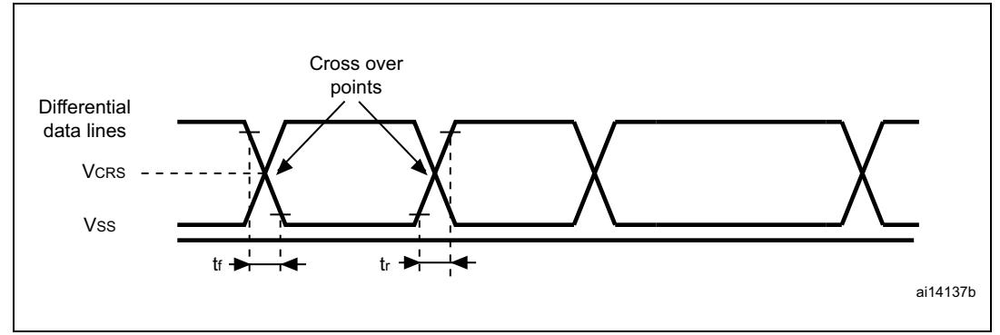

#### **Figure 30. USB OTG FS timings: definition of data signal rise and fall time**


<span id="page-71-0"></span>

| Driver characteristics                                  |                                 |            |     |     |    |  |  |  |
|---------------------------------------------------------|---------------------------------|------------|-----|-----|----|--|--|--|
| Symbol<br>Parameter<br>Conditions<br>Min<br>Max<br>Unit |                                 |            |     |     |    |  |  |  |
| tr                                                      | Rise time(2)                    | CL = 50 pF | 4   | 20  | ns |  |  |  |
| tf                                                      | Fall time(2)                    | CL = 50 pF | 4   | 20  | ns |  |  |  |
| trfm                                                    | Rise/ fall time matching        | tr/tf      | 90  | 110 | %  |  |  |  |
| VCRS                                                    | Output signal crossover voltage | -          | 1.3 | 2.0 | V  |  |  |  |

#### **Table 47. USB OTG FS electrical characteristics(1)**

1. Guaranteed by design, not tested in production.

<span id="page-71-4"></span>2. Measured from 10% to 90% of the data signal. For more detailed informations, refer to USB Specification - Chapter 7 (version 2.0).

#### **Ethernet characteristics**

*[Table 48](#page-71-1)* showns the Ethernet operating voltage.

#### **Table 48. Ethernet DC electrical characteristics**

<span id="page-71-1"></span>

| Symbol      |     | Parameter                  | Min.(1) | Max.(1) | Unit |
|-------------|-----|----------------------------|---------|---------|------|
| Input level | VDD | Ethernet operating voltage | 3.0     | 3.6     | V    |

1. All the voltages are measured from the local ground potential.

*[Table 49](#page-71-2)* gives the list of Ethernet MAC signals for the SMI (station management interface) and *[Figure 31](#page-71-3)* shows the corresponding timing diagram.

<span id="page-71-3"></span>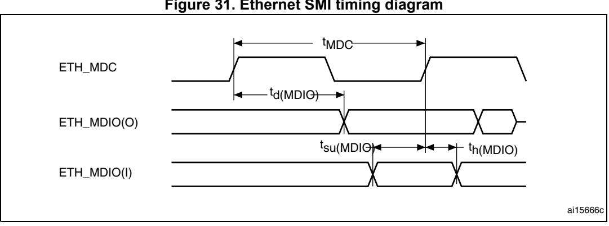

#### **Figure 31. Ethernet SMI timing diagram**

#### **Table 49. Dynamic characteristics: Ethernet MAC signals for SMI**

<span id="page-71-2"></span>

| Symbol    | Rating                                  | Min  | Typ   | Max  | Unit |
|-----------|-----------------------------------------|------|-------|------|------|
| tMDC      | MDC cycle time (1.71 MHz, AHB = 72 MHz) | 583  | 583.5 | 584  | ns   |
| td(MDIO)  | MDIO write data valid time              | 13.5 | 14.5  | 15.5 | ns   |
| tsu(MDIO) | Read data setup time                    | 35   | -     | -    | ns   |
| th(MDIO)  | Read data hold time                     | 0    | -     | -    | ns   |


*[Table 50](#page-72-0)* gives the list of Ethernet MAC signals for the RMII and *[Figure 32](#page-72-1)* shows the corresponding timing diagram.

<span id="page-72-1"></span>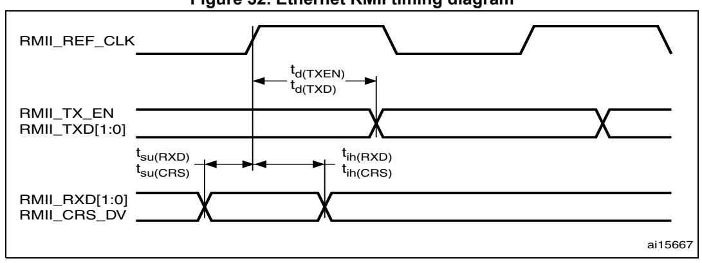


#### **Table 50. Dynamic characteristics: Ethernet MAC signals for RMII**

<span id="page-72-0"></span>

| Symbol                                       | Rating                    | Min | Typ | Max | Unit |
|----------------------------------------------|---------------------------|-----|-----|-----|------|
| tsu(RXD)                                     | Receive data setup time   | 4   | -   | -   | ns   |
| tih(RXD)                                     | Receive data hold time    |     | -   | -   | ns   |
| tsu(DV)                                      | Carrier sense set-up time | 4   | -   | -   | ns   |
| tih(DV)                                      | Carrier sense hold time   |     | -   | -   | ns   |
| td(TXEN)<br>Transmit enable valid delay time |                           | 8   | 10  | 16  | ns   |
| td(TXD)<br>Transmit data valid delay time    |                           | 7   | 10  | 16  | ns   |

*[Table 51](#page-73-1)* gives the list of Ethernet MAC signals for MII and *[Figure 32](#page-72-1)* shows the corresponding timing diagram.

<span id="page-72-2"></span>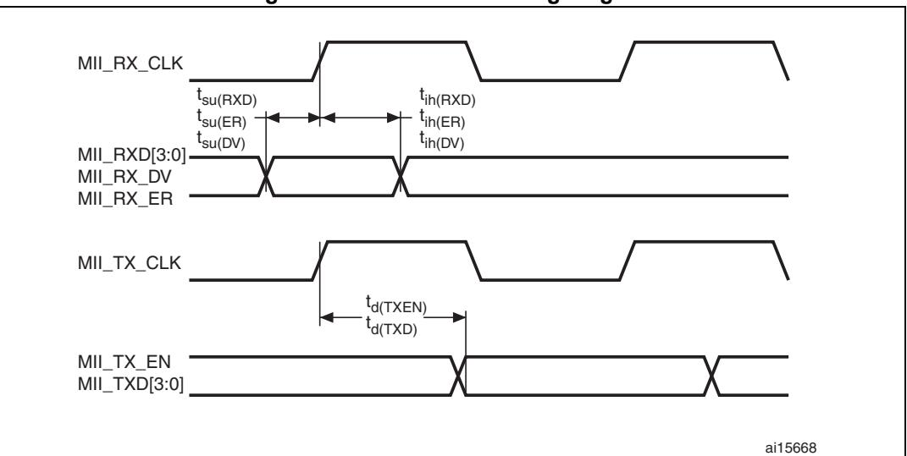

#### **Figure 33. Ethernet MII timing diagram**

<span id="page-73-1"></span>

| Symbol   | Rating                           | Min | Typ | Max | Unit |
|----------|----------------------------------|-----|-----|-----|------|
| tsu(RXD) | Receive data setup time          | 10  | -   | -   | ns   |
| tih(RXD) | Receive data hold time           | 10  | -   | -   | ns   |
| tsu(DV)  | Data valid setup time            | 10  | -   | -   | ns   |
| tih(DV)  | Data valid hold time             | 10  | -   | -   | ns   |
| tsu(ER)  | Error setup time                 | 10  | -   | -   | ns   |
| tih(ER)  | Error hold time                  | 10  | -   | -   | ns   |
| td(TXEN) | Transmit enable valid delay time | 14  | 16  | 18  | ns   |
| td(TXD)  | Transmit data valid delay time   | 13  | 16  | 20  | ns   |

**Table 51. Dynamic characteristics: Ethernet MAC signals for MII**

### **CAN (controller area network) interface**

Refer to *[Section 5.3.12: I/O current injection characteristics](#page-55-1)* for more details on the input/output alternate function characteristics (CANTX and CANRX).

### <span id="page-73-0"></span>**5.3.17 12-bit ADC characteristics**

Unless otherwise specified, the parameters given in *[Table 52](#page-73-2)* are derived from tests performed under the ambient temperature, fPCLK2 frequency and VDDA supply voltage conditions summarized in *[Table 9](#page-36-3)*.

*Note: It is recommended to perform a calibration after each power-up.*

<span id="page-73-2"></span>

| Symbol    | Parameter                          | Conditions                                 | Min                                | Typ    | Max    | Unit   |
|-----------|------------------------------------|--------------------------------------------|------------------------------------|--------|--------|--------|
| VDDA      | Power supply                       | -                                          | 2.4                                | -      | 3.6    | V      |
| VREF+     | Positive reference voltage         | -                                          | 2.4                                | -      | VDDA   | V      |
| IVREF     | Current on the VREF input pin      | -                                          | -                                  | 160(1) | 220(1) | µA     |
| fADC      | ADC clock frequency                | -                                          | 0.6                                | -      | 14     | MHz    |
| (2)<br>fS | Sampling rate                      | -                                          | 0.05                               | -      | 1      | MHz    |
| fTRIG(2)  | External trigger frequency         | fADC = 14 MHz                              | -                                  | -      | 823    | kHz    |
|           |                                    | -                                          | -                                  | -      | 17     | 1/fADC |
| VAIN      | Conversion voltage range(3)        | -                                          | 0 (VSSA or VREF<br>tied to ground) | -      | VREF+  | V      |
| RAIN(2)   | External input impedance           | See Equation 1 and<br>Table 53 for details | -                                  | -      | 50     | kΩ     |
| RADC(2)   | Sampling switch resistance         | -                                          | -                                  | -      | 1      | kΩ     |
| CADC(2)   | Internal sample and hold capacitor | -                                          | -                                  | -      | 8      | pF     |
| tCAL(2)   |                                    | fADC = 14 MHz                              |                                    | 5.9    |        | µs     |
|           | Calibration time                   | -                                          |                                    | 83     |        | 1/fADC |


| Symbol    | Parameter                            | Conditions    | Min                                                               | Typ | Max                                       | Unit                                                         |
|-----------|--------------------------------------|---------------|-------------------------------------------------------------------|-----|-------------------------------------------|--------------------------------------------------------------|
| tlat(2)   | Injection trigger conversion latency | fADC = 14 MHz | -                                                                 | -   | 0.214                                     | µs                                                           |
|           |                                      | -             | -                                                                 | -   | 3(4)                                      | 1/fADC<br>µs<br>1/fADC<br>µs<br>1/fADC<br>µs<br>µs<br>1/fADC |
| tlatr(2)  | Regular trigger conversion latency   | fADC = 14 MHz | -                                                                 | -   | 0.143<br>2(4)<br>17.1<br>239.5<br>1<br>18 |                                                              |
|           |                                      | -             | -                                                                 | -   |                                           |                                                              |
| (2)<br>tS | Sampling time                        | fADC = 14 MHz | 0.107                                                             | -   |                                           |                                                              |
|           |                                      | -             | 1.5                                                               | -   |                                           |                                                              |
| tSTAB(2)  | Power-up time                        | -             | 0                                                                 | 0   |                                           |                                                              |
| tCONV(2)  | Total conversion time (including     | fADC = 14 MHz | 1                                                                 | -   |                                           |                                                              |
|           | sampling time)                       | -             | 14 to 252 (tS for sampling +12.5 for<br>successive approximation) |     |                                           |                                                              |

#### **Table 52. ADC characteristics (continued)**

1. Based on characterization, not tested in production.

2. Guaranteed by design, not tested in production.

3. VREF+ is internally connected to VDDA and VREF- is internally connected to VSSA.

4. For external triggers, a delay of 1/fPCLK2 must be added to the latency specified in *[Table 52](#page-73-2)*.

#### **Equation 1: RAIN max formula**

$$
R_{\text{AIN}} < \frac{T_{\text{S}}}{f_{\text{ADC}} \times C_{\text{ADC}} \times \ln(2^{N+2})} - R_{\text{ADC}}
$$

The formula above (*Equation 1*) is used to determine the maximum external impedance allowed for an error below 1/4 of LSB. Here N = 12 (from 12-bit resolution).

<span id="page-74-0"></span>

| Ts (cycles) | tS (µs) | RAIN max (kΩ) |  |  |  |
|-------------|---------|---------------|--|--|--|
| 1.5         | 0.11    | 0.4           |  |  |  |
| 7.5         | 0.54    | 5.9           |  |  |  |
| 13.5        | 0.96    | 11.4          |  |  |  |
| 28.5        | 2.04    | 25.2          |  |  |  |
| 41.5        | 2.96    | 37.2          |  |  |  |
| 55.5        | 3.96    | 50            |  |  |  |
| 71.5        | 5.11    | NA            |  |  |  |
| 239.5       | 17.1    | NA            |  |  |  |
|             |         |               |  |  |  |

#### **Table 53. RAIN max for fADC = 14 MHz(1)**

1. Based on characterization, not tested in production.


<span id="page-75-0"></span>

| Symbol | Parameter                    | Test conditions                   | Typ  | Max(2) | Unit |
|--------|------------------------------|-----------------------------------|------|--------|------|
| ET     | Total unadjusted error       | fPCLK2 = 56 MHz,                  | ±1.3 | ±2     |      |
| EO     | Offset error                 | fADC = 14 MHz, RAIN < 10 kΩ,      | ±1   | ±1.5   |      |
| EG     | Gain error                   | VDDA = 3 V to 3.6 V<br>TA = 25 °C | ±0.5 | ±1.5   | LSB  |
| ED     | Differential linearity error | Measurements made after           | ±0.7 | ±1     |      |
| EL     | Integral linearity error     | ADC calibration                   | ±0.8 | ±1.5   |      |

| Table 54. ADC accuracy - limited test conditions(1) |  |  |
|-----------------------------------------------------|--|--|
|-----------------------------------------------------|--|--|

1. ADC DC accuracy values are measured after internal calibration.

2. Based on characterization, not tested in production.

<span id="page-75-1"></span>

| Symbol | Parameter                    | Test conditions                                  | Typ  | Max(3) | Unit |
|--------|------------------------------|--------------------------------------------------|------|--------|------|
| ET     | Total unadjusted error       |                                                  | ±2   | ±5     |      |
| EO     | Offset error                 | fPCLK2 = 56 MHz,<br>fADC = 14 MHz, RAIN < 10 kΩ, | ±1.5 | ±2.5   |      |
| EG     | Gain error                   | VDDA = 2.4 V to 3.6 V                            | ±1.5 | ±3     | LSB  |
| ED     | Differential linearity error | Measurements made after<br>ADC calibration       | ±1   | ±2     |      |
| EL     | Integral linearity error     |                                                  | ±1.5 | ±3     |      |

#### **Table 55. ADC accuracy(1) (2)**

1. ADC DC accuracy values are measured after internal calibration.

2. Better performance could be achieved in restricted VDD, frequency and temperature ranges.

3. Based on characterization, not tested in production.

*Note:* ADC accuracy vs. negative injection current: Injecting a negative current on any of the standard (non-robust) analog input pins should be avoided as this significantly reduces the accuracy of the conversion being performed on another analog input. It is recommended to add a Schottky diode (pin to ground) to standard analog pins which may potentially inject negative currents.

> Any positive injection current within the limits specified for IINJ(PIN) and ΣIINJ(PIN) in *[Section 5.3.12](#page-55-1)* does not affect the ADC accuracy.


<span id="page-76-0"></span>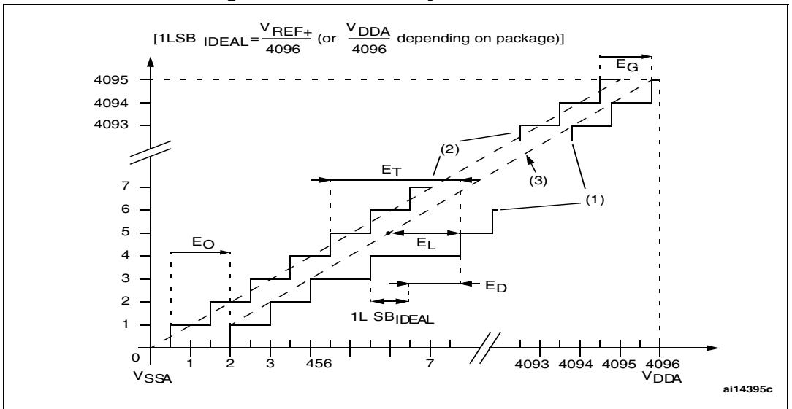

**Figure 34. ADC accuracy characteristics**


<span id="page-76-1"></span>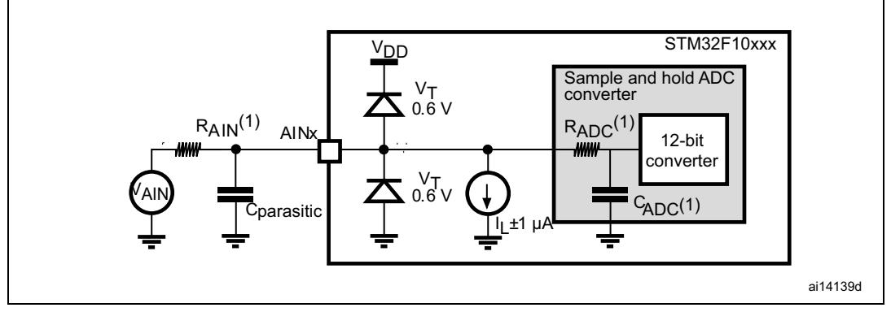

- 1. Refer to *[Table 52](#page-73-2)* for the values of RAIN, RADC and CADC.
- 2. Cparasitic represents the capacitance of the PCB (dependent on soldering and PCB layout quality) plus the pad capacitance (roughly 7 pF). A high Cparasitic value will downgrade conversion accuracy. To remedy this, fADC should be reduced.


### **General PCB design guidelines**

Power supply decoupling should be performed as shown in *[Figure 36](#page-77-0)* or *[Figure 37](#page-77-1)*, depending on whether VREF+ is connected to VDDA or not. The 10 nF capacitors should be ceramic (good quality). They should be placed them as close as possible to the chip.

<span id="page-77-0"></span>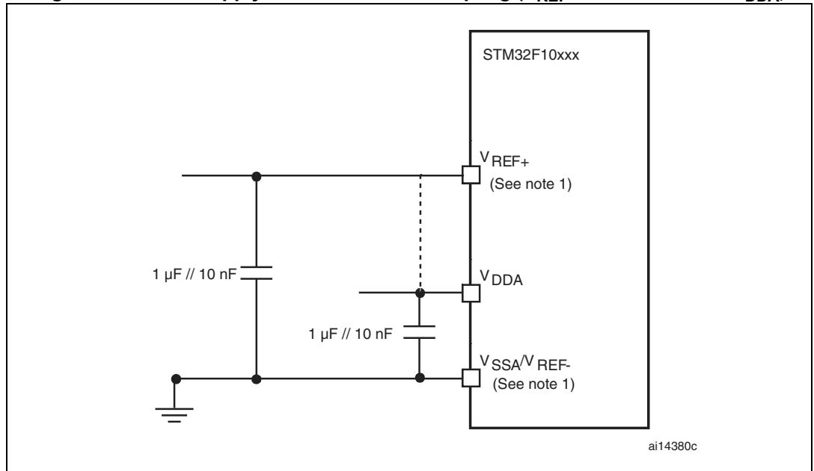

**Figure 36. Power supply and reference decoupling (VREF+ not connected to VDDA)**

1. VREF+ and VREF– inputs are available only on 100-pin packages.

<span id="page-77-1"></span>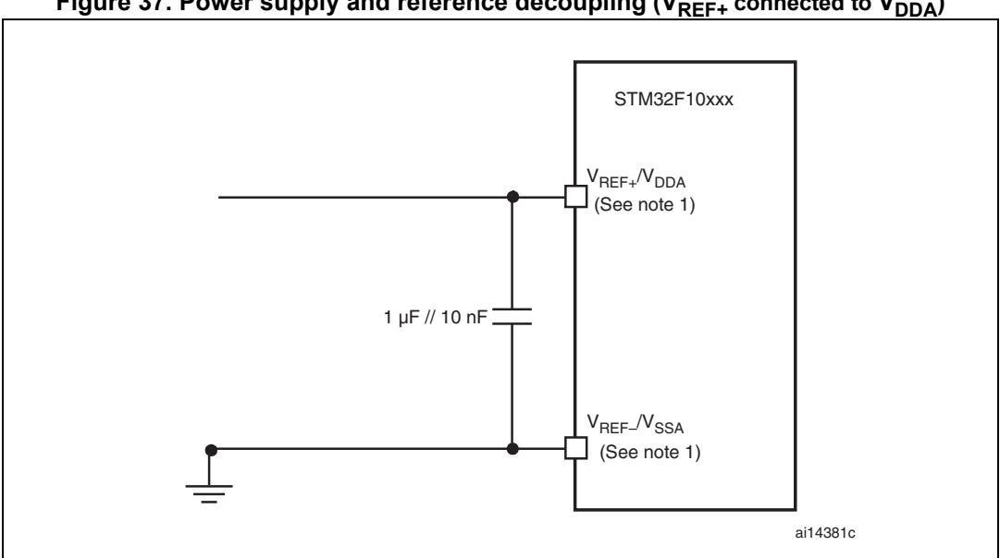


1. VREF+ and VREF– inputs are available only on 100-pin packages.


### <span id="page-78-0"></span>**5.3.18 DAC electrical specifications**

<span id="page-78-1"></span>

| Symbol            | Parameter                                                                                                                                                     | Min | Typ | Max          | Unit | Comments                                                                                                            |  |
|-------------------|---------------------------------------------------------------------------------------------------------------------------------------------------------------|-----|-----|--------------|------|---------------------------------------------------------------------------------------------------------------------|--|
| VDDA              | Analog supply voltage                                                                                                                                         | 2.4 | -   | 3.6          | V    | -                                                                                                                   |  |
| VREF+             | Reference supply voltage                                                                                                                                      | 2.4 | -   | 3.6          | V    | VREF+ must always be below VDDA                                                                                     |  |
| VSSA              | Ground                                                                                                                                                        | 0   | -   | 0            | V    | -                                                                                                                   |  |
| RLOAD(1)          | Resistive load with buffer ON                                                                                                                                 | 5   | -   | -            | kΩ   | -                                                                                                                   |  |
| (1)<br>RO         | Impedance output with buffer<br>OFF                                                                                                                           | -   | -   | 15           | kΩ   | When the buffer is OFF, the<br>Minimum resistive load between<br>DAC_OUT and VSS to have a 1%<br>accuracy is 1.5 MΩ |  |
| CLOAD(1)          | Capacitive load                                                                                                                                               | -   | -   | 50           | pF   | Maximum capacitive load at<br>DAC_OUT pin (when the buffer is<br>ON).                                               |  |
| DAC_OUT<br>min(1) | Lower DAC_OUT voltage<br>with buffer ON                                                                                                                       | 0.2 | -   | -            | V    | It gives the maximum output<br>excursion of the DAC.<br>It corresponds to 12-bit input code                         |  |
| DAC_OUT<br>max(1) | Higher DAC_OUT voltage<br>with buffer ON                                                                                                                      | -   | -   | VDDA – 0.2   | V    | (0x0E0) to (0xF1C) at VREF+ =<br>3.6 V and (0x155) to (0xEAB) at<br>VREF+ = 2.4 V                                   |  |
| DAC_OUT<br>min(1) | Lower DAC_OUT voltage<br>with buffer OFF                                                                                                                      | -   | 0.5 | -            | mV   | It gives the maximum output                                                                                         |  |
| DAC_OUT<br>max(1) | Higher DAC_OUT voltage<br>with buffer OFF                                                                                                                     | -   | -   | VREF+ – 1LSB | V    | excursion of the DAC.                                                                                               |  |
| IDDVREF+          | DAC DC current<br>consumption in quiescent<br>mode (Standby mode)                                                                                             | -   | -   | 220          | µA   | With no load, worst code (0xF1C)<br>at VREF+ = 3.6 V in terms of DC<br>consumption on the inputs                    |  |
|                   | DAC DC current                                                                                                                                                | -   | -   | 380          | µA   | With no load, middle code (0x800)<br>on the inputs                                                                  |  |
| IDDA              | consumption in quiescent<br>mode (Standby mode)                                                                                                               | -   | -   | 480          | µA   | With no load, worst code (0xF1C)<br>at VREF+ = 3.6 V in terms of DC<br>consumption on the inputs                    |  |
| DNL(2)            | Differential non linearity<br>Difference between two<br>consecutive code-1LSB)                                                                                | -   | -   | ±0.5         | LSB  | Given for the DAC in 10-bit<br>configuration.                                                                       |  |
|                   |                                                                                                                                                               | -   | -   | ±2           | LSB  | Given for the DAC in 12-bit<br>configuration.                                                                       |  |
| INL(2)            | Integral non linearity<br>(difference between<br>measured value at Code i<br>and the value at Code i on a<br>line drawn between Code 0<br>and last Code 1023) | -   | -   | ±1           | LSB  | Given for the DAC in 10-bit<br>configuration.                                                                       |  |
|                   |                                                                                                                                                               | -   | -   | ±4           | LSB  | Given for the DAC in 12-bit<br>configuration.                                                                       |  |

#### **Table 56. DAC characteristics**


| Symbol            | Parameter                                                                                                                                                          | Min | Typ | Max  | Unit | Comments                                                                                     |
|-------------------|--------------------------------------------------------------------------------------------------------------------------------------------------------------------|-----|-----|------|------|----------------------------------------------------------------------------------------------|
| Offset(2)         | Offset error<br>(difference between<br>measured value at Code<br>(0x800) and the ideal value =<br>VREF+/2)                                                         | -   | -   | ±10  | mV   | Given for the DAC in 12-bit<br>configuration                                                 |
|                   |                                                                                                                                                                    | -   | -   | ±3   | LSB  | Given for the DAC in 10-bit at<br>VREF+ = 3.6 V                                              |
|                   |                                                                                                                                                                    | -   | -   | ±12  | LSB  | Given for the DAC in 12-bit at<br>VREF+ = 3.6 V                                              |
| Gain<br>error(2)  | Gain error                                                                                                                                                         | -   | -   | ±0.5 | %    | Given for the DAC in 12bit<br>configuration                                                  |
| tSETTLING(2)      | Settling time (full scale: for a<br>10-bit input code transition<br>between the lowest and the<br>highest input codes when<br>DAC_OUT reaches final<br>value ±1LSB | -   | 3   | 4    | µs   | CLOAD<br>≤ 50 pF,<br>RLOAD<br>≥ 5 kΩ                                                         |
| Update<br>rate(2) | Max frequency for a correct<br>DAC_OUT change when<br>small variation in the input<br>code (from code i to i+1LSB)                                                 | -   | -   | 1    |      | MS/s CLOAD<br>≤ 50 pF,<br>RLOAD<br>≥ 5 kΩ                                                    |
| tWAKEUP(2)        | Wakeup time from off state<br>(Setting the ENx bit in the<br>DAC Control register)                                                                                 | -   | 6.5 | 10   | µs   | CLOAD<br>≤ 50 pF, RLOAD<br>≥ 5 kΩ<br>input code between lowest and<br>highest possible ones. |
| PSRR+ (1)         | Power supply rejection ratio<br>(to VDDA) (static DC<br>measurement                                                                                                | -   | –67 | –40  | dB   | No RLOAD, CLOAD = 50 pF                                                                      |

|  |  | Table 56. DAC characteristics (continued) |  |
|--|--|-------------------------------------------|--|
|--|--|-------------------------------------------|--|

1. Guaranteed by design, not tested in production.

2. Guaranteed by characterization, not tested in production.


<span id="page-79-0"></span>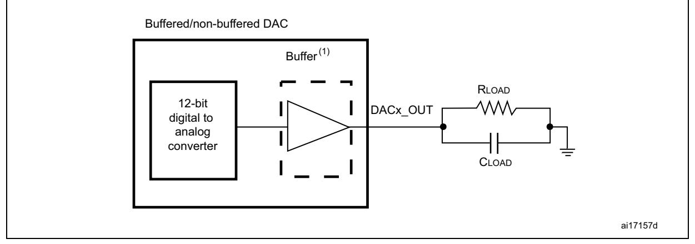

1. The DAC integrates an output buffer that can be used to reduce the output impedance and to drive external loads directly without the use of an external operational amplifier. The buffer can be bypassed by configuring the BOFFx bit in the DAC\_CR register.


### <span id="page-80-0"></span>**5.3.19 Temperature sensor characteristics**

<span id="page-80-1"></span>

| Symbol        | Parameter                                         | Min  | Typ  | Max  | Unit  |  |  |
|---------------|---------------------------------------------------|------|------|------|-------|--|--|
| (1)<br>TL     | VSENSE linearity with temperature                 | -    | ±1   | ±2   | °C    |  |  |
| Avg_Slope(1)  | Average slope                                     | 4.0  | 4.3  | 4.6  | mV/°C |  |  |
| V25(1)        | Voltage at 25 °C                                  | 1.34 | 1.43 | 1.52 | V     |  |  |
| tSTART(2)     | Startup time                                      | 4    | -    | 10   | µs    |  |  |
| TS_temp(3)(2) | ADC sampling time when reading the<br>temperature | -    | -    | 17.1 | µs    |  |  |

**Table 57. TS characteristics**

1. Based on characterization, not tested in production.

2. Guaranteed by design, not tested in production.

3. Shortest sampling time can be determined in the application by multiple iterations.


# <span id="page-81-0"></span>**6 Package information**

In order to meet environmental requirements, ST offers these devices in different grades of ECOPACK® packages, depending on their level of environmental compliance. ECOPACK® specifications, grade definitions and product status are available at: *www.st.com*. ECOPACK® is an ST trademark.

# <span id="page-81-1"></span>**6.1 LFBGA100 package information**

<span id="page-81-2"></span>

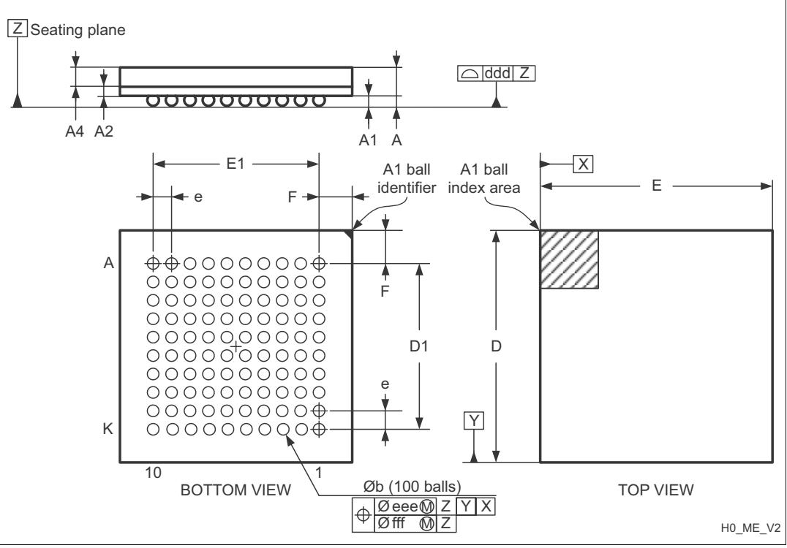


| Symbol | millimeters |        |        | inches(1) |        |        |  |
|--------|-------------|--------|--------|-----------|--------|--------|--|
|        | Min         | Typ    | Max    | Typ       | Min    | Max    |  |
| A      | -           | -      | 1.700  | -         | -      | 0.0669 |  |
| A1     | 0.270       | -      | -      | 0.0106    | -      | -      |  |
| A2     | -           | 0.300  | -      | -         | 0.0118 | -      |  |
| A4     | -           | -      | 0.800  | -         | -      | 0.0315 |  |
| b      | 0.450       | 0.500  | 0.550  | 0.0177    | 0.0197 | 0.0217 |  |
| D      | 9.850       | 10.000 | 10.150 | 0.3878    | 0.3937 | 0.3996 |  |
| D1     | -           | 7.200  | -      | -         | 0.2835 | -      |  |
| E      | 9.850       | 10.000 | 10.150 | 0.3878    | 0.3937 | 0.3996 |  |
| E1     | -           | 7.200  | -      | -         | 0.2835 | -      |  |
| e      | -           | 0.800  | -      | -         | 0.0315 | -      |  |
| F      | -           | 1.400  | -      | -         | 0.0551 | -      |  |
| ddd    | -           | -      | 0.120  | -         | -      | 0.0047 |  |
| eee    | -           | -      | 0.150  | -         | -      | 0.0059 |  |
| fff    | -           | -      | 0.080  | -         | -      | 0.0031 |  |

<span id="page-82-1"></span>**Figure 40. LFBGA100 – 100-ball low profile fine pitch ball grid array, 10 x 10 mm, 0.8 mm pitch, package mechanical data**

1. Values in inches are converted from mm and rounded to 4 decimal digits.

<span id="page-82-2"></span>

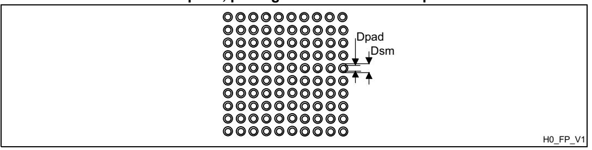

#### **Table 58. LFBGA100 recommended PCB design rules (0.8 mm pitch BGA)**

<span id="page-82-0"></span>

| Dimension         | Recommended values                                                  |
|-------------------|---------------------------------------------------------------------|
| Pitch             | 0.8                                                                 |
| Dpad              | 0.500 mm                                                            |
| Dsm               | 0.570 mm typ. (depends on the soldermask<br>registration tolerance) |
| Stencil opening   | 0.500 mm                                                            |
| Stencil thickness | Between 0.100 mm and 0.125 mm                                       |
| Pad trace width   | 0.120 mm                                                            |


### **Device marking for LFBGA100**

The following figure shows the device marking for the LQFP100 package.

Other optional marking or inset/upset marks, which identify the parts throughout supply chain operations, are not indicated below.

<span id="page-83-0"></span>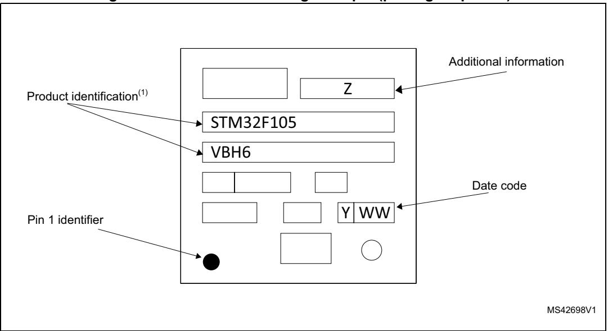

#### **Figure 42. LFBGA100 marking example (package top view)**

Parts marked as "ES", "E" or accompanied by an Engineering Sample notification letter, are not yet qualified and therefore not yet ready to be used in production and any consequences deriving from such usage will not be at ST charge. In no event, ST will be liable for any customer usage of these engineering samples in production. ST Quality has to be contacted prior to any decision to use these Engineering samples to run qualification activity.


# <span id="page-84-0"></span>**6.2 LQFP100 package information**

<span id="page-84-2"></span>**Figure 43. LQFP100 – 14 x 14 mm 100 pin low-profile quad flat package outline**

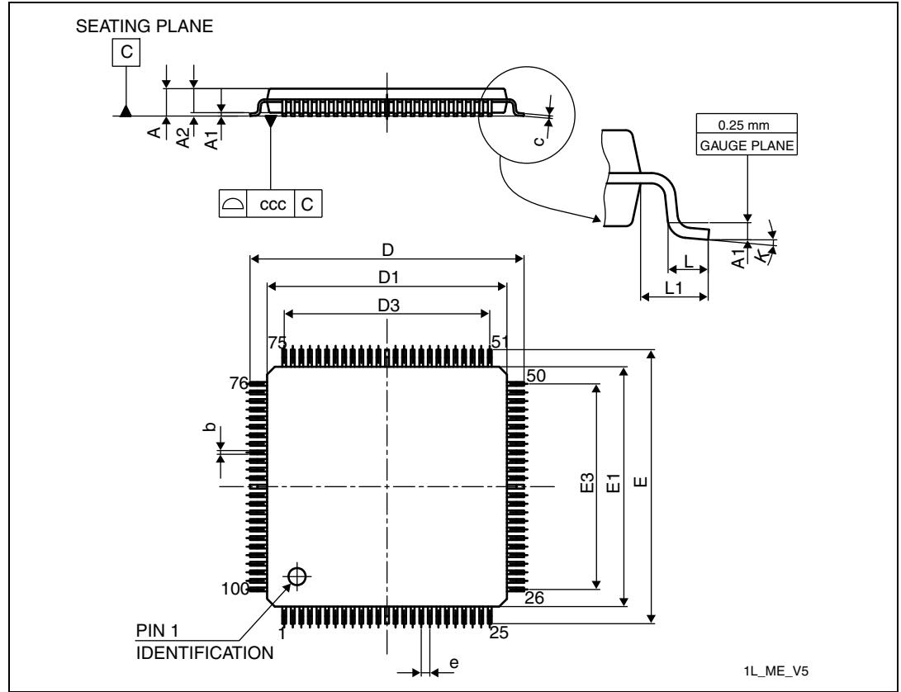

<span id="page-84-1"></span>1. Drawing is not to scale. Dimension are in millimeter.

| Table 59. LQPF100 - 100-pin, 14 x 14 mm low-profile quad flat package<br>mechanical data |             |              |  |  |  |
|------------------------------------------------------------------------------------------|-------------|--------------|--|--|--|
| mhal                                                                                     | millimeters | inches $(1)$ |  |  |  |

| Symbol         | millimeters |            |        | inches $(1)$ |            |        |
|----------------|-------------|------------|--------|--------------|------------|--------|
|                | <b>Min</b>  | <b>Typ</b> | Max    | <b>Min</b>   | <b>Typ</b> | Max    |
| A              | -           |            | 1.600  |              | -          | 0.0630 |
| A <sub>1</sub> | 0.050       |            | 0.150  | 0.0020       | -          | 0.0059 |
| A <sub>2</sub> | 1.350       | 1.400      | 1.450  | 0.0531       | 0.0551     | 0.0571 |
| b              | 0.170       | 0.220      | 0.270  | 0.0067       | 0.0087     | 0.0106 |
| C              | 0.090       |            | 0.200  | 0.0035       |            | 0.0079 |
| D              | 15.800      | 16.000     | 16.200 | 0.6220       | 0.6299     | 0.6378 |
| D <sub>1</sub> | 13.800      | 14.000     | 14.200 | 0.5433       | 0.5512     | 0.5591 |
| D <sub>3</sub> | ۰           | 12.000     | -      |              | 0.4724     |        |
| E              | 15.800      | 16.000     | 16.200 | 0.6220       | 0.6299     | 0.6378 |
| E1             | 13.800      | 14.000     | 14.200 | 0.5433       | 0.5512     | 0.5591 |


| Symbol | millimeters |        |       | inches(1) |        |        |  |
|--------|-------------|--------|-------|-----------|--------|--------|--|
|        | Min         | Typ    | Max   | Min       | Typ    | Max    |  |
| E3     | -           | 12.000 | -     | -         | 0.4724 | -      |  |
| e      | -           | 0.500  | -     | -         | 0.0197 | -      |  |
| L      | 0.450       | 0.600  | 0.750 | 0.0177    | 0.0236 | 0.0295 |  |
| L1     | -           | 1.000  | -     | -         | 0.0394 | -      |  |
| k      | 0.0°        | 3.5°   | 7.0°  | 0.0°      | 3.5°   | 7.0°   |  |
| ccc    | -           | -      | 0.080 | -         | -      | 0.0031 |  |

#### **Table 59. LQPF100 - 100-pin, 14 x 14 mm low-profile quad flat package mechanical data (continued)**

1. Values in inches are converted from mm and rounded to 4 decimal digits.


<span id="page-85-0"></span>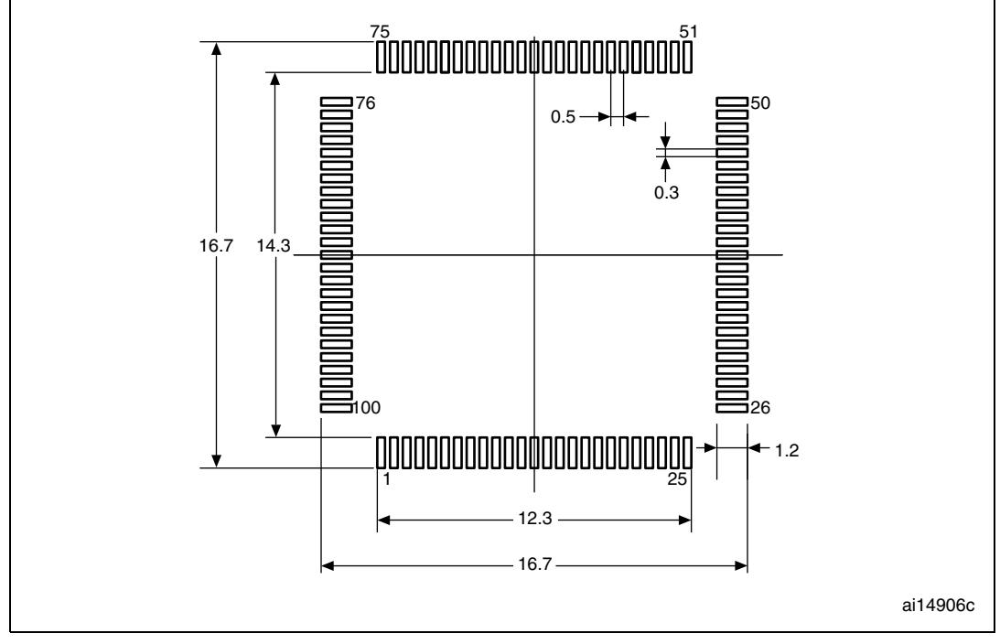


#### **Device marking for LQFP100**

The following figure shows the device marking for the LQFP100 package.

Other optional marking or inset/upset marks, which identify the parts throughout supply chain operations, are not indicated below.

<span id="page-86-0"></span>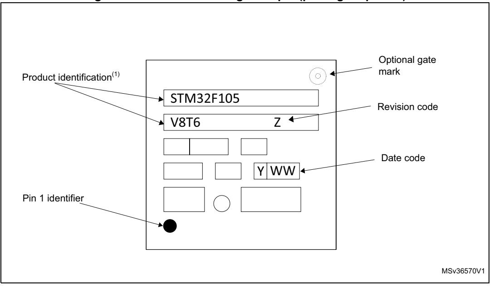

#### **Figure 45.LQFP100 marking example (package top view)**

1. Parts marked as "ES", "E" or accompanied by an Engineering Sample notification letter, are not yet qualified and therefore not yet ready to be used in production and any consequences deriving from such usage will not be at ST charge. In no event, ST will be liable for any customer usage of these engineering samples in production. ST Quality has to be contacted prior to any decision to use these Engineering samples to run qualification activity.


# <span id="page-87-0"></span>**6.3 LQFP64 package information**

<span id="page-87-2"></span>:B0(B9 \$ \$ \$ 6(\$7,1\*3/\$1( FFF & E & F\$ / / . ,'(17,),&\$7,21 3,1 ' ' ' H ( ( (\*\$8\*(3/\$1( PP

**Figure 46.LQFP64 – 10 x 10 mm 64 pin low-profile quad flat package outline**

1. Drawing is not in scale.

<span id="page-87-1"></span>

| Symbol | millimeters |        |       | inches(1) |        |        |
|--------|-------------|--------|-------|-----------|--------|--------|
|        | Min         | Typ    | Max   | Min       | Typ    | Max    |
| A      | -           | -      | 1.600 | -         | -      | 0.0630 |
| A1     | 0.050       | -      | 0.150 | 0.0020    | -      | 0.0059 |
| A2     | 1.350       | 1.400  | 1.450 | 0.0531    | 0.0551 | 0.0571 |
| b      | 0.170       | 0.220  | 0.270 | 0.0067    | 0.0087 | 0.0106 |
| c      | 0.090       | -      | 0.200 | 0.0035    | -      | 0.0079 |
| D      | -           | 12.000 | -     | -         | 0.4724 | -      |
| D1     | -           | 10.000 | -     | -         | 0.3937 | -      |
| D3     | -           | 7.500  | -     | -         | 0.2953 | -      |
| E      | -           | 12.000 | -     | -         | 0.4724 | -      |
| E1     | -           | 10.000 | -     | -         | 0.3937 | -      |
| E3     | -           | 7.500  | -     | -         | 0.2953 | -      |

| Symbol | millimeters |       |       | inches(1) |        |        |
|--------|-------------|-------|-------|-----------|--------|--------|
|        | Min         | Typ   | Max   | Min       | Typ    | Max    |
| e      | -           | 0.500 | -     | -         | 0.0197 | -      |
| θ      | 0°          | 3.5°  | 7°    | 0°        | 3.5°   | 7°     |
| L      | 0.450       | 0.600 | 0.750 | 0.0177    | 0.0236 | 0.0295 |
| L1     | -           | 1.000 | -     | -         | 0.0394 | -      |
| ccc    | -           | -     | 0.080 | -         | -      | 0.0031 |

#### **Table 60.LQFP64 – 10 x 10 mm 64 pin low-profile quad flat package mechanical data**

1. Values in inches are converted from mm and rounded to 4 decimal digits.

#### <span id="page-88-0"></span>**Figure 47.LQFP64 - 64-pin, 10 x 10 mm low-profile quad flat recommended footprint**

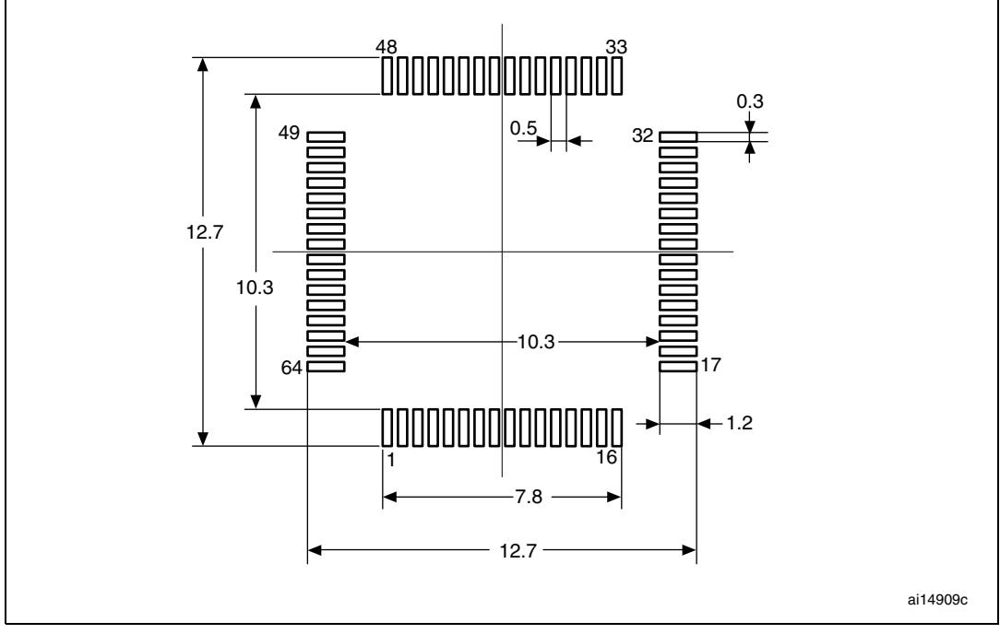

1. Dimensions are in millimeters.


#### **Device marking for LQFP64**

The following figure shows the device marking for the LQFP64 package.

Other optional marking or inset/upset marks, which identify the parts throughout supply chain operations, are not indicated below.

<span id="page-89-0"></span>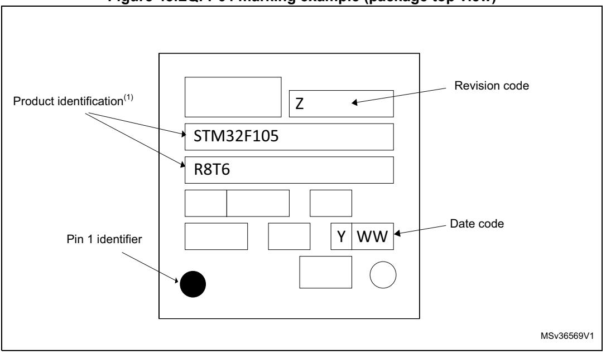

#### **Figure 48.LQFP64 marking example (package top view)**

1. Parts marked as "ES", "E" or accompanied by an Engineering Sample notification letter, are not yet qualified and therefore not yet ready to be used in production and any consequences deriving from such usage will not be at ST charge. In no event, ST will be liable for any customer usage of these engineering samples in production. ST Quality has to be contacted prior to any decision to use these Engineering samples to run qualification activity.


### <span id="page-90-0"></span>**6.4 Thermal characteristics**

The maximum chip junction temperature (TJmax) must never exceed the values given in *[Table 9: General operating conditions on page 37](#page-36-3)*.

The maximum chip-junction temperature, TJ max, in degrees Celsius, may be calculated using the following equation:

$$
T_J
$$
 max =  $T_A$  max + ( $P_D$  max ×  $\Theta_{JA}$ )

Where:

- TA max is the maximum ambient temperature in ° C,
- ΘJA is the package junction-to-ambient thermal resistance, in ° C/W,
- PD max is the sum of PINT max and PI/O max (PD max = PINT max + PI/Omax),
- PINT max is the product of IDD and VDD, expressed in Watts. This is the maximum chip internal power.

PI/O max represents the maximum power dissipation on output pins where:

PI/O max = Σ (VOL × IOL) + Σ((VDD – VOH) × IOH),

taking into account the actual VOL / IOL and VOH / IOH of the I/Os at low and high level in the application.

<span id="page-90-2"></span>

| Symbol | Parameter                                                                   | Value | Unit |
|--------|-----------------------------------------------------------------------------|-------|------|
| ΘJA    | Thermal resistance junction-ambient<br>LQFP100 - 14 × 14 mm / 0.5 mm pitch  | 46    | °C/W |
|        | Thermal resistance junction-ambient<br>LQFP64 - 10 × 10 mm / 0.5 mm pitch   | 45    |      |
| ΘJA    | Thermal resistance junction-ambient<br>LFBGA100 - 10 × 10 mm / 0.8 mm pitch | 40    |      |
|        | Thermal resistance junction-ambient<br>LQFP100 - 14 × 14 mm / 0.5 mm pitch  | 46    | °C/W |
|        | Thermal resistance junction-ambient<br>LQFP64 - 10 × 10 mm / 0.5 mm pitch   | 45    |      |

### <span id="page-90-1"></span>**6.4.1 Reference document**

JESD51-2 Integrated Circuits Thermal Test Method Environment Conditions - Natural Convection (Still Air). Available from www.jedec.org.


### <span id="page-91-0"></span>**6.4.2 Selecting the product temperature range**

When ordering the microcontroller, the temperature range is specified in the ordering information scheme shown in *[Table 62: Ordering information scheme](#page-93-1)*.

Each temperature range suffix corresponds to a specific guaranteed ambient temperature at maximum dissipation and, to a specific maximum junction temperature.

As applications do not commonly use the STM32F103xx at maximum dissipation, it is useful to calculate the exact power consumption and junction temperature to determine which temperature range will be best suited to the application.

The following examples show how to calculate the temperature range needed for a given application.

#### **Example 1: High-performance application**

Assuming the following application conditions:

Maximum ambient temperature TAmax = 82 °C (measured according to JESD51-2), IDDmax = 50 mA, VDD = 3.5 V, maximum 20 I/Os used at the same time in output at low level with IOL = 8 mA, VOL= 0.4 V and maximum 8 I/Os used at the same time in output at low level with IOL = 20 mA, VOL= 1.3 V

PINTmax = 50 mA × 3.5 V= 175 mW

PIOmax = 20 × 8 mA × 0.4 V + 8 × 20 mA × 1.3 V = 272 mW

This gives: PINTmax = 175 mW and PIOmax = 272 mW:

```
PDmax = 175 + 272 = 447 mW
```

Thus: PDmax = 447 mW

Using the values obtained in *[Table 61](#page-90-2)* TJmax is calculated as follows:

– For LQFP100, 46 °C/W

TJmax = 82 °C + (46 °C/W × 447 mW) = 82 °C + 20.6 °C = 102.6 °C

This is within the range of the suffix 6 version parts (–40 < TJ < 105 °C).

In this case, parts must be ordered at least with the temperature range suffix 6 (see *[Table 62: Ordering information scheme](#page-93-1)*).

### **Example 2: High-temperature application**

Using the same rules, it is possible to address applications that run at high ambient temperatures with a low dissipation, as long as junction temperature TJ remains within the specified range.

Assuming the following application conditions:

Maximum ambient temperature TAmax = 115 °C (measured according to JESD51-2), IDDmax = 20 mA, VDD = 3.5 V, maximum 20 I/Os used at the same time in output at low level with IOL = 8 mA, VOL= 0.4 V PINTmax = 20 mA × 3.5 V= 70 mW PIOmax = 20 × 8 mA × 0.4 V = 64 mW This gives: PINTmax = 70 mW and PIOmax = 64 mW: PDmax = 70 + 64 = 134 mW Thus: PDmax = 134 mW


Using the values obtained in *[Table 61](#page-90-2)* TJmax is calculated as follows:

- For LQFP100, 46 °C/W
- TJmax = 115 °C + (46 °C/W × 134 mW) = 115 °C + 6.2 °C = 121.2 °C

This is within the range of the suffix 7 version parts (–40 < TJ < 125 °C).

In this case, parts must be ordered at least with the temperature range suffix 7 (see *[Table 62: Ordering information scheme](#page-93-1)*).

<span id="page-92-0"></span>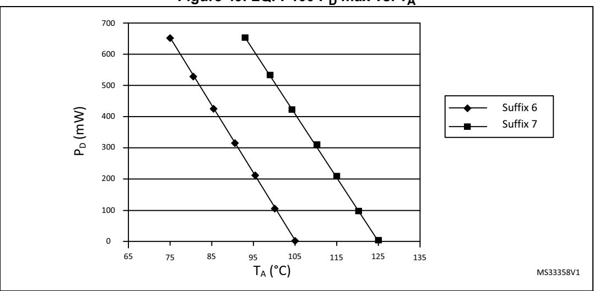

**Figure 49. LQFP100 PD max vs. TA**


# <span id="page-93-0"></span>**7 Part numbering**

<span id="page-93-1"></span>

| Example:                                         | STM32 | F 105 R<br>C<br>T | 6<br>V<br>xxx<br>TR |
|--------------------------------------------------|-------|-------------------|---------------------|
| Device family                                    |       |                   |                     |
|                                                  |       |                   |                     |
| STM32 = ARM-based 32-bit microcontroller         |       |                   |                     |
| Product type                                     |       |                   |                     |
| F = general-purpose                              |       |                   |                     |
|                                                  |       |                   |                     |
| Device subfamily                                 |       |                   |                     |
| 105 = connectivity, USB OTG FS                   |       |                   |                     |
| 107 = connectivity, USB OTG FS & Ethernet        |       |                   |                     |
|                                                  |       |                   |                     |
| Pin count                                        |       |                   |                     |
| R = 64 pins                                      |       |                   |                     |
| V = 100 pins                                     |       |                   |                     |
|                                                  |       |                   |                     |
| Flash memory size                                |       |                   |                     |
| 8 = 64 Kbytes of Flash memory                    |       |                   |                     |
| B = 128 Kbytes of Flash memory                   |       |                   |                     |
| C = 256 Kbytes of Flash memory                   |       |                   |                     |
|                                                  |       |                   |                     |
| Package                                          |       |                   |                     |
| H = BGA                                          |       |                   |                     |
| T = LQFP                                         |       |                   |                     |
|                                                  |       |                   |                     |
| Temperature range                                |       |                   |                     |
| 6 = Industrial temperature range, –40 to 85 °C.  |       |                   |                     |
| 7 = Industrial temperature range, –40 to 105 °C. |       |                   |                     |
|                                                  |       |                   |                     |
| Software option                                  |       |                   |                     |
| Internal code or Blank                           |       |                   |                     |
|                                                  |       |                   |                     |
| Options                                          |       |                   |                     |
| xxx = programmed parts                           |       |                   |                     |
|                                                  |       |                   |                     |
| Packing                                          |       |                   |                     |

**Table 62. Ordering information scheme**

Blank = tray TR = tape and reel

> For a list of available options (speed, package, etc.) or for further information on any aspect of this device, contact your nearest ST sales office.


# <span id="page-94-0"></span>**Appendix A Application block diagrams**

# <span id="page-94-2"></span><span id="page-94-1"></span>**A.1 USB OTG FS interface solutions**

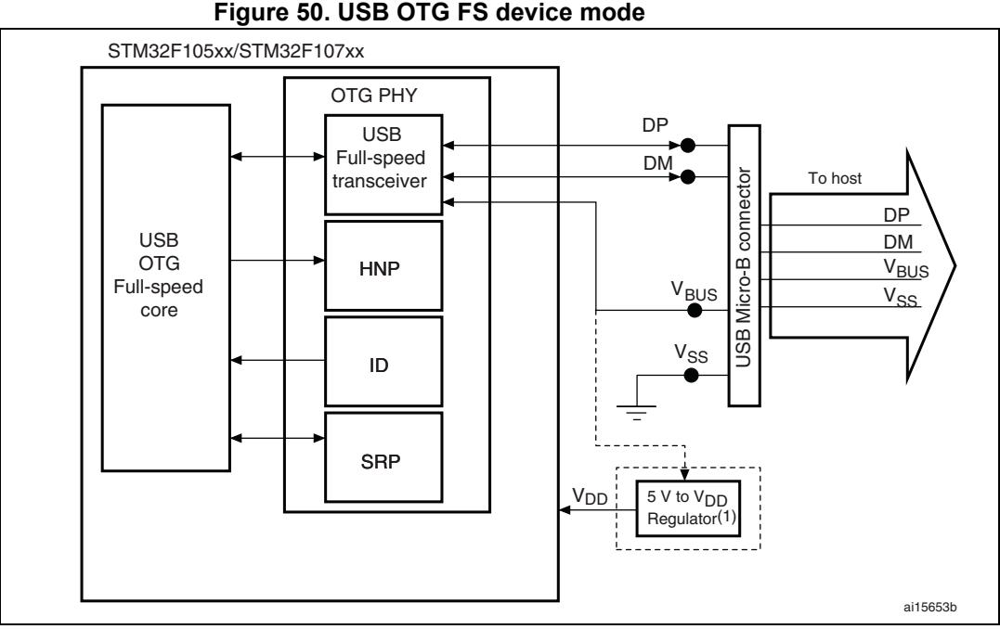

1. Use a regulator if you want to build a bus-powered device.

<span id="page-94-3"></span>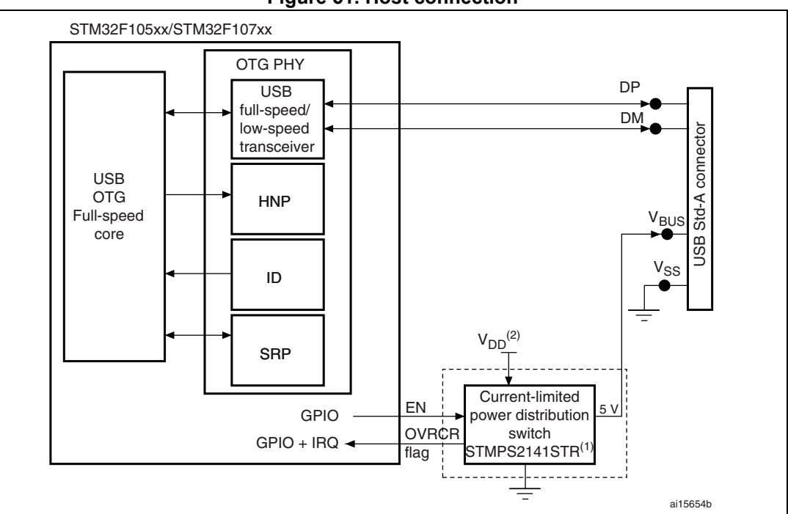

**Figure 51. Host connection**

1. STMPS2141STR needed only if the application has to support bus-powered devices.


<span id="page-95-0"></span>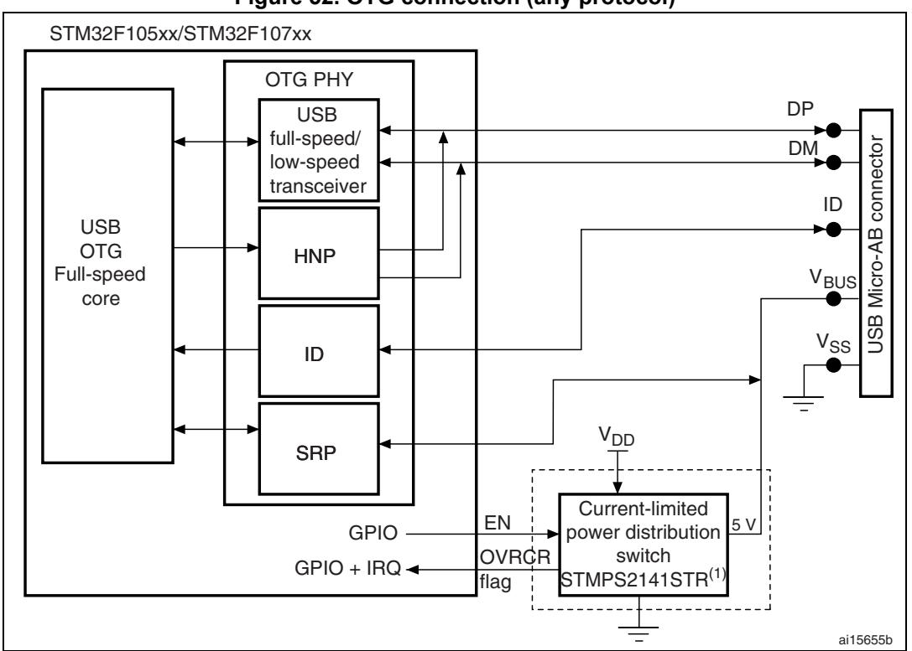

**Figure 52. OTG connection (any protocol)**

1. STMPS2141STR needed only if the application has to support bus-powered devices.


# <span id="page-96-0"></span>**A.2 Ethernet interface solutions**

<span id="page-96-1"></span>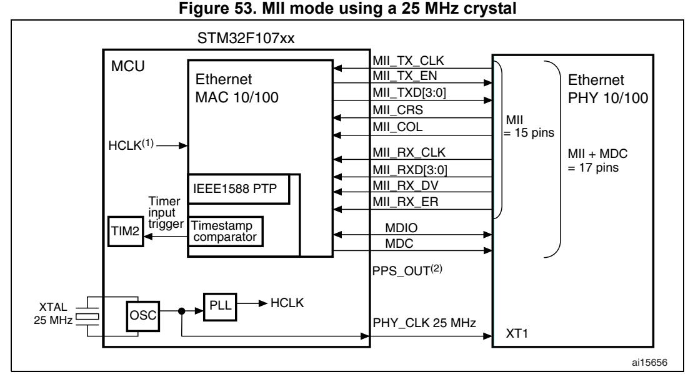

#### 1. HCLK must be greater than 25 MHz.

2. Pulse per second when using IEEE1588 PTP, optional signal.


<span id="page-96-2"></span>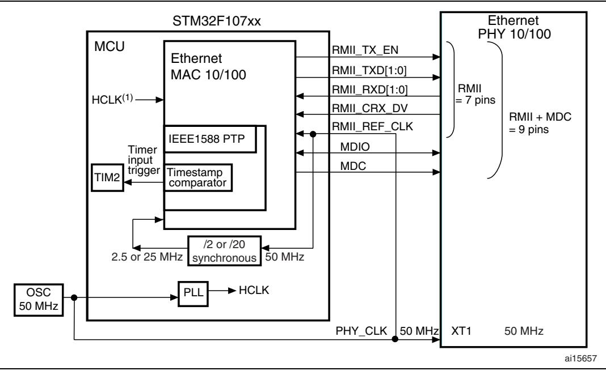

1. HCLK must be greater than 25 MHz.


<span id="page-97-0"></span>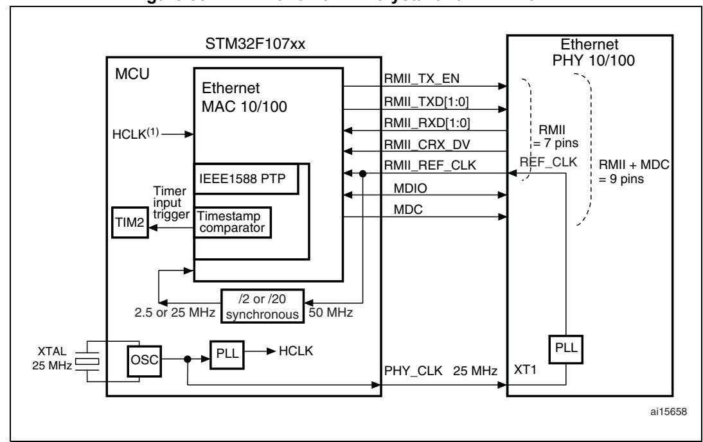

**Figure 55. RMII with a 25 MHz crystal and PHY with PLL**

1. HCLK must be greater than 25 MHz.

<span id="page-97-1"></span>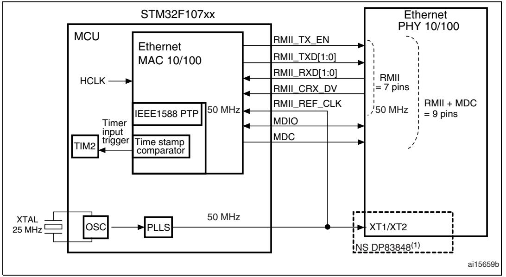

**Figure 56. RMII with a 25 MHz crystal**

1. The NS DP83848 is recommended as the input jitter requirement of this PHY. It is compliant with the output jitter specification of the MCU.


## <span id="page-98-0"></span>**A.3 Complete audio player solutions**

Two solutions are offered, illustrated in *[Figure 57](#page-98-1)* and *[Figure 58](#page-98-2)*.

*[Figure 57](#page-98-1)* shows storage media to audio DAC/amplifier streaming using a software Codec. This solution implements an audio crystal to provide audio class I2S accuracy on the master clock (0.5% error maximum, see the Serial peripheral interface section in the reference manual for details).

<span id="page-98-1"></span>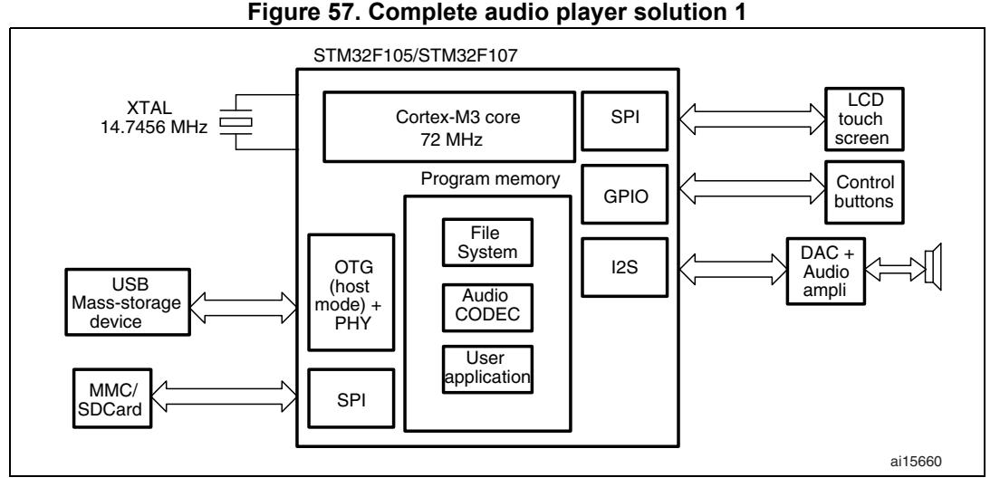

*[Figure 58](#page-98-2)* shows storage media to audio Codec/amplifier streaming with SOF synchronization of input/output audio streaming using a hardware Codec.

<span id="page-98-2"></span>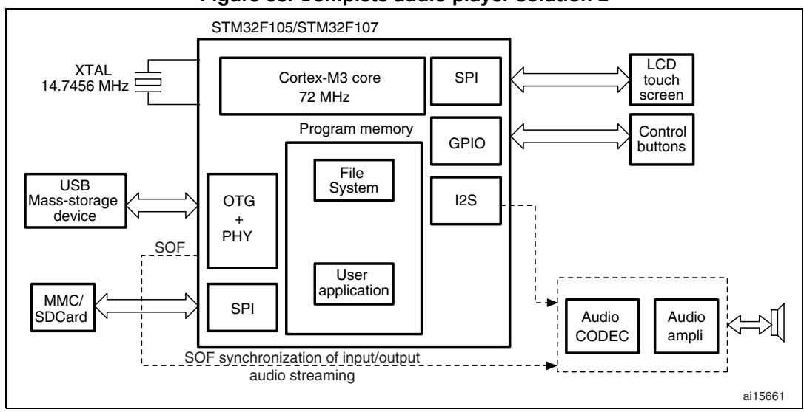

#### **Figure 58. Complete audio player solution 2**


# <span id="page-99-0"></span>**A.4 USB OTG FS interface + Ethernet/I2S interface solutions**

With the clock tree implemented on the STM32F107xx, only one crystal is required to work with both the USB (host/device/OTG) and the Ethernet (MII/RMII) interfaces. *[Figure 59](#page-99-1)* illustrate the solution.

<span id="page-99-1"></span>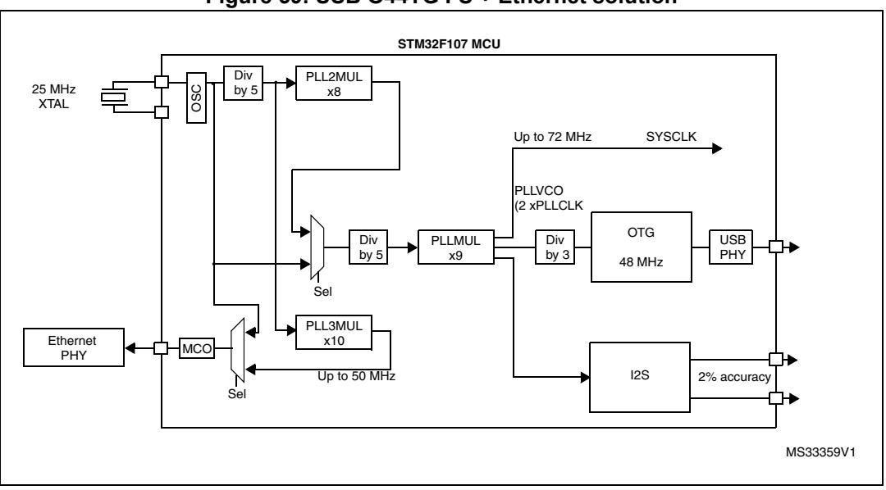

**Figure 59. USB O44TG FS + Ethernet solution**

With the clock tree implem1ented on the STM32F107xx, only one crystal is required to work with both the USB (host/device/OTG) and the I2S (Audio) interfaces. *[Figure 60](#page-99-2)* illustrate the solution.

<span id="page-99-2"></span>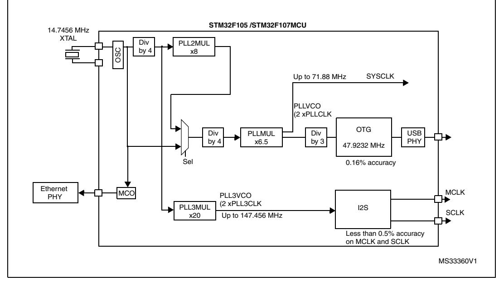

### **Figure 60. USB OTG FS + I2S (Audio) solution**


<span id="page-100-0"></span>

| Application                                   | Crystal<br>value in<br>MHz<br>(XT1) |    | PREDIV2 PLL2MUL | PLLSRC | PREDIV1 | PLLMUL        | USB<br>prescaler<br>(PLLVCO<br>output) | PLL3MUL       | I2Sn<br>clock<br>input | MCO (main<br>clock<br>output)                |
|-----------------------------------------------|-------------------------------------|----|-----------------|--------|---------|---------------|----------------------------------------|---------------|------------------------|----------------------------------------------|
| Ethernet only                                 | 25                                  | /5 | PLL2ON<br>x8    | PLL2   | /5      | PLLON x9      | NA                                     | PLL3ON<br>x10 | NA                     | XT1 (MII)<br>PLL3 (RMII)                     |
| Ethernet + OTG                                | 25                                  | /5 | PLL2ON<br>x8    | PLL2   | /5      | PLLON x9      | /3                                     | PLL3ON<br>x10 | NA                     | XT1 (MII)<br>PLL3 (RMII)                     |
| Ethernet + OTG<br>+ basic audio               | 25                                  | /5 | PLL2ON<br>x8    | PLL2   | /5      | PLLON x9      | /3                                     | PLL3ON<br>x10 | PLL                    | XT1 (MII)<br>PLL3 (RMII)                     |
| Ethernet + OTG<br>+ Audio class<br>2S(1)<br>I | 14.7456                             | /4 | PLL2ON<br>x12   | PLL2   | /4      | PLLON<br>x6.5 | /3                                     | PLL3ON<br>x20 | PLL3<br>VCO<br>Out     | NA<br>ETH PHY<br>must use its<br>own crystal |
| OTG only                                      | 8                                   | NA | PLL2OFF         | XT1    | /1      | PLLON x9      | /3                                     | PLL3OFF       | NA                     | NA                                           |
| OTG + basic<br>audio                          | 8                                   | NA | PLL2OFF         | XT1    | /1      | PLLON x9      | /3                                     | PLL3OFF       | PLL                    | NA                                           |
| OTG + Audio<br>class I2S(1)                   | 14.7456                             | /4 | PLL2ON<br>x12   | PLL2   | /4      | PLLON<br>x6.5 | /3                                     | PLL3ON<br>x20 | PLL3<br>VCO<br>Out     | NA                                           |
| Audio class I2S<br>only(1)                    | 14.7456                             | /4 | PLL2ON<br>x12   | PLL2   | /4      | PLLON<br>x6.5 | NA                                     | PLL3ON<br>x20 | PLL3<br>VCO<br>out     | NA                                           |

**Table 63. PLL configurations**

1. SYSCLK is set to be at 72 MHz except in this case where SYSCLK is at 71.88 MHz.

*[Table 64](#page-101-0)* give the IDD run mode values that correspond to the conditions specified in *[Table 63](#page-100-0)*.


<span id="page-101-0"></span>

| Symbol | parameter                     | Conditions(1)                                                                                             | Typ(2) |       | Max(2) |    |
|--------|-------------------------------|-----------------------------------------------------------------------------------------------------------|--------|-------|--------|----|
|        |                               |                                                                                                           |        | 85 °C | 105 °C |    |
| IDD    | Supply current<br>in run mode | External clock, all peripherals enabled<br>except ethernet,<br>HSE = 8 MHz, fHCLK = 72 MHz, no<br>MCO     | 57     | 63    | 64     |    |
|        |                               | External clock, all peripherals enabled<br>except ethernet,<br>HSE = 14.74 MHz, fHCLK = 72 MHz, no<br>MCO | 60.5   | 67    | 68     |    |
|        |                               | External clock, all peripherals enabled<br>except OTG,<br>HSE = 25 MHz, fHCLK = 72 MHz, MCO<br>= 25 MHz   | 53     | 60.7  | 61     |    |
|        |                               | External clock, all peripherals enabled,<br>HSE = 25 MHz, fHCLK = 72 MHz, MCO<br>= 25 MHz                 | 60.5   | 65.5  | 66     | mA |
|        |                               | External clock, all peripherals enabled,<br>HSE = 25 MHz, fHCLK = 72 MHz, MCO<br>= 50 MHz                 | 64     | 69.7  | 70     |    |
|        |                               | External clock, all peripherals enabled,<br>HSE = 50 MHz(3), fHCLK = 72<br>MHz, no<br>MCO                 | 62.5   | 67.5  | 68     |    |
|        |                               | External clock, only OTG enabled,<br>HSE = 8 MHz, fHCLK = 48 MHz, no<br>MCO                               | 26.7   | None  | None   |    |
|        |                               | External clock, only ethernet enabled,<br>HSE = 25 MHz, fHCLK = 25 MHz, MCO<br>= 25 MHz                   | 14.3   | None  | None   |    |

#### **Table 64. Applicative current consumption in Run mode, code with data processing running from Flash**

1. VDD = 3.3 V.

2. Based on characterization, not tested in production.

3. External oscillator.

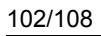


# <span id="page-102-0"></span>**8 Revision history**

<span id="page-102-1"></span>

| Date        | Revision | Changes                                                                                                                                                                                                                                                                                                                                                                                                                                                                                                                                                                                                                                                                                                                                                                                                                                                                      |
|-------------|----------|------------------------------------------------------------------------------------------------------------------------------------------------------------------------------------------------------------------------------------------------------------------------------------------------------------------------------------------------------------------------------------------------------------------------------------------------------------------------------------------------------------------------------------------------------------------------------------------------------------------------------------------------------------------------------------------------------------------------------------------------------------------------------------------------------------------------------------------------------------------------------|
| 18-Dec-2008 | 1        | Initial release.                                                                                                                                                                                                                                                                                                                                                                                                                                                                                                                                                                                                                                                                                                                                                                                                                                                             |
| 20-Feb-2009 | 2        | I/O information clarified on page 1. Figure 4: STM32F105xxx and<br>STM32F107xxx connectivity line BGA100 ballout top view corrected.<br>Section 2.3.8: Boot modes updated.<br>PB4, PB13, PB14, PB15, PB3/TRACESWO moved from Default<br>column to Remap column, plus small additional changes in Table 5:<br>Pin definitions.<br>Consumption values modified in Section 5.3.5: Supply current<br>characteristics.<br>Note modified in Table 13: Maximum current consumption in Run<br>mode, code with data processing running from Flash and Table 15:<br>Maximum current consumption in Sleep mode, code running from<br>Flash or RAM.<br>Table 20: High-speed external user clock characteristics and<br>Table 21: Low-speed external user clock characteristics modified.<br>Table 27: PLL characteristics modified and Table 28: PLL2 and PLL3<br>characteristics added. |

#### **Table 65. Document revision history**


| Date        | Revision | Changes                                                                                                                                                                                                                                                                                                                                                                                                                                                                                                                                                                                                                                                                                                                                                                                                                                                                                                                                                                                                                                                                                                                                                                                                                                                                                                                                                                                                                                                                                                                                                                                                                                                                                                                                                                                                                                                                                                                                                                                                                                                                                                                                                                                                                                                                                                                                                                                                                                                                                                                                                                                                                                                                                                                                                                                           |
|-------------|----------|---------------------------------------------------------------------------------------------------------------------------------------------------------------------------------------------------------------------------------------------------------------------------------------------------------------------------------------------------------------------------------------------------------------------------------------------------------------------------------------------------------------------------------------------------------------------------------------------------------------------------------------------------------------------------------------------------------------------------------------------------------------------------------------------------------------------------------------------------------------------------------------------------------------------------------------------------------------------------------------------------------------------------------------------------------------------------------------------------------------------------------------------------------------------------------------------------------------------------------------------------------------------------------------------------------------------------------------------------------------------------------------------------------------------------------------------------------------------------------------------------------------------------------------------------------------------------------------------------------------------------------------------------------------------------------------------------------------------------------------------------------------------------------------------------------------------------------------------------------------------------------------------------------------------------------------------------------------------------------------------------------------------------------------------------------------------------------------------------------------------------------------------------------------------------------------------------------------------------------------------------------------------------------------------------------------------------------------------------------------------------------------------------------------------------------------------------------------------------------------------------------------------------------------------------------------------------------------------------------------------------------------------------------------------------------------------------------------------------------------------------------------------------------------------------|
|             |          |                                                                                                                                                                                                                                                                                                                                                                                                                                                                                                                                                                                                                                                                                                                                                                                                                                                                                                                                                                                                                                                                                                                                                                                                                                                                                                                                                                                                                                                                                                                                                                                                                                                                                                                                                                                                                                                                                                                                                                                                                                                                                                                                                                                                                                                                                                                                                                                                                                                                                                                                                                                                                                                                                                                                                                                                   |
| 19-Jun-2009 | 3        | Section 2.3.8: Boot modes and Section 2.3.20: Ethernet MAC<br>interface with dedicated DMA and IEEE 1588 support updated.<br>Section 2.3.24: Remap capability added.<br>Figure 1: STM32F105xx and STM32F107xx connectivity line block<br>diagram and Figure 5: Memory map updated.<br>In Table 5: Pin definitions:<br>– I2S3_WS, I2S3_CK and I2S3_SD default alternate functions<br>added<br>– small changes in signal names<br>– Note 6 modified<br>– ETH_MII_PPS_OUT and ETH_RMII_PPS_OUT replaced by<br>ETH_PPS_OUT<br>– ETH_MII_MDIO and ETH_RMII_MDIO replaced by ETH_MDIO<br>– ETH_MII_MDC and ETH_RMII_MDC replaced by ETH_MDC<br>Figures: Typical current consumption in Run mode versus frequency<br>(at 3.6 V) - code with data processing running from RAM, peripherals<br>enabled and Typical current consumption in Run mode versus<br>frequency (at 3.6 V) - code with data processing running from RAM,<br>peripherals disabled removed.<br>Table 13: Maximum current consumption in Run mode, code with<br>data processing running from Flash, Table 14: Maximum current<br>consumption in Run mode, code with data processing running from<br>RAM and Table 15: Maximum current consumption in Sleep mode,<br>code running from Flash or RAM are to be determined.<br>Figure 12 and Figure 13 show typical curves. PLL1 renamed to PLL.<br>IDD supply current in Stop mode modified in Table 16: Typical and<br>maximum current consumptions in Stop and Standby modes.<br>Figure 11: Typical current consumption in Stop mode with regulator<br>in Run mode versus temperature at different VDD values, Figure 13:<br>Typical current consumption in Standby mode versus temperature at<br>different VDD values and Figure 13: Typical current consumption in<br>Standby mode versus temperature at different VDD values updated.<br>Table 17: Typical current consumption in Run mode, code with data<br>processing running from Flash, Table 18: Typical current<br>consumption in Sleep mode, code running from Flash or RAM and<br>Table 19: Peripheral current consumption updated.<br>fHSE_ext modified in Table 20: High-speed external user clock<br>characteristics.<br>Min PLL input clock (fPLL_IN), fPLL_OUT min and fPLL_VCO min<br>modified in Table 27: PLL characteristics.<br>ACCHSI max values modified in Table 24: HSI oscillator<br>characteristics. Table 31: EMS characteristics and Table 32: EMI<br>characteristics updated. Table 43: SPI characteristics updated.<br>Modified: Figure 28: I2S slave timing diagram (Philips protocol)(1),<br>Figure 29: I2S master timing diagram (Philips protocol)(1) and<br>Figure 31: Ethernet SMI timing diagram.<br>BGA100 package removed.<br>Section 6.4: Thermal characteristics added. Small text changes. |

#### **Table 65. Document revision history (continued)**


| Date        | Revision | Changes                                                                                                                                                                                                                                                                                                                                                                                                                                                                                                                                                                                                                                                                                                                                                                                                                                                                                                                                                                                                                                                                                                                                                                                                                                                                                                                                                                                                                                                                                                                                                                                                                                                                                                                                                                                                                                                                                                                                                                                                                                                                                                                                                                                                                                                                                                         |
|-------------|----------|-----------------------------------------------------------------------------------------------------------------------------------------------------------------------------------------------------------------------------------------------------------------------------------------------------------------------------------------------------------------------------------------------------------------------------------------------------------------------------------------------------------------------------------------------------------------------------------------------------------------------------------------------------------------------------------------------------------------------------------------------------------------------------------------------------------------------------------------------------------------------------------------------------------------------------------------------------------------------------------------------------------------------------------------------------------------------------------------------------------------------------------------------------------------------------------------------------------------------------------------------------------------------------------------------------------------------------------------------------------------------------------------------------------------------------------------------------------------------------------------------------------------------------------------------------------------------------------------------------------------------------------------------------------------------------------------------------------------------------------------------------------------------------------------------------------------------------------------------------------------------------------------------------------------------------------------------------------------------------------------------------------------------------------------------------------------------------------------------------------------------------------------------------------------------------------------------------------------------------------------------------------------------------------------------------------------|
| 14-Sep-2009 | 4        | Document status promoted from Preliminary data to full datasheet.<br>Number of DACs corrected in Table 3: STM32F105xx and<br>STM32F107xx family versus STM32F103xx family.<br>Note 5 added in Table 5: Pin definitions.<br>VRERINT and TCoeff added to Table 12: Embedded internal reference<br>voltage.<br>Values added to Table 13: Maximum current consumption in Run<br>mode, code with data processing running from Flash, Table 14:<br>Maximum current consumption in Run mode, code with data<br>processing running from RAM and Table 15: Maximum current<br>consumption in Sleep mode, code running from Flash or RAM.<br>Typical IDD_VBAT value added in Table 16: Typical and maximum<br>current consumptions in Stop and Standby modes.<br>Figure 10: Typical current consumption on VBAT with RTC on vs.<br>temperature at different VBAT values added.<br>Values modified in Table 17: Typical current consumption in Run<br>mode, code with data processing running from Flash and Table 18:<br>Typical current consumption in Sleep mode, code running from Flash<br>or RAM.<br>fHSE_ext min modified in Table 20: High-speed external user clock<br>characteristics.<br>CL1 and CL2 replaced by C in Table 22: HSE 3-25 MHz oscillator<br>characteristics and Table 23: LSE oscillator characteristics (fLSE =<br>32.768 kHz), notes modified and moved below the tables. Note 1<br>modified below Figure 16: Typical application with an 8 MHz crystal.<br>Conditions removed from Table 26: Low-power mode wakeup<br>timings.<br>Standards modified in Section 5.3.10: EMC characteristics on<br>page 54, conditions modified in Table 31: EMS characteristics.<br>Jitter maximum values added to Table 27: PLL characteristics and<br>Table 28: PLL2 and PLL3 characteristics.<br>RPU and RPD modified in Table 36: I/O static characteristics.<br>Condition added for VNF(NRST) parameter in Table 39: NRST pin<br>characteristics. Note removed and RPD, RPU values added in<br>Table 46: USB OTG FS DC electrical characteristics.<br>Table 48: Ethernet DC electrical characteristics added.<br>Parameter values added to Table 49: Dynamic characteristics:<br>Ethernet MAC signals for SMI, Table 50: Dynamic characteristics:<br>Ethernet MAC signals for RMII and Table 51: Dynamic |
|             |          | characteristics: Ethernet MAC signals for MII.                                                                                                                                                                                                                                                                                                                                                                                                                                                                                                                                                                                                                                                                                                                                                                                                                                                                                                                                                                                                                                                                                                                                                                                                                                                                                                                                                                                                                                                                                                                                                                                                                                                                                                                                                                                                                                                                                                                                                                                                                                                                                                                                                                                                                                                                  |
|             |          | CADC and RAIN parameters modified in Table 52: ADC<br>characteristics. RAIN max values modified in Table 53: RAIN max for<br>fADC = 14 MHz.<br>Table 56: DAC characteristics modified. Figure 38: 12-bit buffered<br>/non-buffered DAC added.<br>Table 64: Applicative current consumption in Run mode, code with<br>data processing running from Flash added.                                                                                                                                                                                                                                                                                                                                                                                                                                                                                                                                                                                                                                                                                                                                                                                                                                                                                                                                                                                                                                                                                                                                                                                                                                                                                                                                                                                                                                                                                                                                                                                                                                                                                                                                                                                                                                                                                                                                                  |
|             |          | Small text changes.                                                                                                                                                                                                                                                                                                                                                                                                                                                                                                                                                                                                                                                                                                                                                                                                                                                                                                                                                                                                                                                                                                                                                                                                                                                                                                                                                                                                                                                                                                                                                                                                                                                                                                                                                                                                                                                                                                                                                                                                                                                                                                                                                                                                                                                                                             |

**Table 65. Document revision history (continued)**


| Date        | Revision | Changes                                                                                                                                                                                                                                                                                                                                                                                                                                                                                                                                                                                                                                                                                                                                                                                                                                                                                                                                                       |
|-------------|----------|---------------------------------------------------------------------------------------------------------------------------------------------------------------------------------------------------------------------------------------------------------------------------------------------------------------------------------------------------------------------------------------------------------------------------------------------------------------------------------------------------------------------------------------------------------------------------------------------------------------------------------------------------------------------------------------------------------------------------------------------------------------------------------------------------------------------------------------------------------------------------------------------------------------------------------------------------------------|
| 11-May-2010 | 5        | Added BGA package.<br>Table 5: Pin definitions:<br>ETH_RMII_RXD0 and ETH_RMII_RXD1 added in remap column for<br>PD9 and PD10, respectively.<br>Note added to ETH_MII_RX_DV, ETH_MII_RXD0, ETH_MII_RXD1,<br>ETH_MII_RXD2 and ETH_MII_RXD3<br>Updated Table 36: I/O static characteristics on page 57<br>Added Figure 18: Standard I/O input characteristics - CMOS port<br>to Figure 21: 5 V tolerant I/O input characteristics - TTL port<br>Updated Table 43: SPI characteristics on page 66.<br>Updated Table 44: I2S characteristics on page 69.<br>Updated Table 48: Ethernet DC electrical characteristics on page 72.<br>Updated Table 49: Dynamic characteristics: Ethernet MAC signals<br>for SMI on page 72.<br>Updated Table 50: Dynamic characteristics: Ethernet MAC signals<br>for RMII on page 73<br>Updated Figure 59: USB O44TG FS + Ethernet solution on<br>page 100.<br>Updated Figure 60: USB OTG FS + I2S (Audio) solution on<br>page 100 |
| 01-Aug-2011 | 6        | Changed SRAM size to 64 KB on all parts.<br>Updated PD0 and PD1 description in Table 5: Pin definitions on<br>page 27<br>Updated footnotes below Table 6: Voltage characteristics on page 36<br>and Table 7: Current characteristics on page 36<br>Updated tw min in Table 20: High-speed external user clock<br>characteristics on page 47<br>Updated startup time in Table 23: LSE oscillator characteristics (fLSE<br>= 32.768 kHz) on page 50<br>Added Section 5.3.12: I/O current injection characteristics on<br>page 56<br>Updated Table 36: I/O static characteristics on page 57<br>Add Interna code V to Table 62: Ordering information scheme on<br>page 94                                                                                                                                                                                                                                                                                        |
| 06-Mar-2014 | 7        | Added a "Packing" entry to Table 62: Ordering information scheme<br>including "Blank = tray" and "TR = Tape and reel".<br>Referenced 4 Figures: Figure 41, Figure 49, Figure 59 and<br>Figure 60.<br>Updated the "Package" line with "BGA100" in Table 2:<br>STM32F105xx and STM32F107xx features and peripheral counts.                                                                                                                                                                                                                                                                                                                                                                                                                                                                                                                                                                                                                                      |

|  |  | Table 65. Document revision history (continued) |
|--|--|-------------------------------------------------|
|  |  |                                                 |


| Date        | Revision | Changes                                                                                                                                                                                                                                                                                                                                                                                                                                                                                                                                                                                                                                                                                                                                                                                                                                                                                                                                                                           |
|-------------|----------|-----------------------------------------------------------------------------------------------------------------------------------------------------------------------------------------------------------------------------------------------------------------------------------------------------------------------------------------------------------------------------------------------------------------------------------------------------------------------------------------------------------------------------------------------------------------------------------------------------------------------------------------------------------------------------------------------------------------------------------------------------------------------------------------------------------------------------------------------------------------------------------------------------------------------------------------------------------------------------------|
| 06-Mar-2015 | 8        | Updated Table 40: LFBGA100 – 100-ball low profile fine pitch ball<br>grid array, 10 x 10 mm, 0.8 mm pitch, package mechanical data,<br>Table 59: LQPF100 - 100-pin, 14 x 14 mm low-profile quad flat<br>package mechanical data and Table 60: LQFP64 – 10 x 10 mm 64<br>pin low-profile quad flat package mechanical data<br>Updated Figure 14: High-speed external clock source AC timing<br>diagram; Figure 39: LFBGA100 - 10 x 10 mm low profile fine pitch<br>ball grid array package outline, Figure 43: LQFP100 – 14 x 14 mm<br>100 pin low-profile quad flat package outline, Figure 44: LQFP100 -<br>100-pin, 14 x 14 mm low-profile quad flat recommended footprint,<br>Figure 46: LQFP64 – 10 x 10 mm 64 pin low-profile quad flat<br>package outline and Figure 47: LQFP64 - 64-pin, 10 x 10 mm low<br>profile quad flat recommended footprint<br>Added Figure 45: LQFP100 marking example (package top view),<br>Figure 48: LQFP64 marking example (package top view) |
| 3-Sept-2015 | 9        | Updated:<br>– Table 19: Peripheral current consumption<br>– Figure 44: LQFP100 - 100-pin, 14 x 14 mm low-profile quad flat<br>recommended footprint<br>– Table 58: LFBGA100 recommended PCB design rules (0.8 mm<br>pitch BGA)                                                                                                                                                                                                                                                                                                                                                                                                                                                                                                                                                                                                                                                                                                                                                    |
| 22-Mar-2017 | 10       | Updated:<br>– Table 5: Pin definitions<br>– Section 6: Package information<br>Added:<br>– Figure 42: LFBGA100 marking example (package top view)                                                                                                                                                                                                                                                                                                                                                                                                                                                                                                                                                                                                                                                                                                                                                                                                                                  |

| Table 65. Document revision history (continued) |
|-------------------------------------------------|
|-------------------------------------------------|


#### **IMPORTANT NOTICE – PLEASE READ CAREFULLY**

STMicroelectronics NV and its subsidiaries ("ST") reserve the right to make changes, corrections, enhancements, modifications, and improvements to ST products and/or to this document at any time without notice. Purchasers should obtain the latest relevant information on ST products before placing orders. ST products are sold pursuant to ST's terms and conditions of sale in place at the time of order acknowledgement.

Purchasers are solely responsible for the choice, selection, and use of ST products and ST assumes no liability for application assistance or the design of Purchasers' products.

No license, express or implied, to any intellectual property right is granted by ST herein.

Resale of ST products with provisions different from the information set forth herein shall void any warranty granted by ST for such product.

ST and the ST logo are trademarks of ST. All other product or service names are the property of their respective owners.

Information in this document supersedes and replaces information previously supplied in any prior versions of this document.

© 2017 STMicroelectronics – All rights reserved

108/108 DocID15274 Rev 10

